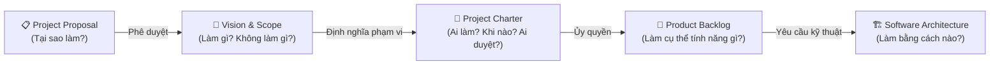

# TRẢ LỜI VẤN ĐÁP – MÔN QUẢN LÝ DỰ ÁN PHẦN MỀM

**Dự án:** Hệ thống Thư viện Số Thương mại & Quản lý Bản quyền Số (CDLS – Commercial Digital Library System)
**Giảng viên:** TS. Ngô Huy Biên | **Năm:** 2026

> [!NOTE]
> Toàn bộ câu trả lời bên dưới được xây dựng dựa trên các tài liệu thực tế của nhóm:
> `LIBIF-Project-Proposal.md`, `LIBIF-Project-Vision-Scope.md`, `LIBIF-Project-Charter.md`,
> `LIBIF-Product-Backlog.md`, `LIBIF-Architecturemd`.

---

## CÂU HỎI 1 – Tài liệu Đề xuất Dự án (Project Proposal)

**Câu hỏi chính:** *Trình bày quá trình hình thành và phương pháp đánh giá tài liệu Đề xuất dự án của nhóm.*

---

### 1.1 Các câu hỏi chính mà tài liệu Đề xuất Dự án phải trả lời

Tài liệu Đề xuất Dự án cần trả lời **5 câu hỏi cốt lõi** về sự tồn tại của dự án:

| # | Câu hỏi cốt lõi                                                 | Câu trả lời trong tài liệu nhóm                                                                                                                   |
| :- | :------------------------------------------------------------------ | :------------------------------------------------------------------------------------------------------------------------------------------------------ |
| 1 | **Dự án giải quyết bài toán gì?**                      | Thư viện truyền thống không thể số hóa sách an toàn và bảo vệ bản quyền khi chia sẻ tài liệu số.                                     |
| 2 | **Tại sao thực hiện vào thời điểm này?**              | Luật Sở hữu trí tuệ siết chặt + Nhu cầu học tập từ xa 24/7 bùng nổ sau dịch.                                                              |
| 3 | **Các giải pháp hiện có có đáp ứng được không?** | Không: DSpace thiếu DRM; Ex Libris Alma quá đắt; ghép nối công cụ rời rạc tạo lỗ hổng bảo mật.                                          |
| 4 | **Giải pháp đề xuất là gì?**                           | Xây dựng hệ thống CDLS tích hợp Tesseract OCR + Giao diện kiểm duyệt Side-by-side + Bảo mật đa lớp (DRM, Watermark động, Canvas Reader). |
| 5 | **Dự án có khả thi không?**                              | Có: Khả thi Kỹ thuật (Medium-High), Kinh doanh (High), Vận hành (High), Pháp lý (High).                                                         |

---

### 1.2 Đầu vào và các bước hình thành tài liệu Đề xuất Dự án

Để trả lời thuyết phục và đạt điểm tối đa khi vấn đáp, câu trả lời cần được phân tách rõ ràng thành **2 tầng**: Khung lý thuyết tổng quát (chuẩn môn học/PMBOK/Karl Wiegers) và Minh chứng áp dụng thực tế vào dự án của nhóm.

#### A. Các đầu vào cần thiết (Inputs)

##### 1. Khung lý thuyết tổng quát môn học

Một tài liệu Đề xuất Dự án chuẩn cần tổng hợp **5 nhóm đầu vào chính**:

* **Tài liệu khởi tạo ban đầu (Initial Artifacts):** Yêu cầu đề xuất (*Request for Proposals - RFP*), biên bản các cuộc họp khởi tạo (*Meeting minutes*), mô tả ý tưởng/yêu cầu sơ bộ, tài liệu hướng dẫn vận hành hiện tại (*User guides/Admin guides*).
* **Khám phá Khách hàng & Vấn đề Vận hành (Customer Discovery & Operational Problems):** Khảo sát thực tế, phỏng vấn các bên liên quan (*Stakeholders* gồm Sponsor, Client, Users) để xác định điểm nghẽn (*Pain points*), chi phí lãng phí, rủi ro trong quy trình hiện tại.
* **Phân tích Hệ thống Hiện hữu & Tương tự (Existing & Similar Systems):** Rà soát mã nguồn, dữ liệu, các lỗi vận hành (*Bugs, Security, Performance*), hoặc giới hạn công nghệ của hệ thống đang chạy.
* **Phân tích Thị trường & Đối thủ Cạnh tranh (Competitor Analysis & Benchmarking):** Nghiên cứu tối thiểu 3 sản phẩm đối thủ/giải pháp thay thế trên thị trường, phân tích SWOT để tìm ra điểm khác biệt cốt lõi (*Differentiators*).
* **Ràng buộc Nguồn lực & Khung Pháp lý (Constraints, Budget & Compliance):** Ngân sách khả dụng của Sponsor (*Yearly budget/Savings*), các tiêu chuẩn tuân thủ pháp luật, các công nghệ xu hướng (*Trending technologies*).

##### 2. Minh chứng áp dụng thực tế vào dự án nhóm (CDLS / LIBIF):

* **Initial Artifacts:** Báo cáo khảo sát thực trạng số hóa tài liệu tại các thư viện đại học/chuyên ngành.
* **Operational Problems:** Sách giấy bị giới hạn truy cập vật lý; file quét dạng scan không tìm kiếm được toàn văn; chia sẻ file PDF thô qua Google Drive/Zalo gây nguy cơ vi phạm bản quyền cao.
* **Competitors & Benchmarking:** Phân tích 3 nhóm giải pháp hiện hữu: DSpace/Greenstone (Mã nguồn mở - thiếu DRM), Ex Libris Alma (Thương mại quốc tế - chi phí quá cao), và Ghép nối công cụ rời rạc (Tesseract độc lập + Drive + Acrobat - quy trình đứt gãy).
* **Constraints & Compliance:** Tuân thủ Luật Sở hữu trí tuệ Việt Nam, Luật An ninh mạng; giới hạn nguồn lực 6 sinh viên năm 4 và ngân sách VPS Staging (~4.000.000 VNĐ).

---

#### B. Các bước nhóm đã thực hiện để tạo tài liệu (Steps / Process)

##### 1. Khung quy trình tổng quát chuẩn (Process Flow):

1. **Khám phá & Xác định bài toán (Problem Discovery):** Phỏng vấn Stakeholders, ghi nhận nỗi đau thực tế (*Pain points*), phân loại thông tin (FACT, INDUSTRY PRACTICE, EXPERT JUDGEMENT, ASSUMPTION).
2. **Khảo sát giải pháp hiện có & Đối thủ (Benchmarking & Competitor Analysis):** Lập bảng so sánh tính năng/chi phí với tối thiểu 3 đối thủ để chỉ ra lý do tại sao các giải pháp hiện tại không đáp ứng được (*Why now? Why existing solutions fail?*).
3. **Phân tích Đánh đổi (Trade-off Analysis - Buy vs. Build):** Đánh giá giữa việc mua giải pháp thương mại, dùng mã nguồn mở, hay tự phát triển mới (*Build*).
4. **Nghiên cứu Tính khả thi (Feasibility Study):** Đánh giá toàn diện trên 6–8 khía cạnh: Kỹ thuật (*Technical*), Kinh tế/Tài chính (*Economic*), Vận hành (*Operational*), Tiến độ (*Schedule*), Pháp lý (*Legal*), và Thị trường (*Market*).
5. **Phân tích Các bên Liên quan (Stakeholder Analysis):** Nhận diện Sponsor, Customer, Users, Project Team; làm rõ mục tiêu, mối quan ngại và kỳ vọng của từng bên.
6. **Tổng hợp Tóm tắt Điều hành (Executive Summary):** Hoàn thiện bản đề xuất hỗ trợ ra quyết định (*Decision Support Document*) để trình Sponsor phê duyệt.

##### 2. Minh chứng thực hiện cụ thể trong dự án nhóm (CDLS / LIBIF):

* **Bước 1:** Nhận diện 3 bài toán vận hành cốt lõi của thư viện trong `Docs/LIBIF-Project-Proposal.md` (Mục 2.1).
* **Bước 2:** Lập bảng so sánh chi tiết 5 phương án theo 5 tiêu chí kỹ thuật & kinh doanh (Mục 3.2).
* **Bước 3:** Phân tích Buy vs. Build, quyết định tự xây dựng lõi DRM kết hợp Tesseract OCR self-hosted để làm chủ công nghệ và tối ưu chi phí (Mục 3.5).
* **Bước 4:** Đánh giá tính khả thi 6 chiều, kết luận khả thi cao về Kỹ thuật, Vận hành, Pháp lý và Kinh doanh (Mục 6).
* **Bước 5:** Lập ma trận Stakeholders với 6 nhóm đối tượng liên quan (Mục 5).
* **Bước 6:** Soạn thảo hoàn chỉnh `LIBIF-Project-Proposal.md` làm căn cứ pháp lý khởi động dự án.

---

### 1.3 Dữ liệu hình thành bản Đề xuất

Tài liệu Đề xuất phân loại nguồn gốc thông tin thành 4 loại:

| Loại                       | Ý nghĩa                  | Ví dụ trong tài liệu nhóm                                               |
| :-------------------------- | :------------------------- | :--------------------------------------------------------------------------- |
| **FACT**              | Sự thật đã chứng minh | Thư viện chia sẻ PDF thô qua Zalo → nguy cơ vi phạm bản quyền cao.  |
| **INDUSTRY PRACTICE** | Thông lệ ngành          | Tài liệu quét dạng ảnh không qua OCR không thể tìm kiếm full-text. |
| **EXPERT JUDGEMENT**  | Phán đoán chuyên gia   | Watermark động đủ khả năng răn đe người dùng chụp màn hình.    |
| **ASSUMPTION**        | Giả định cần xác minh | Độc giả chấp nhận xem sách có nhúng watermark trên màn hình.      |

---

### 1.4 Các sản phẩm cạnh tranh trực tiếp

| Đối thủ                                                                   | Điểm mạnh                                        | Lý do bị loại bỏ trong phân tích                                                                                                           |
| :--------------------------------------------------------------------------- | :-------------------------------------------------- | :----------------------------------------------------------------------------------------------------------------------------------------------- |
| **DSpace / Greenstone**                                                | Mã nguồn mở, chi phí $0, biên mục Dublin Core | Không có DRM bảo vệ bản quyền chặt chẽ; độc giả vẫn tải được file PDF gốc khi được cấp quyền xem.                          |
| **Ex Libris Alma / Primo**                                             | DRM chuẩn quốc tế, tính năng đầy đủ        | Chi phí $10,000–$50,000+/năm; khó tùy biến OCR cho font tiếng Việt cổ; vendor lock-in.                                                  |
| **Kết hợp công cụ rời rạc** (Tesseract + Google Drive + Acrobat) | Chi phí ban đầu thấp                            | Quy trình đứt gãy (4-5 ứng dụng cho 1 cuốn sách); Watermark tĩnh không nhúng thông tin người đọc; thiếu Audit Trail tập trung. |

---

### 1.5 Tài liệu Đề xuất được đánh giá như thế nào?

Tài liệu Đề xuất Dự án được đánh giá dựa trên:

- **Tính đầy đủ của phân tích vấn đề:** Mỗi vấn đề phải ghi rõ loại thông tin (FACT / INDUSTRY PRACTICE / ASSUMPTION) để đảm bảo tính khách quan.
- **Tính thuyết phục của phân tích Trade-off:** So sánh Buy vs Build phải có số liệu cụ thể (ví dụ: tiết kiệm $0 bản quyền OCR API so với Google Cloud Vision).
- **Tính khả thi được xác minh:** Phân tích tính khả thi trên 6 chiều với kết luận rõ ràng cho từng chiều.
- **Mức độ giải quyết mối quan ngại của Sponsor:** Phân tích đủ để Nhà đầu tư đưa ra quyết định phê duyệt.

---

### 1.6 Tại sao cần tạo tài liệu Đề xuất Dự án?

Tài liệu Đề xuất Dự án phục vụ 3 mục đích chính:

1. **Hỗ trợ ra quyết định (Decision Support Document):** Cung cấp căn cứ để Sponsor phê duyệt hoặc từ chối đầu tư.
2. **Đặt nền móng cho các tài liệu tiếp theo:** Project Proposal là đầu vào cho Vision & Scope, Project Charter, và SRS.
3. **Ghi lại lý do tồn tại của dự án (Project Rationale):** Đảm bảo mọi thành viên và stakeholder đều hiểu rõ **tại sao** dự án được thực hiện, từ đó đưa ra quyết định nhất quán trong suốt vòng đời dự án.

---

### 1.7 Tài liệu được sử dụng và cập nhật trong dự án như thế nào?

* **Giai đoạn Khởi động (Initiation & Kickoff):**
  * Là căn cứ duy nhất để **Sponsor** và **Khách hàng** đánh giá tính khả thi và ký duyệt  *"Go/No-Go"* , giải ngân ngân sách.
  * Là cơ sở để ban hành **Điều lệ Dự án (Project Charter)** và xác lập thẩm quyền cho Giám đốc Dự án (PM).
* **Giai đoạn Phân tích & Lập kế hoạch (Requirements & Planning):**
  * Cung cấp bối cảnh kinh doanh ( *Business Context* ) để BA chuyển hóa thành  **Tầm nhìn & Phạm vi (Project Vision & Scope)** .
  * Dữ liệu đối thủ cạnh tranh ( *Competitor Benchmarking* ) giúp định vị các tính năng tạo sự khác biệt ( *Differentiators* ) trong  **Product Backlog** .
* **Giai đoạn Thiết kế Kiến trúc & Thực thi (Architecture & Execution):**
  * Bảng phân tích đánh đổi ( *Trade-off: Buy vs. Build* ) là **kim chỉ nam** giúp Kiến trúc sư lựa chọn giải pháp kỹ thuật đúng đắn (ví dụ: tự xây dựng lõi DRM và dùng Tesseract self-hosted).
  * Đảm bảo đội ngũ phát triển luôn giải quyết đúng bài toán nghiệp vụ ( *Business Alignment* ), tránh phát triển tính năng thừa ( *Over-engineering* ).
* **Giai đoạn Nghiệm thu & Đóng dự án (Validation & Closing):**
  * Bảng *Lợi ích Kỳ vọng (Expected Benefits & KPIs)* trong Proposal được dùng làm thước đo đánh giá tỷ suất hoàn vốn ( *Benefit Realization / ROI Evaluation* ) và nghiệm thu UAT.
  * Tổng kết bài học kinh nghiệm ( *Lessons Learned*

---

### 1.8 Dự án phần mềm là gì?

1. **Tính tạm thời (Temporary):**
   * Dự án luôn có **điểm bắt đầu (Start Date)** và **điểm kết thúc (End Date)** xác định rõ ràng.
   * Dự án kết thúc khi các mục tiêu đã đạt được, hoặc khi dự án bị hủy bỏ vì không còn tính khả thi.
   * *(Lưu ý: "Tạm thời" nói về thời gian thực hiện dự án, không có nghĩa sản phẩm tạo ra chỉ dùng tạm thời).*
2. **Tính duy nhất (Unique Deliverable):**
   * Kết quả bàn giao của dự án (phần mềm, tài liệu, kiến trúc) là  **duy nhất** , có sự khác biệt về công nghệ, bối cảnh, khách hàng hoặc nghiệp vụ, không phải là việc sản xuất hàng loạt lặp đi lặp lại.
3. **Tính phát triển/làm rõ dần (Progressive Elaboration):**
   * Ở giai đoạn đầu (Initiation), yêu cầu còn ở mức trừu tượng/tổng quan; càng đi sâu vào các giai đoạn sau (Planning, Execution), chi tiết về tính năng, kiến trúc và rủi ro càng được làm sáng tỏ và cụ thể hóa.

### 1.9 Phân biệt Project / Operation / Program / Portfolio:

| Khái niệm         | Đặc điểm                               | Ví dụ trong dự án nhóm                                      |
| :------------------ | :----------------------------------------- | :--------------------------------------------------------------- |
| **Project**   | Tạm thời, kết quả duy nhất            | Dự án CDLS-2026: phát triển hệ thống thư viện số        |
| **Operation** | Liên tục, lặp lại                      | Vận hành kho thư viện số sau khi bàn giao cho khách hàng |
| **Program**   | Nhóm nhiều project liên quan            | CDLS + Mobile App + HTR Extension = Program Số hóa Tri thức   |
| **Portfolio** | Tập hợp dự án theo ưu tiên đầu tư | Danh mục sản phẩm phần mềm của Sponsor                     |

**Chốt nhanh:** Project → tạo ra thứ mới. Operation → duy trì thứ đã có. Program → điều phối nhiều Project. Portfolio → lựa chọn & cân đối ngân sách cho toàn bộ danh mục đầu tư.

### 1.10 Phạm vi dự án:

Là tập hợp tất cả công việc cần thực hiện và kết quả bàn giao cần tạo ra để hoàn thành dự án thành công –  không hơn, không kém .

Phạm vi gồm 2 thành phần:

* **In-Scope (Trong phạm vi):** Tất cả tính năng, chức năng, tài liệu và kết quả nhóm **cam kết thực hiện** trong dự án.
* **Out-of-Scope (Ngoài phạm vi):** Những gì **không làm** trong dự án này, được ghi rõ ràng để phòng tránh *Scope Creep* (phình phạm vi ngoài kiểm soát).

Tại sao phạm vi quan trọng? → Thay đổi Scope mà không kiểm soát sẽ kéo theo tăng chi phí, trễ tiến độ và giảm chất lượng.

*Ví dụ trong dự án nhóm:*

* **In-Scope:** 5 phân hệ (Số hóa & OCR, Kiểm duyệt Side-by-side, Quản lý kho số, Canvas Reader, Quản trị bảo mật).
* **Out-of-Scope:** Sản xuất phần cứng scanner, mua bán bản quyền nội dung, in ấn tài liệu số, dịch tự động ngôn ngữ.

#### 1.11 Các vai trò thường tham gia vào một dự án phần mềm

| Vai trò                               | Trách nhiệm chính                                                                                                      |
| -------------------------------------- | ------------------------------------------------------------------------------------------------------------------------- |
| **Project Sponsor**              | Phê duyệt ngân sách, định hướng chiến lược, giải quyết các vấn đề vượt thẩm quyền PM.                |
| **Project Manager (PM)**         | Lập kế hoạch, điều phối nhân lực, kiểm soát tiến độ–chi phí–phạm vi–rủi ro.                            |
| **Business Analyst (BA)**        | Thu thập & phân tích yêu cầu, cầu nối giữa khách hàng và đội phát triển, viết SRS/Product Backlog.        |
| **Software Architect**           | Thiết kế kiến trúc tổng thể hệ thống, lựa chọn công nghệ và đưa ra các quyết định kỹ thuật cấp cao. |
| **Developer (Frontend/Backend)** | Xây dựng và lập trình các tính năng theo thiết kế kiến trúc và Product Backlog.                              |
| **QA / Tester**                  | Lập kế hoạch kiểm thử, viết test case, thực hiện kiểm thử chức năng, bảo mật và nghiệm thu UAT.           |
| **DevOps / System Admin**        | Quản lý hạ tầng, CI/CD Pipeline, đóng gói triển khai, giám sát vận hành hệ thống.                           |
| **Customer / End User**          | Cung cấp yêu cầu, phản hồi trong các buổi demo, nghiệm thu sản phẩm cuối (UAT).                                |

*Ví dụ trong dự án nhóm:* Nhóm 06 sinh viên đảm nhận đồng thời các vai trò BA Lead, Dev Lead Frontend, Dev Lead Backend, Security Lead (SecOps) và QA Lead, dưới sự bảo trợ của Sponsor (Giảng viên hướng dẫn) và Khách hàng (Thư viện đại học đối tác).

### 1.12 Phân loại kết quả của dự án:

Một dự án phần mềm tạo ra kết quả ở  **3 cấp độ khác nhau** :

| Loại kết quả                                           | Định nghĩa                                                                                                               | Ví dụ trong dự án nhóm                                                                                                                                                          |
| --------------------------------------------------------- | --------------------------------------------------------------------------------------------------------------------------- | ------------------------------------------------------------------------------------------------------------------------------------------------------------------------------------ |
| **Output / Deliverable** *(Sản phẩm bàn giao)* | Thứ nhóm tạo ra và bàn giao trực tiếp cho khách hàng – có thể nhìn thấy và đo đếm được.                | Module Tesseract OCR, Canvas Reader, tài liệu SRS/Product Backlog, bộ kịch bản kiểm thử UAT, bộ đóng gói Docker.                                                          |
| **Outcome** *(Kết quả tác động)*             | Sự thay đổi về hành vi, quy trình hoặc năng lực của khách hàng**sau khi** sử dụng sản phẩm bàn giao. | Thư viện bảo vệ được tài sản số (0 sự cố rò rỉ file), thủ thư giảm 70% thời gian xử lý OCR, thư viện ký kết được hợp đồng bản quyền với NXB.        |
| **Benefit** *(Lợi ích kinh doanh)*              | Giá trị kinh tế hoặc chiến lược dài hạn mà tổ chức thu được từ Outcome.                                     | Tăng doanh thu thương mại từ bán bản quyền/SaaS phần mềm CDLS; mở rộng thị phần sang các thư viện tỉnh/thành phố; nâng cao uy tín thương hiệu của Sponsor. |

**Chốt nhanh**: Output → nhóm làm ra. Outcome → khách hàng thay đổi nhờ Output. Benefit → tổ chức thu lời từ Outcome. Nhiều dự án thất bại vì chỉ tập trung vào Output mà bỏ quên Outcome và Benefit.

### 1.13 Phân tích các nguyên nhân chính khiến một dự án phần mềm thất bại:

|     STT     | Nguyên nhân / Vấn đề                                                                         | Mô tả rủi ro                                                                                                                               | Biện pháp kiểm soát & Giảm thiểu                                                                                                                                 |
| :---------: | :------------------------------------------------------------------------------------------------ | :-------------------------------------------------------------------------------------------------------------------------------------------- | :--------------------------------------------------------------------------------------------------------------------------------------------------------------------- |
| **1** | **Yêu cầu không rõ ràng hoặc thay đổi liên tục***(Unclear/Changing Requirements)* | Khách hàng và team không đồng thuận về phạm vi; yêu cầu bị thêm mới giữa chừng không kiểm soát (Scope Creep).              | Nhóm kiểm soát bằng cách định nghĩa rõ In-Scope / Out-of-Scope trong Vision & Scope và quản lý thay đổi qua Change Request.                              |
| **2** | **Thiếu sự tham gia của Stakeholder***(Lack of Stakeholder Engagement)*                  | Khách hàng/người dùng không được tham gia vào quá trình phát triển; sản phẩm bàn giao không phù hợp thực tế vận hành. | Nhóm tổ chức User Feedback Session định kỳ với thủ thư và độc giả đại diện để đảm bảo giao diện Side-by-side UI phù hợp nghiệp vụ thực tế. |
| **3** | **Ước tính không chính xác***(Poor Estimation)*                                       | Thời gian và chi phí bị đánh giá thấp hơn thực tế; dẫn đến trễ tiến độ và vượt ngân sách.                              | Nhóm dùng phương pháp ước tính Agile (Story Points, Planning Poker) và dự phòng rủi ro OCR quality dựa trên kết quả đo PoC thực tế.                 |
| **4** | **Rủi ro kỹ thuật không được quản lý***(Unmanaged Technical Risks)*                | Phát hiện vấn đề kỹ thuật chí mạng quá muộn (gần deadline); công nghệ chọn không phù hợp.                                   | Nhóm xây dựng Proof of Concept (PoC) cho kiến trúc Zero-Download Canvas DRM trước giai đoạn phát triển chính để xác nhận tính khả thi kỹ thuật.    |
| **5** | **Năng lực đội ngũ & Quản lý nhân sự yếu***(Team & Leadership Issues)*            | Thiếu kỹ năng chuyên môn; phân công vai trò không rõ ràng; xung đột nội bộ không giải quyết kịp thời.                     | Nhóm xây dựng Skill Matrix, phân công rõ theo RACI Matrix trong Project Charter và tổ chức Daily Standup 15 phút để phát hiện sớm điểm nghẽn.        |

### 1.14 Ràng buộc dự án có ý nghĩa gì?

**Ràng buộc dự án (Project Constraints)** là các **giới hạn và điều kiện bắt buộc phải tuân thủ** không thể thương lượng, ảnh hưởng trực tiếp đến cách lên kế hoạch và đưa ra quyết định trong suốt dự án.

**Ý nghĩa cốt lõi của ràng buộc:**

* Định hình **không gian giải pháp khả thi** – team chỉ có thể chọn các phương án nằm trong vùng giao của tất cả các ràng buộc.
* Là căn cứ để **từ chối yêu cầu bất khả thi** – khi Sponsor đề xuất thay đổi vi phạm ràng buộc, PM có văn bản để phân tích tác động và đề xuất điều chỉnh chính thức.
* Buộc đội dự án phải **sáng tạo trong khuôn khổ** – tìm ra giải pháp tối ưu trong giới hạn cho phép.

**4 ràng buộc chính của dự án CDLS:**

| Loại                     | Nội dung ràng buộc                                                                                             | Tác động đến quyết định dự án                                                                                   |
| ------------------------- | ----------------------------------------------------------------------------------------------------------------- | ------------------------------------------------------------------------------------------------------------------------- |
| **Kỹ thuật**      | Phải chạy trên trình duyệt HTML5 hiện đại, không cài thêm plugin/extension.                            | Buộc phải dùng HTML5 Canvas API + Web Crypto API thay vì Flash hay ứng dụng desktop.                                |
| **Công nghệ OCR** | Phải dùng Tesseract OCR Engine self-hosted, không dùng Cloud OCR API bên ngoài.                             | Tiết kiệm $0 chi phí bản quyền API; đảm bảo dữ liệu tài liệu quét không bị gửi ra máy chủ bên thứ ba. |
| **Bản quyền**     | Tuyệt đối không cung cấp cơ chế nào cho phép xuất ngược file PDF gốc sau khi đã mã hóa lưu kho. | Kiến trúc Zero-Download Canvas DRM là yêu cầu bắt buộc từ ràng buộc này, không thể thỏa hiệp.              |
| **Ngân sách**     | Chi phí phát triển phải nằm trong hạn mức Sponsor phê duyệt (không vượt quá ngưỡng 5%).            | Mọi quyết định thay đổi ngân sách phải được Sponsor phê duyệt chính thức qua Change Request.              |

---

## CÂU HỎI 2 – Tài liệu Viễn cảnh và Phạm vi Dự án (Project Vision & Scope)

**Câu hỏi chính:** *Trình bày quá trình hình thành và phương pháp đánh giá tài liệu Viễn cảnh và phạm vi dự án của nhóm.*

---

### 2.1 Các câu hỏi chính trong tài liệu Vision & Scope

Tài liệu Vision & Scope trả lời **4 câu hỏi then chốt**:

| # | Câu hỏi                                                         | Câu trả lời trong tài liệu nhóm                                                                                                                                      |
| :- | :---------------------------------------------------------------- | :------------------------------------------------------------------------------------------------------------------------------------------------------------------------- |
| 1 | **Tầm nhìn dài hạn của sản phẩm là gì?**           | Trở thành nền tảng phần mềm thư viện số thương mại chuẩn hóa tại Việt Nam, giúp thư viện chuyển đổi số an toàn và hợp tác bản quyền với NXB. |
| 2 | **Khoảng cách giữa hiện tại và tương lai là gì?** | Gap Analysis 6 vấn đề cụ thể (không tìm kiếm full-text → module OCR; rò rỉ file → Canvas Reader; thiếu audit trail → Activity Logging...)                    |
| 3 | **Phạm vi hệ thống bao gồm gì (In Scope)?**            | 5 phân hệ: Số hóa & OCR, Kiểm duyệt Side-by-side, Quản lý Kho số, Reader Viewer, Quản trị & Bảo mật.                                                          |
| 4 | **Điều gì KHÔNG thuộc phạm vi (Out of Scope)?**       | Không sản xuất phần cứng scanner; không mua bán bản quyền nội dung; không in ấn; không dịch tự động.                                                      |

---

### 2.2 Đầu vào và các bước hình thành tài liệu Vision & Scope

**Đầu vào:**

- Tài liệu Đề xuất Dự án (Project Proposal) đã được Sponsor phê duyệt
- Kết quả phỏng vấn người dùng: Thủ thư, Ban Giám đốc Thư viện, Độc giả đại diện
- Phân tích quy trình vận hành hiện tại (As-Is Process) và thiết kế quy trình tương lai (To-Be Process)

**Các bước nhóm thực hiện:**

1. **Viết Tuyên bố Tầm nhìn (Vision Statement):** Sử dụng cấu trúc "Dành cho [khách hàng]... sản phẩm [tên] là giải pháp... không giống như [đối thủ]... sản phẩm này [khác biệt]... Mục tiêu dài hạn là..."
2. **Vẽ As-Is Workflow:** Mô tả quy trình vận hành hiện tại của thư viện (4 vấn đề chính: bảo quản, số hóa, xử lý OCR, chia sẻ & bản quyền).
3. **Vẽ To-Be Workflow:** Thiết kế luồng nghiệp vụ tương lai 5 bước: Upload → OCR ngầm → Side-by-side Review → Mã hóa AES-256 → Canvas Reader.
4. **Phân tích khoảng trống (Gap Analysis):** Bảng 6 dòng ánh xạ từng vấn đề hiện tại → quy trình tương lai → tính năng tương ứng.
5. **Định nghĩa In-Scope / Out-of-Scope:** Phân định ranh giới rõ ràng để phòng tránh scope creep.
6. **Xây dựng danh mục tính năng cấp cao (High-level Features):** 8 feature từ FE-01 đến FE-08, mỗi feature có Acceptance Criteria viết theo chuẩn Given-When-Then.

---

### 2.3 Tài liệu Vision & Scope được đánh giá như thế nào?

| Tiêu chí Đánh giá                                        | Phương pháp Kiểm tra                                                                                  |
| :------------------------------------------------------------ | :-------------------------------------------------------------------------------------------------------- |
| **Tầm nhìn rõ ràng và truyền cảm hứng**         | Vision Statement phải trả lời được: Ai là khách hàng? Giải pháp là gì? Khác gì đối thủ? |
| **Gap Analysis đầy đủ và chính xác**             | Mỗi vấn đề hiện tại phải ánh xạ sang đúng tính năng giải quyết                             |
| **Phạm vi In-Scope được định nghĩa chính xác** | Không có tính năng nào "mơ hồ" – phải quyết định rõ ràng In hay Out                         |
| **Acceptance Criteria cho từng Feature**               | Viết đúng chuẩn Given-When-Then, có thể kiểm thử được                                          |
| **Out-of-Scope được ghi nhận**                      | Tránh tranh luận về phạm vi sau này (nguồn gốc chính của scope creep)                            |

---

### 2.4 Tại sao cần tạo tài liệu Vision & Scope?

1. **Định hướng chiến lược sản phẩm:** Tuyên bố Tầm nhìn là "ngọn hải đăng" giúp team đưa ra quyết định đúng hướng khi có mâu thuẫn ưu tiên.
2. **Phòng tránh Scope Creep:** Định nghĩa rõ Out-of-Scope (ví dụ: không in ấn, không dịch tự động) giúp PM từ chối các yêu cầu phát sinh không có trong phạm vi.
3. **Căn cứ cho Product Backlog:** Danh mục 8 tính năng cấp cao trong Vision & Scope là đầu vào trực tiếp để phân rã thành 16 PBIs trong Product Backlog.
4. **Thống nhất kỳ vọng giữa Sponsor và Team:** Tài liệu được ký duyệt chính thức đảm bảo tất cả bên liên quan có cùng hiểu biết về sản phẩm sẽ được xây dựng.

---

### 2.5 Tài liệu được sử dụng và cập nhật trong dự án như thế nào?

- **Sprint Planning:** To-Be Workflow được dùng làm tài liệu tham chiếu khi phân rã Epic thành User Stories trong Product Backlog.
- **Kiểm soát Scope Creep:** Mỗi yêu cầu mới phát sinh được đối chiếu với phần "In Scope / Out of Scope" để quyết định có đưa vào Backlog không.
- **Phạm vi Tương lai (Future Scope):** Các ý tưởng không vào phiên bản này (AI tóm tắt, Mobile App, HTR) được ghi rõ trong "Future Scope" để không bị mất, nhưng không làm phức tạp Sprint hiện tại.
- **Cập nhật khi Scope Change:** Nếu Sponsor yêu cầu thay đổi phạm vi lớn, tài liệu Vision & Scope phải được cập nhật chính thức và tái phê duyệt trước khi thực hiện.

---

## CÂU HỎI 3 – Tài liệu Ủy nhiệm Dự án (Project Charter)

**Câu hỏi chính:** *Trình bày quá trình hình thành và phương pháp đánh giá tài liệu Ủy nhiệm dự án của nhóm.*

---

### 3.1 Các câu hỏi chính trong tài liệu Project Charter

Project Charter phải trả lời **6 câu hỏi quyền lực**:

| # | Câu hỏi                                             | Câu trả lời trong tài liệu nhóm                                                                                                                                                    |
| :- | :---------------------------------------------------- | :--------------------------------------------------------------------------------------------------------------------------------------------------------------------------------------- |
| 1 | **Mục tiêu kinh doanh của dự án là gì?** | 4 mục tiêu: Thương mại hóa sản phẩm; Bảo vệ tuyệt đối tài sản số; Tối ưu năng suất thủ thư (-70% thời gian OCR); Nâng cao truy cập tri thức (tìm kiếm < 2s). |
| 2 | **Tiêu chí thành công là gì?**            | SC-01: 0 rò rỉ file; SC-02: 100% tài liệu được đối soát; SC-03: 100% kịch bản UAT; SC-04: Đúng tiến độ và ngân sách.                                                 |
| 3 | **Ai làm gì? (RACI Matrix)**                  | Sponsor: phê duyệt ngân sách (A); PM: quản lý kế hoạch (A); Dev Lead: phát triển kỹ thuật (R); Thủ thư: nghiệm thu UAT (R).                                               |
| 4 | **Các mốc chính là khi nào?**              | M1: Kick-off (T1) → M2: Core OCR (T3) → M3: Security & Canvas Reader (T5) → M4: Integration & QA (T6) → M5: UAT & Release (T7).                                                      |
| 5 | **Ràng buộc và giả định là gì?**        | 4 ràng buộc kỹ thuật/bản quyền/ngân sách; 3 giả định về hạ tầng scanner và chấp nhận Watermark.                                                                         |
| 6 | **Ai có quyền phê duyệt gì?**              | Bảng Quyền hạn Phê duyệt 5 cấp: từ Sponsor đến Khách hàng.                                                                                                                    |

---

### 3.2 Đầu vào và các bước hình thành Project Charter

**Đầu vào:**

- Tài liệu Project Proposal và Vision & Scope đã phê duyệt
- Thông tin về nguồn lực: 06 sinh viên năm 4, ngân sách VPS Staging ~4,000,000 VNĐ
- Các ràng buộc pháp lý (Luật SHTT, Luật An ninh mạng)

**Các bước nhóm thực hiện:**

1. **Xác định Mục tiêu Kinh doanh (Business Objectives):** Chuyển các "lợi ích kỳ vọng" từ Proposal thành các mục tiêu đo lường được với KPIs cụ thể.
2. **Xây dựng Tiêu chí Thành công (Success Criteria):** Mỗi tiêu chí phải có phương pháp kiểm tra và người phê duyệt cụ thể.
3. **Lập danh sách Sản phẩm Bàn giao (Deliverables):** 6 deliverable từ DEL-01 (Tài liệu phân tích) đến DEL-06 (Bộ đóng gói triển khai).
4. **Xây dựng Ma trận RACI:** Phân công rõ ràng R/A/C/I cho 8 hạng mục công việc chính.
5. **Lập kế hoạch Giao tiếp (Communication Plan):** 5 loại họp từ Daily Standup (15 phút/ngày) đến Sponsor Steering (hàng tháng).
6. **Phê duyệt chính thức:** Project Charter phải được Sponsor ký để chính thức ủy quyền cho PM điều hành dự án.

---

### 3.3 Tài liệu Project Charter được đánh giá như thế nào?

Project Charter được đánh giá theo nguyên tắc: **"Có đủ để ủy quyền và đo lường không?"**

| Tiêu chí                                      | Câu hỏi kiểm tra                                                                                                              |
| :---------------------------------------------- | :------------------------------------------------------------------------------------------------------------------------------- |
| **Mục tiêu SMART**                      | Mỗi Business Objective có KPI đo lường được không? (BO-03: giảm 70% thời gian OCR ✅)                                 |
| **Tiêu chí thành công rõ ràng**     | Có người phê duyệt cụ thể cho từng tiêu chí không? ✅                                                                 |
| **RACI đầy đủ**                       | Mỗi hạng mục công việc có đúng 1 chữ "A" không? ✅                                                                     |
| **Ràng buộc được ghi rõ**           | Ràng buộc nào có thể dẫn đến thất bại nếu không tuân thủ? (Ràng buộc bản quyền: không xuất file PDF gốc ✅) |
| **Kế hoạch giao tiếp đủ tần suất** | Có họp Sponsor hàng tháng không? Có Daily Standup không? ✅                                                               |
| **Bảng Quyền hạn Phê duyệt**         | Ai được quyết định gì? Ngưỡng thay đổi ngân sách > 5% cần Sponsor ✅                                               |

---

### 3.4 Tại sao cần tạo Project Charter?

Project Charter là **văn bản pháp lý nội bộ** của dự án, có 3 tác dụng:

1. **Chính thức ủy quyền cho PM:** Sponsor ký duyệt Charter = trao quyền cho PM huy động nguồn lực, điều phối nhân sự và đưa ra các quyết định trong ngưỡng phê duyệt.
2. **Gắn trách nhiệm giải trình:** RACI Matrix đảm bảo mỗi công việc có đúng 1 người chịu trách nhiệm giải trình (Accountable).
3. **Điểm tham chiếu kiểm soát dự án:** Khi có tranh chấp hoặc xung đột ưu tiên, tất cả các bên quay về Charter để tìm câu trả lời.

---

### 3.5 Tài liệu được sử dụng và cập nhật trong dự án như thế nào?

- **Tuần 1 – Kick-off Meeting:** Charter được công bố chính thức với toàn bộ team, xác nhận vai trò và trách nhiệm theo RACI.
- **Hàng tháng – Sponsor Steering Meeting:** PM báo cáo tiến độ đối chiếu với 5 Milestones và 4 Business Objectives trong Charter.
- **Khi có Scope Change lớn:** Nếu thay đổi ngân sách > 5% hoặc thay đổi mục tiêu chiến lược → phải cập nhật Charter và trình Sponsor phê duyệt lại.
- **UAT & Bàn giao:** Tiêu chí thành công trong Charter (SC-01 đến SC-04) là checklist chính thức để Giám đốc Thư viện ký nghiệm thu sản phẩm.

---

## CÂU HỎI 4 – Tài liệu Yêu cầu Phần mềm (Product Backlog)

**Câu hỏi chính:** *Trình bày quá trình hình thành và phương pháp đánh giá tài liệu Yêu cầu phần mềm (Product Backlog) của nhóm.*

---

### 4.1 Các câu hỏi chính trong tài liệu Yêu cầu Phần mềm

| # | Câu hỏi                                                   | Câu trả lời trong Product Backlog nhóm                                                                            |
| :- | :---------------------------------------------------------- | :-------------------------------------------------------------------------------------------------------------------- |
| 1 | **Hệ thống có những tính năng gì?**            | 5 Epics, 8 Features (FE-01 đến FE-08), 16 Product Backlog Items (PBI-01 đến PBI-16).                              |
| 2 | **Tính năng nào quan trọng nhất?**               | 13 PBIs "Must Have" (81.25%), 3 PBIs "Should Have" (18.75%).                                                          |
| 3 | **Mỗi tính năng phải làm được gì cụ thể?** | Mỗi PBI có User Story chuẩn (Là... / Tôi muốn... / Để...) và Acceptance Criteria Given-When-Then.            |
| 4 | **Các tính năng phụ thuộc nhau như thế nào?** | Bảng Dependencies: PBI-02 → PBI-04 → PBI-05 → PBI-07 → PBI-11 → PBI-14, 15, 16.                                 |
| 5 | **Nguồn gốc của yêu cầu từ đâu?**             | Ma trận Traceability: mỗi PBI truy xuất về Feature → Epic → Bước Quy trình Tương lai trong Vision & Scope. |

---

### 4.2 Đầu vào và các bước hình thành Product Backlog

**Đầu vào:**

- Tài liệu Vision & Scope (8 High-level Features là nguồn chiếu chính)
- To-Be Workflow (5 bước quy trình tương lai = 5 nhóm Epic)
- Gap Analysis (6 khoảng trống = 6 nhóm tính năng phải xây dựng)
- Phỏng vấn người dùng thực tế (Thủ thư, Độc giả, Quản trị viên)

**Các bước nhóm thực hiện:**

1. **Phân rã Feature thành Epic:** Nhóm 8 Features thành 5 Epics theo luồng nghiệp vụ: Số hóa & OCR → Kiểm duyệt → Xuất bản → Tìm kiếm & Đọc → Bảo mật & Nhật ký.
2. **Viết User Story cho từng PBI:** Áp dụng chuẩn "Là [vai trò], Tôi muốn [hành động], Để [mục tiêu kinh doanh]".
3. **Viết Acceptance Criteria Given-When-Then:** Đảm bảo mỗi PBI có tiêu chí nghiệm thu cụ thể, có thể viết test case và kiểm thử tự động.
4. **Ưu tiên MoSCoW:** Phân loại Must Have / Should Have / Could Have / Won't Have cho từng PBI.
5. **Xác định Dependencies:** Vẽ biểu đồ phụ thuộc để Sprint Planning có thể sắp xếp thứ tự phát triển hợp lý.
6. **Xây dựng Ma trận Traceability:** Đảm bảo 100% PBIs truy xuất được về Bước Quy trình Tương lai trong Vision & Scope.

---

### 4.3 Cấu trúc Product Backlog của nhóm

```
Epic 1: Số hóa & OCR (PBI-01, 02, 03)
  ├── PBI-01: Upload file scan (Must Have)
  ├── PBI-02: Tesseract OCR ngầm tự động (Must Have)
  └── PBI-03: Giám sát hàng chờ OCR (Should Have)

Epic 2: Kiểm duyệt Side-by-side (PBI-04, 05, 06)
  ├── PBI-04: Giao diện đối soát màn hình kép (Must Have)
  ├── PBI-05: Phê duyệt / Từ chối xuất bản (Must Have)
  └── PBI-06: Biên mục dữ liệu số Dublin Core (Must Have)

Epic 3: Xuất bản & Phân quyền (PBI-07, 08, 09)
  ├── PBI-07: Mã hóa AES-256 lưu kho MinIO (Must Have)
  ├── PBI-08: Phân quyền theo nhóm người dùng (Must Have)
  └── PBI-09: Giới hạn đọc đồng thời (Concurrent Limit) (Must Have)

Epic 4: Tìm kiếm & Reader (PBI-10, 11, 12, 13)
  ├── PBI-10: Full-text Search toàn văn (Must Have)
  ├── PBI-11: HTML5 Canvas Reader mã hóa stream (Must Have)
  ├── PBI-12: Block Download & chặn IDM (Must Have)
  └── PBI-13: Nhảy tới trang từ kết quả tìm kiếm (Should Have)

Epic 5: Bảo mật & Nhật ký (PBI-14, 15, 16)
  ├── PBI-14: Dynamic Watermark (User ID + IP + Timestamp) (Must Have)
  ├── PBI-15: Screenshot Blur khi mất focus (Should Have)
  └── PBI-16: Audit Trail Log bất biến (Must Have)
```

---

### 4.4 Tài liệu được đánh giá như thế nào?

| Tiêu chí Đánh giá                                | Câu hỏi Kiểm tra                                               | Kết quả nhóm                       |
| :---------------------------------------------------- | :---------------------------------------------------------------- | :------------------------------------ |
| **Tính truy xuất nguồn gốc (Traceability)** | Mỗi PBI có truy xuất về Feature và Bước Quy trình không? | ✅ 100% PBIs có Traceability         |
| **User Story đúng chuẩn**                    | Có đủ 3 phần: Vai trò / Hành động / Mục tiêu?           | ✅ Tất cả 16 PBIs                   |
| **Acceptance Criteria kiểm thử được**      | Viết Given-When-Then, có thể tự động hóa test case?        | ✅ Tất cả 16 PBIs                   |
| **Phân loại MoSCoW hợp lý**                 | Must Have có đủ để ra mắt sản phẩm không?                | ✅ 13 Must Have = 81.25%              |
| **Dependencies rõ ràng**                      | Có thể lập Sprint Plan mà không bị block không?            | ✅ Chuỗi phụ thuộc được vẽ rõ |

---

### 4.5 Tại sao cần tạo tài liệu Yêu cầu Phần mềm?

1. **Hướng dẫn phát triển cụ thể:** Mỗi lập trình viên biết chính xác cần code gì, đáp ứng tiêu chí gì.
2. **Căn cứ kiểm thử:** QA viết test case trực tiếp từ Acceptance Criteria Given-When-Then.
3. **Kiểm soát phạm vi kỹ thuật:** PM dùng Backlog để tracking tiến độ Sprint, biết bao nhiêu % PBIs đã hoàn thành.
4. **Giao tiếp với khách hàng:** Thủ thư và Giám đốc Thư viện có thể review Backlog để xác nhận yêu cầu trước khi code.

---

### 4.6 Tài liệu được sử dụng và cập nhật trong dự án như thế nào?

- **Sprint Planning:** Mỗi Sprint, nhóm kéo các PBIs từ Backlog vào Sprint Backlog theo thứ tự ưu tiên và dependencies.
- **Sprint Review:** Demo tính năng đã xây dựng, đối chiếu với Acceptance Criteria để xác nhận PBI "Done".
- **Refinement:** PBIs mới phát sinh được thêm vào Backlog với đầy đủ User Story, Acceptance Criteria và ưu tiên MoSCoW trước khi đưa vào Sprint.
- **Backlog là "living document":** Được cập nhật liên tục sau mỗi Sprint Review và sau mỗi buổi phỏng vấn người dùng thực tế.

---

## CÂU HỎI 5 – Tài liệu Kiến trúc Phần mềm (Software Architecture)

**Câu hỏi chính:** *Trình bày quá trình hình thành và phương pháp đánh giá tài liệu Kiến trúc phần mềm của nhóm.*

---

### 5.1 Các câu hỏi chính trong tài liệu Kiến trúc Phần mềm

| # | Câu hỏi                                                           | Câu trả lời trong LIBIF-Architecture.md                                                                                          |
| :- | :------------------------------------------------------------------ | :---------------------------------------------------------------------------------------------------------------------------------- |
| 1 | **Kiểu ứng dụng là gì?**                                 | Enterprise Commercial Web Application: Modular Monolith + Multi-layered DRM Security.                                               |
| 2 | **Kiến trúc tổng thể theo mô hình nào?**               | Modular Monolith (thay vì Microservices) – phù hợp với tiến độ 10 tuần và 6 sinh viên.                                   |
| 3 | **Các luồng dữ liệu chạy như thế nào?**               | Pipe & Filter Pipeline: Upload → OCR Queue → Side-by-side Review → AES-256 Vault → Full-text Index.                             |
| 4 | **Bảo mật bản quyền được triển khai như thế nào?** | Zero-Download Canvas DRM Architecture 4 lớp: MinIO Vault → Signed Token Streaming → RAM Decrypt → Active Deterrence.            |
| 5 | **Tech Stack là gì?**                                       | Frontend: React/Next.js; Backend: NestJS; DB: PostgreSQL 16; Queue: Redis + BullMQ; Storage: MinIO; OCR: Tesseract; Deploy: Docker. |

---

### 5.2 Đầu vào và các bước hình thành tài liệu Kiến trúc

**Đầu vào:**

- Product Backlog (16 PBIs – là nguồn chiếu chính xác định các yêu cầu kỹ thuật)
- Tài liệu Proof of Concept (LIBIF-Proof-Of-Concept.md – chứng minh Zero-Download Canvas DRM hoạt động được)
- Statement of Work (SOW) – các ràng buộc hạ tầng và tiến độ
- Hạ tầng hiện có của nhóm: NestJS, PostgreSQL, Redis, MinIO

**Các bước nhóm thực hiện:**

1. **Xác định loại hình ứng dụng:** Phân tích các yêu cầu PBIs → Kết luận cần 2 cổng giao diện: Librarian Admin Panel (thủ thư) và Reader Secure Canvas Portal (độc giả).
2. **Quyết định kiến trúc tổng thể:** So sánh Modular Monolith vs Microservices → Chọn Modular Monolith vì: chi phí hạ tầng thấp ($4M VNĐ VPS), triển khai đơn giản qua Docker, phù hợp tiến độ 10 tuần.
3. **Thiết kế Pipe & Filter Pipeline:** Vẽ sơ đồ luồng dữ liệu 5 Filter từ Upload đến Full-text Index, xác định điểm "Human-in-the-loop" (thủ thư đối soát bắt buộc trước khi mã hóa).
4. **Thiết kế Zero-Download Canvas DRM Architecture:** 4 lớp bảo mật khép kín từ MinIO Vault → Signed Token → RAM Decrypt → Active Deterrence.
5. **Lựa chọn Tech Stack:** Tận dụng 100% hạ tầng hiện có (NestJS, PostgreSQL, Redis, MinIO) để tiết kiệm 80% nỗ lực tái cấu trúc.
6. **Xác định Thuộc tính Chất lượng (Quality Attributes):** Security (0% rò rỉ), Tương thích hạ tầng (100% tái sử dụng), Hiệu năng (render < 50ms/trang, tìm kiếm < 2s), Khả năng Mở rộng (Redis BullMQ tách rời OCR queue).

---

### 5.3 Chi tiết Kiến trúc DRM – Điểm then chốt của dự án

Đây là phần kiến trúc phức tạp và quan trọng nhất, giải quyết bài toán cốt lõi "không để lộ file gốc":

```
[MinIO Encrypted Vault]
    → AES-256 File Chunks được lưu kho (không có file .pdf mở)

[Backend NestJS Streaming Layer]
    → Xác thực Single-use Signed Token (TTL 30 giây)
    → Stream byte mã hóa qua WebSocket/API (KHÔNG cấp Presigned URL MinIO ra ngoài)

[Client Browser RAM]
    → Web Crypto API giải mã trực tiếp trên RAM
    → Vẽ (render) nét chữ/ảnh lên HTML5 Canvas Element
    → DOM hoàn toàn KHÔNG chứa , <embed> hay Blob URL

[Active Protection Layer]
    → Dynamic Watermark: "UserID - IP - Timestamp" phủ chéo Canvas
    → Screenshot Blur: blur 100% khi mất focus hoặc nhấn PrintScreen
    → Block F12/Context Menu/IDM
    → Audit Trail Log bất biến vào PostgreSQL
```

**Lý do đây là kiến trúc đúng đắn:**

- File gốc không tồn tại ở dạng mở nào trên server → không thể đánh cắp trực tiếp.
- Không có URL tĩnh nào được cấp ra ngoài → IDM không bắt được link.
- Dữ liệu chỉ sống trong RAM của browser trong phiên đọc → không thể cache hay lưu file.

---

### 5.4 Tài liệu được đánh giá như thế nào?

| Tiêu chí Đánh giá                           | Câu hỏi Kiểm tra                                                                         | Kết quả nhóm                  |
| :----------------------------------------------- | :------------------------------------------------------------------------------------------ | :------------------------------- |
| **Quyết định kiến trúc có căn cứ** | Có bảng so sánh giải thích tại sao chọn Modular Monolith không chọn Microservices? | ✅ Bảng so sánh 2 phương án |
| **Luồng dữ liệu rõ ràng**             | Sơ đồ Pipe & Filter có đủ 5 bước không?                                            | ✅ Flowchart đầy đủ          |
| **Bảo mật DRM được chứng minh**      | Zero-Download Architecture có 4 lớp bảo vệ không?                                      | ✅ 4 lớp chi tiết              |
| **Tech Stack phù hợp nguồn lực**       | Tận dụng hạ tầng hiện có, không mua thêm phần mềm không cần thiết?             | ✅ 100% hạ tầng sẵn có       |
| **Quality Attributes đo lường được** | Có chỉ số cụ thể (< 50ms/trang, < 2s tìm kiếm)?                                      | ✅ Có số liệu cụ thể        |
| **Liên kết với Product Backlog**        | Mỗi module kiến trúc có giải quyết các PBIs tương ứng không?                     | ✅ Traceability đầy đủ       |

---

### 5.5 Tại sao cần tạo tài liệu Kiến trúc Phần mềm?

1. **Định hướng kỹ thuật dài hạn:** Kiến trúc Modular Monolith hiện tại đã thiết kế sẵn để nâng cấp lên Microservices khi quy mô lớn (Domain Modules tách biệt sạch sẽ).
2. **Giảm rủi ro kỹ thuật:** Proof of Concept đã chứng minh Zero-Download Canvas DRM hoạt động trước khi bắt đầu phát triển → tránh phát hiện vấn đề kỹ thuật chí mạng ở giai đoạn cuối.
3. **Phân công công việc hiệu quả:** Dev Lead Frontend, Backend Lead, Security Lead có thể làm việc song song dựa trên kiến trúc module đã định nghĩa.
4. **Căn cứ cho Security Review:** Security Lead dùng tài liệu kiến trúc DRM làm checklist Pentest.

---

### 5.6 Tài liệu được sử dụng và cập nhật trong dự án như thế nào?

- **Sprint 1 (Kick-off & Architecture):** Tài liệu kiến trúc được phê duyệt và chia sẻ với toàn team trước khi code dòng đầu tiên.
- **Code Review:** Mọi Pull Request được đánh giá có tuân thủ cấu trúc Module và luồng dữ liệu trong kiến trúc không.
- **Security Review (M4 – Tháng 6):** Security Lead thực hiện Pentest dựa trên 4 lớp DRM đã thiết kế, xác nhận không có lỗ hổng rò rỉ URL file gốc.
- **Cập nhật khi có quyết định kỹ thuật mới:** Nếu phát sinh thay đổi công nghệ (ví dụ: thêm WebAssembly cho DRM), tài liệu kiến trúc được cập nhật với lý do thay đổi ghi rõ ràng.
- **Bàn giao sản phẩm:** Tài liệu kiến trúc được đính kèm trong DEL-06 (Bộ Đóng gói Triển khai) để đội kỹ thuật của thư viện khách hàng hiểu cách hệ thống hoạt động và cách bảo trì.

---

## TÓM TẮT TỔNG QUAN 5 TÀI LIỆU



| Tài liệu                      | Câu hỏi cốt lõi                                                      | Đầu vào chính                            | Người phê duyệt           |
| :------------------------------ | :----------------------------------------------------------------------- | :------------------------------------------- | :---------------------------- |
| **Project Proposal**      | Tại sao dự án này xứng đáng đầu tư?                            | Khảo sát thực tế, phân tích đối thủ | Project Sponsor               |
| **Vision & Scope**        | Sản phẩm tương lai sẽ như thế nào? Phạm vi giới hạn ở đâu? | Project Proposal + Phỏng vấn người dùng | Sponsor + PM                  |
| **Project Charter**       | Ai làm gì? Khi nào xong? Ai có quyền quyết định?                 | Vision & Scope + Nguồn lực + Ràng buộc   | Project Sponsor               |
| **Product Backlog**       | Từng tính năng cụ thể là gì? Ưu tiên ra sao?                    | Vision & Scope (High-level Features)         | Product Owner / PM            |
| **Software Architecture** | Giải pháp kỹ thuật nào để hiện thực hóa các tính năng?      | Product Backlog + Proof of Concept           | Software Architect / Dev Lead |

---

> [!TIP]
> **Gợi ý khi vấn đáp:** Luôn liên kết câu trả lời lý thuyết với minh chứng cụ thể từ tài liệu của dự án CDLS. Ví dụ: khi nói về "Ràng buộc dự án", ngay lập tức chỉ vào 4 ràng buộc trong Project Charter (kỹ thuật HTML5, Tesseract self-hosted, không xuất file PDF gốc, ngân sách Sponsor). Điều này thể hiện sự kết nối giữa lý thuyết và thực tiễn dự án.
