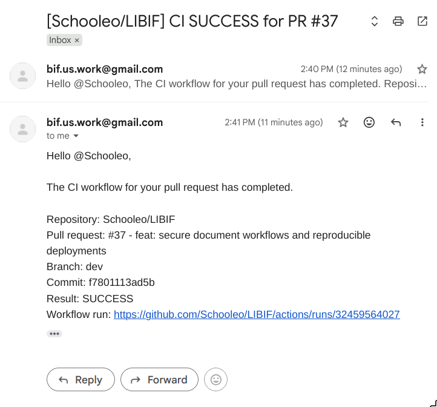

# BẢN IN NỘP KÈM — CONTINUOUS INTEGRATION CỦA NHÓM LIBIF

## 1. Kịch bản build và kiểm tra chất lượng

### 1.1 Các lệnh build chung của monorepo

Các lệnh dưới đây là nội dung thực tế được khai báo trong **package.json**:

    build:          npm run build --workspaces --if-present
    lint:           npm run lint --workspaces --if-present
    test:           npm run test --workspaces --if-present
    test:worker:    npm run test:worker -w apps/api
    test:e2e:       npm run test:e2e -w apps/api
    db:migrate:     npm run db:migrate -w apps/api

Ý nghĩa:

- build biên dịch shared package, NestJS API và Next.js Web;
- lint kiểm tra coding standards bằng ESLint;
- test chạy Jest cho API và Vitest cho Web;
- test:worker kiểm tra luồng PostgreSQL–Redis–MinIO–OCR worker;
- test:e2e kiểm tra API theo luồng sử dụng hoàn chỉnh.

### 1.2 Kịch bản chuẩn hóa cho developer

Nội dung thực tế trong **Makefile**:

    build:
        npm run build

    lint:
        npm run lint

    test:
        npm test

    test-e2e:
        npm run test:e2e

    test-worker:
        npm run test:worker

    verify: lint test test-e2e test-worker build

Lệnh **make verify** gom toàn bộ quality gate thành một quy trình thống nhất trước khi mở Pull Request.

### 1.3 Kịch bản build tự động trên GitHub Actions

Backend pipeline trong **API CI**:

    Trigger: Pull Request vào main/dev; push vào dev

    Lint API
      npm run lint -w packages/shared
      npm run lint -w apps/api

    Build API
      cp .env.example .env
      npm run build -w apps/api

    Test API
      cài Poppler + ImageMagick
      npm test -w apps/api

    Worker integration
      docker compose up --detach --wait
      npm run test:worker

    API end-to-end
      docker compose up --detach --wait
      npm run prisma:migrate:deploy -w apps/api
      npm run test:e2e

Frontend pipeline trong **Web CI**:

    Trigger: Pull Request vào main/dev; push vào dev

    Lint web
      npm run lint -w apps/web

    Build web
      npm run build -w apps/web

    Test web
      npm test -w apps/web

Các job độc lập được GitHub Actions chạy song song. PR chỉ được xem là đạt quality gate khi các job cần thiết đều thành công.

### 1.4 Kịch bản build container

API image sử dụng multi-stage build:

    Stage dependencies
      npm ci

    Stage build
      npm run build -w packages/shared
      npm run prisma:generate -w apps/api
      npm run build -w apps/api

    Stage runtime
      cài Poppler, ImageMagick, Tesseract tiếng Việt/Anh
      copy production dependencies và API artifact
      chạy bằng user node
      CMD node apps/api/dist/src/main.js

Web image sử dụng multi-stage build:

    Stage dependencies
      npm ci

    Stage build
      npm run build -w packages/shared
      npm run build -w apps/web

    Stage runtime
      copy Next.js standalone artifact và static assets
      chạy bằng user node
      CMD node apps/web/server.js

Multi-stage build giúp image runtime chỉ chứa thành phần cần thiết, nhất quán giữa các môi trường và không mang toàn bộ source/development dependency vào production.

## 2. Email kết quả build tự động

Email thể hiện trực tiếp:

- repository: Schooleo/LIBIF;
- Pull Request và branch được kiểm tra;
- commit cụ thể;
- kết quả SUCCESS;
- link tới GitHub Actions workflow run.

Workflow **CI Email Notification** chạy sau khi API CI hoặc Web CI hoàn tất. Hệ thống tìm email của tác giả Pull Request; nếu GitHub không cung cấp email hợp lệ thì dùng địa chỉ fallback đã cấu hình. SMTP_FROM chỉ là địa chỉ gửi, không phải mặc định là người nhận.

## 3. Hướng dẫn cài đặt công cụ và biên dịch trên máy developer

### 3.1 Công cụ cần có

| Công cụ | Mục đích |
|---|---|
| Git | Clone repository, branch, commit và Pull Request |
| Node.js 22 và npm | Cài dependency, build và test TypeScript |
| Docker và Docker Compose | Chạy PostgreSQL, Redis và MinIO giống nhau trên các máy |
| GNU Make | Cung cấp giao diện lệnh thống nhất |
| Poppler và ImageMagick | Render PDF và chạy các kiểm thử backend/OCR |

### 3.2 Cài đặt dự án

    git clone https://github.com/Schooleo/LIBIF.git
    cd LIBIF
    npm install
    cp .env.example .env

### 3.3 Khởi tạo hạ tầng và database cho development

    make infra-up
    make db-migrate
    make db-seed

PostgreSQL, Redis và MinIO phải đạt trạng thái healthy trước khi chạy integration/E2E test.

### 3.4 Biên dịch và kiểm tra

    make build
    make lint
    make test

Kiểm tra đầy đủ trước khi mở Pull Request:

    make verify

Kết quả mong đợi:

- NestJS API và Next.js Web build thành công;
- ESLint không báo lỗi;
- Jest/Vitest, worker integration và API E2E test đạt;
- không có lỗi migration hoặc kết nối service.

### 3.5 Chạy hệ thống để phát triển

    make dev

Địa chỉ mặc định:

- Web: http://localhost:3000
- API: http://localhost:3001

Khi kết thúc, developer có thể dừng hạ tầng bằng:

    make infra-down

## 4. Quan hệ giữa kịch bản build và CI

Developer dùng cùng nhóm lệnh npm/Make ở máy cá nhân; GitHub Actions chạy lại trong môi trường sạch. Nếu pipeline fail, tác giả PR nhận email, đọc log, sửa code và push lại. Cách này tạo vòng lặp **build → test → phản hồi → sửa** có thể lặp lại và kiểm chứng.
