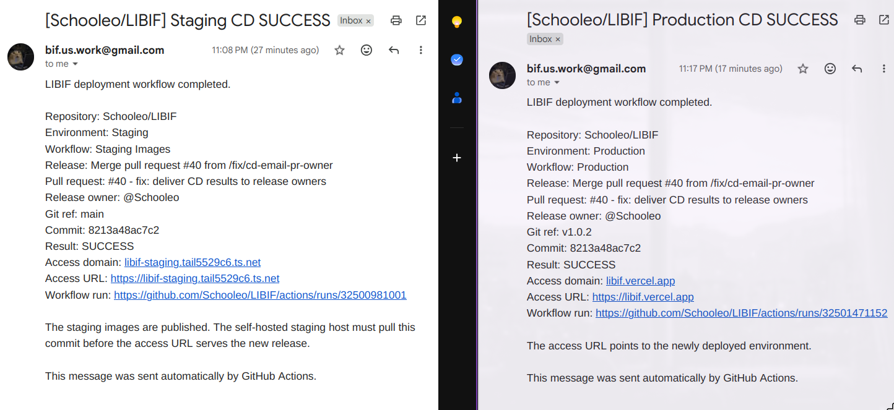

# BẢN IN NỘP KÈM — CONTINUOUS DELIVERY CỦA NHÓM LIBIF

## 1. Kịch bản triển khai

### 1.1 Tạo artifact cho Staging

Workflow **Staging Images** được kích hoạt khi main có commit mới:

    Trigger: push vào main

    API quality gate ─┐
                      ├─ đều SUCCESS → Publish staging images
    Web quality gate ─┘

    GHCR artifacts:
      ghcr.io/schooleo/libif-api:<full-commit-sha>
      ghcr.io/schooleo/libif-migrate:<full-commit-sha>
      ghcr.io/schooleo/libif-web:<full-commit-sha>

Phần publish của workflow dùng đúng commit GitHub:

    images: ghcr.io/${repository_owner}/libif-api
    tags:   ${github.sha}

    images: ghcr.io/${repository_owner}/libif-migrate
    tags:   ${github.sha}

    images: ghcr.io/${repository_owner}/libif-web
    tags:   ${github.sha}

Workflow không ghi tag latest. Full SHA giúp artifact staging bất biến và truy vết đúng commit đã qua CI.

### 1.2 Chọn và triển khai Staging release

Kịch bản chọn release thực hiện các bước:

    release_sha = newest successful Staging Images run on main

    for image in libif-api libif-migrate libif-web:
        docker buildx imagetools inspect \
          ghcr.io/schooleo/${image}:${release_sha}

    nếu thiếu bất kỳ image nào:
        dừng deployment

    ghi release_sha vào LIBIF_STAGING_RELEASE_SHA

Các lệnh vận hành thực tế:

    make staging-pin-main
    make staging-config
    make staging-up
    make staging-funnel
    make staging-ps

Kịch bản **staging-up**:

    1. Tìm full SHA mới nhất đã pass trên main.
    2. Kiểm tra đủ API, migration và Web image.
    3. Validate .env.staging và Compose model.
    4. docker compose pull.
    5. docker compose up --detach --no-build --wait.
    6. Hiển thị Funnel URL để Ops kiểm tra.

Host chỉ cập nhật khi Ops chủ động chạy lệnh; commit main mới không tự thay đổi phiên bản đang UAT.

### 1.3 Kích hoạt Production release

Production chỉ chấp nhận strict semantic version:

    git switch main
    git pull --ff-only
    git tag v1.0.2
    git push origin v1.0.2

Workflow kiểm tra:

    Tag phải khớp: ^v[0-9]+\.[0-9]+\.[0-9]+$
    Tag phải trỏ đúng GITHUB_SHA.
    Commit được tag phải thuộc lịch sử main.

Sau khi validate, API CI và Web CI được chạy lại. Chỉ khi cả hai thành công, các job deploy mới chạy.

### 1.4 Triển khai frontend bằng Vercel CLI

Kịch bản thực tế:

    vercel pull --yes --environment=production

    kiểm tra:
      NEXT_PUBLIC_API_BASE_URL = https://libif.vercel.app
      INTERNAL_API_BASE_URL =
        https://libif-schooleo-prod.eastasia.cloudapp.azure.com

    vercel build --prod
    vercel deploy --prebuilt --prod \
      --meta releaseTag=${version-tag} \
      --meta gitCommitSha=${commit-sha}

Vercel build/deploy Next.js từ source đã qua quality gate. Vercel không kéo libif-web Docker image.

### 1.5 Đóng gói và triển khai backend lên Azure

Workflow publish:

    ghcr.io/schooleo/libif-api:v1.0.2
    ghcr.io/schooleo/libif-migrate:v1.0.2

GitHub Actions đăng nhập Azure bằng OIDC, sau đó dùng Azure VM Run Command để chạy deployment script. Script kiểm tra release:

    LIBIF_RELEASE_TAG phải là vMAJOR.MINOR.PATCH
    LIBIF_RELEASE_SHA phải là full 40-character SHA
    Tag phải resolve đúng SHA được workflow truyền vào
    Không cho hai deployment chạy đồng thời
    Private environment không được còn placeholder

Các lệnh triển khai chính trên VM:

    export LIBIF_API_IMAGE=
      ghcr.io/schooleo/libif-api:${LIBIF_RELEASE_TAG}

    export LIBIF_MIGRATE_IMAGE=
      ghcr.io/schooleo/libif-migrate:${LIBIF_RELEASE_TAG}

    docker compose \
      --env-file /etc/libif/.env.production \
      -f docker-compose.production.yml \
      -f docker-compose.azure.yml \
      config --quiet

    docker compose ... pull \
      postgres redis minio migrate api worker azure-edge

    docker compose ... up \
      --detach --no-build --remove-orphans \
      --wait --wait-timeout 300

    curl --fail --retry 12 \
      https://${LIBIF_API_HOSTNAME}/api/health

Sau health check thành công, script lưu version và full SHA hiện tại để Ops truy vết.

## 2. Kịch bản cấu hình cơ sở dữ liệu

### 2.1 Database schema có version

LIBIF dùng PostgreSQL và Prisma. Các migration thực tế được quản lý theo thứ tự:

    20260717073000_init
    20260720105000_auth_access
    20260721114643_phase5_domain_foundations
    20260722062955_phase6_processing_foundation
    20260723050000_phase6_ocr_privacy_hardening
    20260723143000_phase7_administration_reader_security_foundation
    20260724090000_catalogue_search_text

Mỗi thư mục chứa migration.sql; schema.prisma là mô hình dữ liệu nguồn của ứng dụng.

### 2.2 Migration service trong Staging/Production

    migrate:
      image: libif-migrate:<SHA-hoặc-version>
      command:
        npx prisma migrate deploy \
          --config apps/api/prisma.config.ts
      environment:
        DATABASE_URL: <private PostgreSQL URL>
      depends_on:
        postgres:
          condition: service_healthy
      restart: no

API và worker phụ thuộc kết quả migration:

    api / worker:
      depends_on:
        migrate:
          condition: service_completed_successfully

Luồng triển khai database:

    PostgreSQL healthy
          ↓
    Prisma migrate deploy
          ↓ thành công
    API + OCR worker khởi động

Mục đích là đưa schema database đi cùng application release. Nếu migration lỗi, service mới không được coi là khởi động thành công.

## 3. Cấu hình dịch vụ bên thứ ba

### 3.1 Hợp đồng cấu hình

| Dịch vụ | Cấu hình sử dụng | Mục đích |
|---|---|---|
| GitHub Actions | repository workflows, protected production environment | Chạy CI/CD và lưu execution log |
| GHCR | GitHub token với packages permission | Lưu API, migration và Web images |
| Tailscale Funnel | TAILSCALE_AUTHKEY, TAILSCALE_HOSTNAME | HTTPS public cho Staging/UAT |
| Vercel | VERCEL_TOKEN, VERCEL_ORG_ID, VERCEL_WEB_PROJECT_ID | Build/deploy Next.js frontend |
| Azure | AZURE_CLIENT_ID, TENANT_ID, SUBSCRIPTION_ID, VM_NAME | OIDC và Azure VM deployment |
| Caddy | LIBIF_API_HOSTNAME, LIBIF_ACME_EMAIL | HTTPS/reverse proxy cho Azure API |
| SMTP | SMTP_HOST, PORT, USERNAME, PASSWORD, FROM | Gửi kết quả CI/CD |
| PostgreSQL | DATABASE_URL | Persistent relational database |
| Redis | REDIS_URL | Queue/cache và worker coordination |
| MinIO | S3 endpoint, bucket, access key, secret key | Private PDF/object storage |

### 3.2 Cấu hình Staging đã ẩn secret

    LIBIF_GHCR_NAMESPACE=schooleo
    LIBIF_STAGING_RELEASE_SHA=<full-main-commit-sha>
    LIBIF_STAGING_BASE_URL=https://<node>.<tailnet>.ts.net

    POSTGRES_PASSWORD=<private-secret>
    REDIS_PASSWORD=<private-secret>
    MINIO_ROOT_USER=<private-access-key>
    MINIO_ROOT_PASSWORD=<private-secret>
    TAILSCALE_AUTHKEY=<private-secret>

### 3.3 Cấu hình Production đã ẩn secret

    Frontend origin:
      https://libif.vercel.app

    Azure API origin:
      https://libif-schooleo-prod.eastasia.cloudapp.azure.com

    NEXT_PUBLIC_API_BASE_URL=https://libif.vercel.app
    INTERNAL_API_BASE_URL=https://libif-schooleo-prod.eastasia.cloudapp.azure.com
    LIBIF_WEB_BASE_URL=https://libif.vercel.app

    VERCEL_TOKEN=<GitHub Secret>
    SMTP_PASSWORD=<GitHub Secret>
    AZURE_CLIENT_ID=<protected environment variable>

Browser gọi /api trên Vercel origin; Vercel rewrite request sang Azure backend. Credential thật không được lưu trong Git repository.

## 4. Email kết quả deployment tự động

Email thể hiện:

- Staging hoặc Production environment;
- workflow và release/version;
- PR và release owner;
- git ref, commit và kết quả SUCCESS;
- access domain, access URL và workflow run.

Email Staging ghi rõ image đã được publish và self-hosted host phải pull commit trước khi URL phục vụ release mới. Email Production xác nhận access URL trỏ tới môi trường vừa deploy.

## 5. Hướng dẫn triển khai dành cho kỹ sư vận hành

### 5.1 Triển khai Self-hosted Staging

Chuẩn bị:

1. Bật MagicDNS, HTTPS certificates và Funnel attribute trên Tailscale.
2. Tạo reusable auth key dành riêng cho staging node.
3. Tạo .env.staging từ example, dùng password riêng và chmod 600.
4. Đăng nhập GitHub CLI và GHCR với quyền read:packages nếu package private.

Triển khai:

    make staging-pin-main
    make staging-config
    make staging-up
    make staging-funnel
    make staging-ps

Xác minh:

    curl --fail \
      https://<staging-node>.<tailnet>.ts.net/api/health

Sau đó kiểm tra sign-in, processing, approval, Reader search/page jump, History và administration reporting. Staging chỉ dùng dữ liệu demo, không dùng tài liệu nhạy cảm.

Vận hành:

    make staging-logs
    make staging-ps
    make staging-down

staging-down giữ lại persistent volume và Tailscale identity. Chỉ xóa volume sau khi xác nhận dữ liệu demo không còn cần thiết.

### 5.2 Triển khai Production trên Vercel và Azure

Chuẩn bị một lần:

1. Azure Bicep đã tạo VM, network, disk, public DNS và GitHub OIDC identity.
2. Private environment đã được cài tại /etc/libif/.env.production với mode 600.
3. VM đã đăng nhập GHCR hoặc package được phép đọc.
4. Vercel production variables và GitHub protected environment đã cấu hình.
5. AZURE_DEPLOY_ENABLED chỉ bật sau khi endpoint, credential và environment được xác minh.

Release:

    git switch main
    git pull --ff-only
    git tag v1.0.2
    git push origin v1.0.2

Theo dõi GitHub Actions cho đến khi:

- validate tag và main ancestry đạt;
- API/Web quality gates đạt;
- Vercel deployment thành công;
- GHCR images có đúng version;
- Azure backend health check thành công;
- email CD có đúng production access URL.

Vận hành backend:

    # Xem trạng thái container
    sudo make AZURE_ENV_FILE=/etc/libif/.env.production azure-ps

    # Xem log
    sudo make AZURE_ENV_FILE=/etc/libif/.env.production azure-logs

    # Xem release đang chạy
    sudo cat /var/lib/libif-deploy/current-release

    # Xem full commit SHA
    sudo cat /var/lib/libif-deploy/current-release-sha

Chỉ xác nhận deployment thành công khi workflow, health check và access URL đều đạt; việc image được publish riêng lẻ chưa đủ để kết luận hệ thống đã triển khai thành công.
