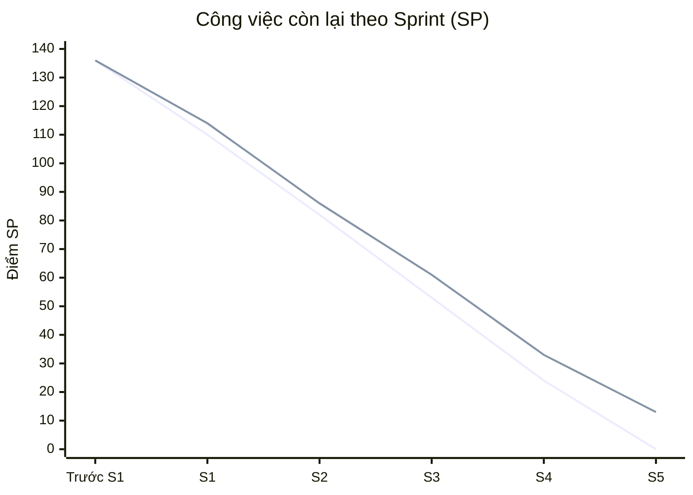

# BIỂU ĐỒ CÔNG VIỆC CÒN LẠI CỦA TOÀN DỰ ÁN

> **Kịch bản giả lập để luyện trình bày — không phải số liệu Trello hoặc nghiệm thu đã xác nhận.** Khi nộp chính thức, thay các giá trị giả lập bằng lịch sử nghiệm thu thực tế.

## Biểu đồ đường



| Đường | Ý nghĩa | Giá trị từ trước S1 đến cuối S5 |
|---|---|---|
| Đường 1 | Kế hoạch | 136 → 110 → 82 → 53 → 24 → 0 |
| Đường 2 | Thực tế giả lập | 136 → 114 → 86 → 61 → 33 → 13 |

Dạng chữ tương ứng:

```text
Kế hoạch: 136 ─ 110 ─ 82 ─ 53 ─ 24 ─ 0
Thực tế : 136 ─ 114 ─ 86 ─ 61 ─ 33 ─ 13
           S0    S1    S2    S3    S4    S5
```

## Dữ liệu dùng để dựng biểu đồ

| Mốc | Phạm vi (SP) | Nghiệm thu trong Sprint (SP) | Còn lại (SP) |
|---|---:|---:|---:|
| Trước S1 | 136 | 0 | 136 |
| Cuối S1 — 20/07/2026 | 136 | 22 | 114 |
| Cuối S2 — 21/07/2026 | 136 | 28 | 86 |
| Cuối S3 — 22/07/2026 | 141 | 30 | 61 |
| Cuối S4 — 23/07/2026 | 141 | 28 | 33 |
| Cuối S5 — 24/07/2026 | 141 | 20 | 13 |

`Số điểm còn lại = phạm vi đã duyệt − tổng điểm PBI đã nghiệm thu lũy kế`.

- Đường cơ sở: **136 SP**; cuối S3 giả định có yêu cầu thay đổi, tăng lên **141 SP**.
- S1–S5 nghiệm thu lần lượt **22, 28, 30, 28, 20 SP**, tổng 128 SP; cuối S5 còn 13 SP công việc chuyển tiếp.
- Ảnh Trello có 17 thẻ `Done`, 5 thẻ `Product Backlog`, các cột khác 0. Số thẻ và 31 bản ghi thời gian/68:10 không thay thế lịch sử nghiệm thu SP.
- Kho mã chưa có lịch sử điểm câu chuyện được Chủ sở hữu sản phẩm nghiệm thu theo Sprint; vì vậy đường thực tế trên chỉ là minh họa.

Nguồn: [Kế hoạch dự án](../../../markdowns-vi-v2/LIBIF-Project-Planning.md), ảnh Trello và tệp PDF ghi nhận thời gian trong thư mục hồ sơ.
