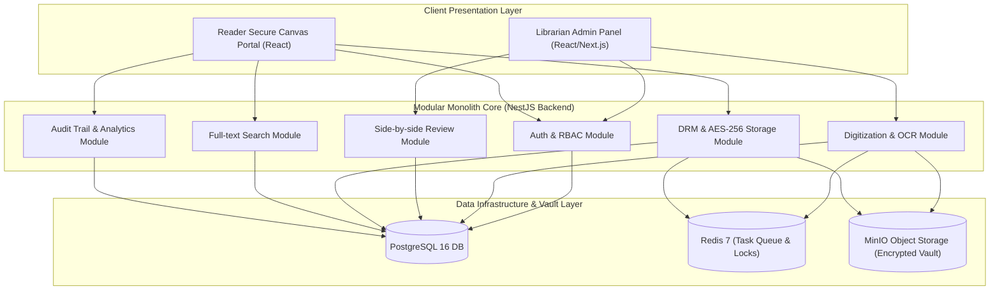
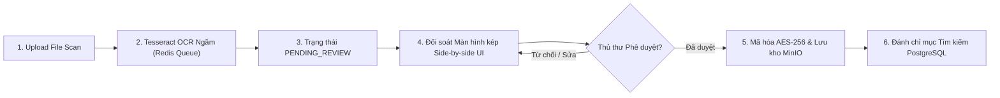
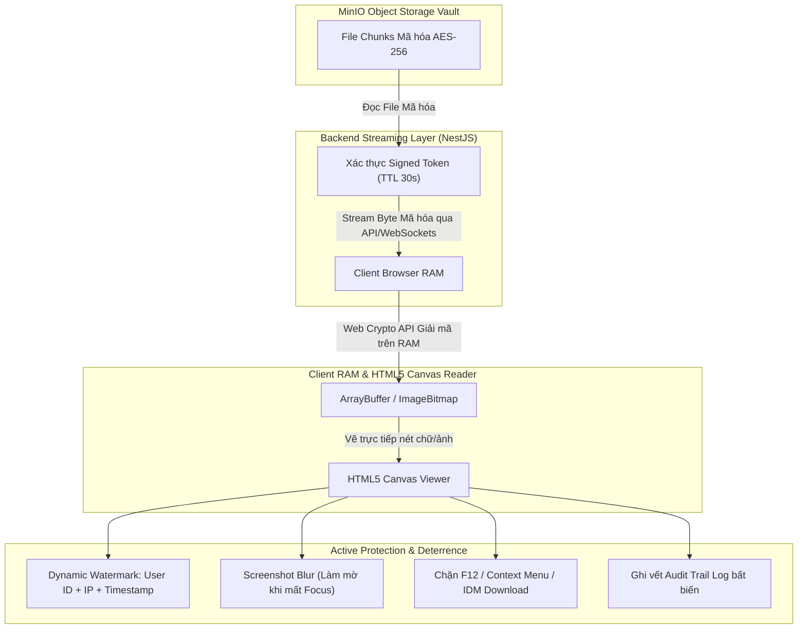

# TÀI LIỆU KIẾN TRÚC HỆ THỐNG PHẦN MỀM (SOFTWARE ARCHITECTURE DOCUMENT)

**Tên dự án:** Hệ thống Thư viện Số Thương mại & Quản lý Bản quyền Số (Commercial Digital Library System)  
**Tên tài liệu:** `docs/markdowns-vi-v2/LIBIF-Architecture.md`  
**Mã kiến trúc:** CDLS-ARCH-2026  
**Nguồn chiếu chính (Source of Truth):**  
- Tài liệu Product Backlog chính thức (`docs/markdowns-vi-v2/LIBIF-Product-Backlog.md` - 16 PBIs)  
- Tài liệu Chứng minh Khả thi (`docs/markdowns-vi-v2/LIBIF-Proof-Of-Concept.md` - OCR tiếng Việt bất đồng bộ)
- Tuyên bố Phạm vi Công việc SOW (`docs/markdowns-vi-v2/LIBIF-Statement-Of-Work.md`)  
**Đội ngũ thực hiện:** 06 Sinh viên năm 4 (Chuyên ngành CNTT / Antigravity AI Assistant)  
**Ngôn ngữ tài liệu:** Tiếng Việt  
**Tình trạng:** Bản Thiết kế Kiến trúc Thống nhất (Approved Master Architecture)  

---

## 1. Loại hình Ứng dụng & Định hướng Kiến trúc (Application Type & Overview)

**LIBIF (CDLS)** là một **Ứng dụng Web Doanh nghiệp Thương mại (Enterprise Commercial Web Application)** kết hợp kiến trúc **Modular Monolith** và cơ chế **Bảo mật Bản quyền Số đa lớp (Multi-layered DRM)**:

* **Trang Quản trị Thủ thư (Librarian Admin Panel):** Cổng thông tin nghiệp vụ nội bộ phục vụ thủ thư upload gói file scan, theo dõi hàng chờ Tesseract OCR, thực hiện **kiểm duyệt đối soát Side-by-side (Ảnh gốc vs Văn bản OCR)**, biên mục dữ liệu Dublin Core và phê duyệt xuất bản.
* **Cổng Độc giả & Trình đọc An toàn (Reader Portal & Secure Canvas Viewer):** Cổng tra cứu tìm kiếm toàn văn và đọc sách trực tuyến cho độc giả trên **HTML5 Canvas Reader** (mã hóa stream RAM-only, chặn tải file gốc, nhúng Watermark động và răn đe chụp màn hình).

---

## 2. Lựa chọn Kiến trúc Tổng thể: Modular Monolith

Hệ thống thống nhất áp dụng mô hình kiến trúc **Modular Monolith** nhằm tối ưu hóa chi phí vận hành cho hạ tầng sinh viên và đảm bảo hiệu năng cao:

| Phương án Đánh giá | Ưu điểm cốt lõi | Lý do Lựa chọn & Đóng gói |
| :--- | :--- | :--- |
| **Modular Monolith (Quyết định)** | • Triển khai đơn giản qua Docker Container trên Azure for Students, Vercel và staging qua Tailscale Funnel với chi phí tiền mặt 0 VNĐ. • Gọi hàm nội bộ (in-process), hiệu năng cao. • Ranh giới miền (Domain Modules) tách biệt sạch sẽ, sẵn sàng nâng cấp lên Microservices khi quy mô lớn. | ✅ **Phù hợp $100\%$ với tiến độ 10 tuần của 06 sinh viên năm 4 và hệ thống hiện có.** |
| **Microservices** | • Mở rộng độc lập cho từng dịch vụ OCR/DRM. | ❌ Quá phức tạp về hạ tầng, gây độ trễ mạng RPC và tốn kém chi phí máy chủ không cần thiết. |

---

## 3. Mô hình Xử lý Dữ liệu Số hóa & OCR (Pipe & Filter with Human-in-the-loop)

Quy trình số hóa sách trải qua mô hình dòng dữ liệu **Pipe & Filter** kết hợp với bước dừng kiểm duyệt đối soát bắt buộc của Thủ thư trước khi mã hóa lưu kho:

### Chi tiết các bước trong Pipeline:
1. **Filter 1 - Tiếp nhận & Tiền xử lý (Upload):** Tiếp nhận gói file PDF/Ảnh scan thô từ máy quét, kiểm tra định dạng và lưu tạm vào MinIO Temp Bucket.
2. **Filter 2 - Tesseract OCR Ngầm (Async Worker):** Trích xuất văn bản Tiếng Việt (`vie`) và tọa độ Bounding Box của từng từ thông qua hàng chờ **Redis + BullMQ**.
3. **Filter 3 - Kiểm duyệt Màn hình kép (Side-by-side Review UI):** Hiển thị giao diện đối soát 2 màn hình cho Thủ thư kiểm tra và chỉnh sửa trực tiếp. Dữ liệu chuyển sang trạng thái `APPROVED`.
4. **Filter 4 - Mã hóa AES-256 & Lưu kho MinIO:** Sách đã duyệt được mã hóa thuật toán **AES-256-GCM** theo từng phân đoạn (Chunks/Pages) và lưu vĩnh viễn vào **MinIO Object Storage Encrypted Vault**.
5. **Filter 5 - Đánh chỉ mục Toàn văn:** Nạp dữ liệu văn bản đã chuẩn hóa vào bộ chỉ mục tìm kiếm `tsvector` trong **PostgreSQL 16**.

---

## 4. Mô hình Bảo mật Bản quyền Số (Zero-Download Canvas DRM Architecture)

Để giải quyết bài toán chống rò rỉ file gốc trên môi trường Web, hệ thống triển khai kiến trúc bảo mật 4 lớp khép kín:

### Các Lớp Bảo mật Chi tiết:
* **Lớp 1 - Lưu trữ Mã hóa MinIO:** File gốc không tồn tại ở dạng `.pdf` mở trên máy chủ. Mọi tài sản được mã hóa khóa AES-256 riêng biệt trước khi lưu vào MinIO.
* **Lớp 2 - Truyền tải Không lộ URL (Zero-Presigned URL):** Không cấp đường dẫn Presigned URL tĩnh của MinIO ra ngoài Client. Backend cấp **Single-use Signed Token (TTL 30s)** và đẩy trực tiếp luồng byte mã hóa về Client.
* **Lớp 3 - Giải mã trên RAM & Render Canvas:** Trình duyệt nhận luồng byte, dùng **Web Crypto API** giải mã trực tiếp trên bộ nhớ RAM và vẽ nét hiển thị đè lên **HTML5 Canvas Element**. Cây DOM hoàn toàn không chứa tag ``, `<embed>` hay link Blob.
* **Lớp 4 - Bảo vệ Răn đe & Nhật ký:** Nhúng mờ Watermark chứa `User ID + IP + Timestamp` phủ kín Canvas; tự động kích hoạt `blur-protection` khi bấm PrintScreen hoặc chuyển ứng dụng; ghi nhật ký **Audit Trail Log** bất biến vào PostgreSQL.

---

## 5. Danh mục Công nghệ Sử dụng (Tech Stack)

| Tầng Kiến trúc | Công nghệ Lựa chọn | Trạng thái Hiện có & Tích hợp | Lý do Kỹ thuật & Tối ưu |
| :--- | :--- | :---: | :--- |
| **Frontend UI** | React.js / Next.js, HTML5 Canvas API | **Sẵn có / Nâng cấp** | Render giao diện nhanh, tương thích tốt với Canvas DRM và Web Crypto API. |
| **Backend API** | NestJS (Node.js / TypeScript) | **Sẵn có** | Kiến trúc Modular Monolith chuẩn mực, dễ bảo trì và phân rã mô-đun. |
| **Cơ sở Dữ liệu** | PostgreSQL 16 | **Sẵn có** | Lưu trữ quan hệ ACID, hỗ trợ tìm kiếm toàn văn tiếng Việt qua `tsvector`. |
| **Hàng chờ Tác vụ**| Redis 7 + BullMQ | **Sẵn có** | Điều phối hàng chờ OCR ngầm, quản lý khóa đồng thời (Redis Lock) đếm phiên đọc. |
| **Lưu trữ Kho số** | **MinIO Object Storage** | **Sẵn có** | **Lưu trữ đối tượng chuẩn S3 (Self-hosted), đóng vai trò Mã hóa Vault AES-256.** |
| **AI / OCR Engine** | Tesseract OCR Engine (`vie`) | **Sẵn có** | Engine OCR mã nguồn mở hiệu năng cao, không tốn chi phí bản quyền API. |
| **Đóng gói Triển khai**| Docker & Docker Compose | **Sẵn có** | Đóng gói toàn bộ hệ thống (NestJS, PostgreSQL, Redis, MinIO) chạy trên 01 VPS. |

---

## 6. Thuộc tính Chất lượng Kiến trúc (Quality Attributes)

1. **Tính Bảo mật (Security & DRM):** Triệt tiêu $100\%$ khả năng bắt link file gốc bằng IDM/F12; có bằng chứng vết Watermark định danh độc giả khi xảy ra sự cố rò rỉ.
2. **Khả năng Tương thích Hạ tầng Sẵn có:** Tận dụng $100\%$ hạ tầng **MinIO, NestJS, PostgreSQL, Redis** hiện có của nhóm, giúp tiết kiệm $80\%$ nỗ lực tái cấu trúc.
3. **Hiệu năng & Tốc độ Phản hồi:** Thời gian giải mã RAM và render trang sách trên Canvas $< 50\text{ ms/trang}$; thời gian phản hồi tìm kiếm toàn văn $< 2\text{ giây}$.
4. **Khả năng Mở rộng (Scalability):** Mô hình Redis + BullMQ giúp tách rời tải xử lý OCR khỏi luồng xử lý HTTP request của độc giả, giữ hệ thống luôn mượt mà.

---
> **Xác nhận:** Tài liệu Thiết kế Kiến trúc Hệ thống (LIBIF-Architecture.md) đã được cập nhật chuẩn xác, tích hợp hoàn hảo hạ tầng MinIO hiện có với mô hình mã hóa lưu kho AES-256, Giao diện đối soát Side-by-side UI và Trình đọc HTML5 Canvas DRM.
