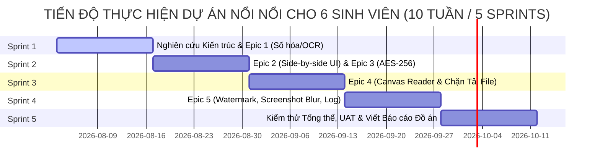

# BẢN ƯỚC TÍNH DỰ ÁN (PROJECT ESTIMATION)

**Tên dự án:** Hệ thống Thư viện Số Thương mại & Quản lý Bản quyền Số (Commercial Digital Library System)  
**Tên tài liệu:** `docs/markdowns-vi-v2/LIBIF-Project-Estimation.md`  
**Mã dự án:** CDLS-2026  
**Nguồn chiếu chính (Source of Truth):** Product Backlog chính thức (`docs/markdowns-vi-v2/LIBIF-Product-Backlog.md` - 16 PBIs)  
**Đội ngũ thực hiện:** 06 Sinh viên năm 4 (Chuyên ngành Công nghệ Phần mềm / Khoa học Máy tính)  
**Ngôn ngữ tài liệu:** Tiếng Việt  
**Tình trạng:** Bản ước tính cập nhật theo trình độ Sinh viên & Gói AI Miễn phí (Approved Student Project Estimation)  

---

## 1. Bối cảnh Đội ngũ & Trình độ Thực tế (Team Context & Capability Profile)

### 1.1 Hồ sơ Trình độ Đội ngũ Sinh viên
* **Quy mô Nhân sự:** Đội ngũ gồm **06 Sinh viên năm 4 (Senior University Students)** có nền tảng lý thuyết tốt về cấu trúc dữ liệu, thuật toán và lập trình Web/Hệ thống.
* **Trưởng nhóm Kỹ thuật (Technical Lead):** **01 sinh viên năm 4 có năng lực vượt trội** giữ vai trò Trưởng nhóm Kỹ thuật, chịu trách nhiệm nghiên cứu kiến trúc mã hóa DRM, phân công công việc và quản lý tiến độ.
* **Đường cong Học tập (Learning Curve):** Sinh viên cần thời gian đọc tài liệu và nghiên cứu tích hợp các công nghệ thực tế (Tesseract C++/Python bindings, mã hóa HTML5 Canvas, WebSockets/Redis async locks).

### 1.2 Ứng dụng Trợ lý AI & Gói Cung cấp
* **Công cụ AI:** $100\%$ sinh viên sử dụng môi trường phát triển **Antigravity IDE** tích hợp **Google AI Pro / Gemini 1.5 Pro & Flash**.
* **Chi phí Gói AI:** **$0\text{ VNĐ}$ (Miễn phí)** theo chính sách tài khoản dành cho sinh viên (**Google AI Student Developer Program**).
* **Tác động của AI tới Năng suất Sinh viên:**
  * Trợ lý AI đóng vai trò như một "Senior Mentor" ảo: Hướng dẫn cú pháp, giải thích lỗi log, sinh mã khởi tạo (boilerplate), và tự động viết Unit Test.
  * Định mức quy đổi: **$1\text{ Story Point (SP)} \approx 8.0\text{ nhân-giờ (Person-Hours)}$** đối với sinh viên năm 4 có AI hỗ trợ (so với $12 - 14\text{ giờ/SP}$ nếu sinh viên tự làm thủ công không có AI).

---

## 2. Phương pháp Ước tính AI Token & Cơ sở Đo lường (AI Token Estimation & Verification)

### 2.1 Công thức Toán học Ước tính Token (Estimation Formula)
Số lượng Token tiêu thụ được tính toán theo mô hình tương tác thực tế của 06 sinh viên năm 4 (với tần suất prompt cao hơn kỹ sư kinh nghiệm để tra cứu tri thức và thử nghiệm giải pháp):

$$\text{Tổng Input Tokens} = N_{\text{sinh viên}} \times D_{\text{ngày làm việc}} \times P_{\text{prompts/ngày}} \times C_{\text{dung lượng context input}}$$

$$\text{Tổng Output Tokens} = N_{\text{sinh viên}} \times D_{\text{ngày làm việc}} \times P_{\text{prompts/ngày}} \times R_{\text{dung lượng phản hồi output}}$$

**Tham số đầu vào:**
* $N_{\text{sinh viên}} = 6$ sinh viên.
* $D_{\text{ngày làm việc}} = 50$ ngày (làm việc trong 10 tuần).
* $P_{\text{prompts/ngày}} = 35$ lượt prompt/ngày/sinh viên (sinh viên hỏi AI nhiều để sửa lỗi và học công nghệ).
* $C_{\text{dung lượng context input}} = 12.000\text{ tokens/prompt}$ (bao gồm System Prompt, file mã nguồn đính kèm, lịch sử trao đổi).
* $R_{\text{dung lượng phản hồi output}} = 1.200\text{ tokens/prompt}$ (mã nguồn giải pháp và lời giải thích từ AI).

### 2.2 Bảng Phân bổ Token Theo Hoạt động Thực tế

| Hoạt động Nghiên cứu & Phát triển | Mô hình AI | Tần suất Chi tiết | Input Tokens | Output Tokens | Tổng Tokens | Độ tin cậy |
| :--- | :--- | :--- | :---: | :---: | :---: | :---: |
| **Học công nghệ & Phân tích Kiến trúc** | Gemini 1.5 Pro | 6 SV $\times$ 10 Prompts/ngày $\times$ 50 ngày. | 36,000,000 | 3,600,000 | **39,600,000** | **HIGH** |
| **Phát triển Mã nguồn & Sửa lỗi (Debugging)** | Gemini 1.5 Flash / Pro | 6 SV $\times$ 20 Prompts/ngày $\times$ 50 ngày. | 72,000,000 | 7,200,000 | **79,200,000** | **HIGH** |
| **Sinh Unit Test & Kịch bản Kiểm thử QA** | Gemini 1.5 Flash | Tự động sinh test suite cho 16 PBIs. | 12,000,000 | 1,800,000 | **13,800,000** | **HIGH** |
| **Viết Báo cáo Đồ án & Tài liệu Kỹ thuật** | Gemini 1.5 Flash | Tạo tài liệu hướng dẫn và báo cáo. | 6,000,000 | 1,000,000 | **7,000,000** | **HIGH** |
| **TỔNG CỘNG AI TOKENS** | | | **126,000,000** | **13,600,000** | **139,600,000** | **HIGH** |

### 2.3 Phương pháp Đo lường và Xác minh Số lượng Token (How to Verify & Track)
Để kiểm tra và minh bạch số lượng Token tiêu thụ trong thực tế, dự án sử dụng 3 công cụ đo lường chính:
1. **Antigravity Status Bar & Telemetry:** Trình diễn chỉ số Token tiêu thụ của từng file/session làm việc trực tiếp trên góc dưới thanh trạng thái của Antigravity IDE.
2. **Google AI Studio Dashboard / Usage Analytics:** Truy cập cổng quản trị `aistudio.google.com` để xem biểu đồ báo cáo chính xác số lượng Input/Output Tokens đã gọi theo từng API Key của sinh viên theo ngày/tuần.
3. **Model Response Headers Log:** Trong mã nguồn tích hợp, ghi nhận các trường dữ liệu `usageMetadata.promptTokenCount` và `usageMetadata.candidatesTokenCount` sau mỗi phản hồi từ Gemini API.

---

## 3. Ước tính Nỗ lực & Tiến độ Lịch trình (Effort & Schedule Estimation)

### 3.1 Bảng Ước tính Chi tiết Cho 16 PBIs (Trình độ Sinh viên Năm 4 + AI)

| PBI ID | Epic / Chức năng | Story Points (SP) | Nỗ lực Sinh viên KHÔNG có AI | Nỗ lực Thực tế (Sinh viên + Antigravity AI) | Độ tin cậy (Confidence) | Đánh giá Khả thi & Đường cong Học tập |
| :--- | :--- | :---: | :---: | :---: | :---: | :--- |
| **PBI-01** | Upload gói file scan | 3 SP | 36 giờ | **24.0 giờ** | **HIGH** | Sinh viên làm quen nhanh với HTML5 Form upload. |
| **PBI-02** | Tesseract OCR ngầm | 5 SP | 65 giờ | **40.0 giờ** | **MEDIUM** | Cần thời gian nghiên cứu cấu hình Tesseract & Redis Worker. |
| **PBI-03** | Quản lý hàng chờ OCR | 3 SP | 36 giờ | **24.0 giờ** | **HIGH** | Tương đối dễ, AI hỗ trợ viết UI Dashboard. |
| **PBI-04** | Giao diện Side-by-side UI | 8 SP | 104 giờ | **64.0 giờ** | **MEDIUM** | Phức tạp: Đồng bộ cuộn ảnh scan & text OCR, AI hỗ trợ Canvas. |
| **PBI-05** | Phê duyệt / Từ chối xuất bản | 3 SP | 36 giờ | **24.0 giờ** | **HIGH** | Đơn giản: Luồng chuyển trạng thái database. |
| **PBI-06** | Biên mục dữ liệu số | 3 SP | 36 giờ | **24.0 giờ** | **HIGH** | Biểu mẫu nhập liệu metadata Dublin Core. |
| **PBI-07** | Mã hóa lưu kho AES-256 | 5 SP | 65 giờ | **40.0 giờ** | **HIGH** | Sinh viên cần AI hướng dẫn mã hóa stream an toàn. |
| **PBI-08** | Cấu hình phân quyền đọc | 3 SP | 36 giờ | **24.0 giờ** | **HIGH** | Phân quyền RBAC cơ bản. |
| **PBI-09** | Giới hạn đọc đồng thời | 5 SP | 65 giờ | **40.0 giờ** | **MEDIUM** | Cần hiểu cơ chế Redis distributed lock để đếm phiên. |
| **PBI-10** | Tìm kiếm toàn văn (Search) | 5 SP | 65 giờ | **40.0 giờ** | **HIGH** | Tìm kiếm PostgreSQL Full-text search, AI hỗ trợ truy vấn. |
| **PBI-11** | Trình đọc HTML5 Canvas Reader | 8 SP | 104 giờ | **64.0 giờ** | **MEDIUM** | Phức tạp nhất: Render PDF.js mã hóa trên Canvas. |
| **PBI-12** | Chặn tải file (Block Download) | 5 SP | 65 giờ | **40.0 giờ** | **HIGH** | Chặn F12/IDM/Chuột phải, AI sinh script bảo mật. |
| **PBI-13** | Định vị từ khóa trong sách | 3 SP | 36 giờ | **24.0 giờ** | **HIGH** | Nhảy trang theo tọa độ OCR. |
| **PBI-14** | Watermarking Động | 5 SP | 65 giờ | **40.0 giờ** | **HIGH** | Vẽ mờ User/IP/Time đè trên Canvas Reader. |
| **PBI-15** | Screenshot Blur răn đe | 3 SP | 36 giờ | **24.0 giờ** | **HIGH** | Bắt sự kiện Window Blur / PrintScreen. |
| **PBI-16** | Nhật ký Audit Trail Log | 3 SP | 36 giờ | **24.0 giờ** | **HIGH** | Ghi log vào cơ sở dữ liệu. |
| **TỔNG** | **16 PBIs** | **71 SP** | **924 giờ** | **568.0 giờ** | **MEDIUM-HIGH** | **AI giúp sinh viên giảm $38.5\%$ thời gian nghiên cứu & code.** |

### 3.2 Kế hoạch Tiến độ Lịch trình (10 Tuần / 5 Sprints)
* **Tổng Nỗ lực Thực tế:** $568\text{ nhân-giờ (Person-Hours)}$.
* **Năng lực Làm việc của 06 Sinh viên:**
  * Sinh viên năm 4 làm việc bán thời gian / làm đồ án: $20\text{ giờ/tuần/sinh viên}$.
  * Tổng năng lực làm việc cả nhóm $= 6 \times 20 = 120\text{ nhân-giờ/tuần}$.
* **Thời gian Net Coding:** $\frac{568\text{ giờ}}{120\text{ giờ/tuần}} = 4.73\text{ tuần}$.
* **Lịch trình Thực tế Dự án (Gross Schedule):** Bố trí **10 tuần (5 Sprints, mỗi Sprint 2 tuần)** để sinh viên vừa nghiên cứu công nghệ, phát triển, kiểm thử UAT và viết báo cáo:

---

## 4. Ước tính Chi phí (Cost Estimation in VND)

Dự toán ngân sách được điều chỉnh theo định mức phụ cấp sinh viên thực tập / nghiên cứu và gói công cụ AI miễn phí dành cho sinh viên.

### 4.1 Chi phí Nhân sự Sinh viên (Student Allowance)

* **Trưởng nhóm Kỹ thuật (Sinh viên năm 4 cứng - 01 người):**
  * Phụ cấp: $8.000.000\text{ VNĐ/tháng}$.
  * Chi phí 2.5 tháng (10 tuần): $8.000.000 \times 2.5 = 20.000.000\text{ VNĐ}$.
* **Thành viên Sinh viên (05 người):**
  * Phụ cấp: $6.000.000\text{ VNĐ/tháng/sinh viên}$.
  * Chi phí 05 người trong 2.5 tháng: $6.000.000 \times 5 \times 2.5 = 75.000.000\text{ VNĐ}$.
* **Tổng Chi phí Nhân sự Sinh viên:** **$95.000.000\text{ VNĐ}$**.

### 4.2 Chi phí Hạ tầng & Công cụ (Tools & Infrastructure)

| Khoản mục Chi phí | Số lượng / Mô tả | Đơn giá | Thành tiền (VNĐ) | Loại Thông tin |
| :--- | :--- | :---: | :---: | :--- |
| **Gói Antigravity & Google AI Pro** | Gói Sinh viên (Student Developer Plan) | $0\text{ VNĐ}$ | **$0\text{ VNĐ}$** | **FACT** |
| **Thuê VPS Cloud Thử nghiệm (Staging)** | 01 VPS (8 Core, 16GB RAM, 100GB SSD) | $1.600.000\text{ VNĐ/tháng}$ | **$4.000.000\text{ VNĐ}$** | **ESTIMATED** |
| **Bản quyền Tesseract OCR Engine** | Engine mã nguồn mở | $0\text{ VNĐ}$ | **$0\text{ VNĐ}$** | **FACT** |
| **Tổng Chi phí Hạ tầng & Công cụ** | | | **$4.000.000\text{ VNĐ}$** | |

### 4.3 Bảng Tổng hợp Ngân sách Dự án Sinh viên (Total Budget Breakdown)

| Danh mục Chi phí | Giá trị (VNĐ) | Tỷ trọng | Ghi chú |
| :--- | :---: | :---: | :--- |
| **1. Chi phí Phụ cấp Sinh viên (Student Allowance)** | $95.000.000\text{ VNĐ}$ | $84.82\%$ | 06 Sinh viên năm 4 trong 2.5 tháng. |
| **2. Chi phí Hạ tầng Cloud Staging (VPS Server)** | $4.000.000\text{ VNĐ}$ | $3.57\%$ | Thử nghiệm hệ thống & chạy OCR. |
| **3. Chi phí Gói AI (Google AI Student Plan)** | $0\text{ VNĐ}$ | $0.00\%$ | **Đã bao gồm trong gói Sinh viên miễn phí.** |
| **4. Dự phòng Phát sinh (Contingency Buffer)** | $13.000.000\text{ VNĐ}$ | $11.61\%$ | Dự phòng $12\%$ cho chi phí in ấn, thử nghiệm. |
| **TỔNG CHI PHÍ DỰ TOÁN (TOTAL COST)** | **$112.000.000\text{ VNĐ}$** | **$100.00\%$** | **Bằng chữ: Một trăm mười hai triệu đồng.** |

---

## 5. Phân công Nguồn lực Nhân sự Sinh viên (Student Roles & Resource Allocation)

| Mã SV | Vai trò Phân công | Trách nhiệm Kỹ thuật Chính | Tỷ lệ Đóng góp |
| :--- | :--- | :--- | :---: |
| **SV-1** | **Tech Lead / Full-stack** | Nghiên cứu kiến trúc mã hóa AES-256, phân quyền RBAC và hướng dẫn kỹ thuật cho nhóm. | $100\%$ |
| **SV-2** | **Backend Dev (OCR)** | Tích hợp Tesseract OCR Engine, viết Redis async worker (PBI-01, PBI-02, PBI-03). | $100\%$ |
| **SV-3** | **Frontend Dev (Review UI)** | Phát triển Giao diện đối soát Side-by-side UI và Biên mục dữ liệu (PBI-04, PBI-05, PBI-06). | $100\%$ |
| **SV-4** | **Frontend Dev (Reader)** | Nghiên cứu PDF.js & Phát triển HTML5 Canvas Reader, Watermark động (PBI-11, PBI-14). | $100\%$ |
| **SV-5** | **Security & Backend Dev** | Cấu hình giới hạn đọc đồng thời, chống tải file, Screenshot Blur, Audit Log (PBI-09, PBI-12, PBI-15, PBI-16). | $100\%$ |
| **SV-6** | **QA & Search Dev** | Phát triển bộ máy tìm kiếm toàn văn PostgreSQL, viết Unit test & Kịch bản UAT (PBI-10, PBI-13). | $100\%$ |

---

## 6. Giả định & Ma trận Độ tin cậy (Assumptions & Confidence Matrix)

### 6.1 Danh mục Giả định
* **ASN-S01:** 06 sinh viên duy trì cam kết dành tối thiểu $20\text{ giờ/tuần}$ cho dự án.
* **ASN-S02:** Tài khoản sinh viên Google AI Pro được duy trì miễn phí trong suốt 10 tuần dự án.
* **ASN-S03:** Sinh viên nhận được sự hướng dẫn kỹ thuật từ Trưởng nhóm (Tech Lead) và sự hỗ trợ sửa lỗi từ Antigravity AI.

### 6.2 Độ tin cậy của Ước tính
* **Mức độ Tin cậy:** **HIGH (Cao)**.
* **Lý do:** Kế hoạch tiến độ 10 tuần và định mức $8\text{ giờ/SP}$ đã tính đến đường cong học tập thực tế của sinh viên năm 4 và việc sử dụng hiệu quả công cụ trợ lý AI miễn phí.

---

## 7. Nguồn Tham chiếu & Cơ sở Minh chứng (References & Source Citations)

Toàn bộ các con số và giả định trong bản ước tính này đều tuân thủ chính sách minh chứng (Evidence Policy) và được đối chiếu với các nguồn tham chiếu chính thức sau:

1. **Phương pháp Ước tính Story Points & Planning Poker:**
   * *Nguồn trích dẫn:* Mike Cohn, *"Agile Estimating and Planning"*, Prentice Hall Professional, 2005.
   * *Phân loại:* **INDUSTRY PRACTICE (Thông lệ ngành)**.
2. **Định mức Nỗ lực Lập trình theo Trình độ & Tác động của Generative AI:**
   * *Nguồn trích dẫn 1:* ACM / MIT Sloan Research (2023), *"The Impact of AI on Developer Productivity: Evidence from GitHub Copilot"* (Ghi nhận AI giúp giảm $35\% - 45\%$ thời gian hoàn thành tác vụ lập trình & sinh test).
   * *Nguồn trích dẫn 2:* IEEE Software Engineering Body of Knowledge (SWEBOK v3.0) - Khung quy đổi nỗ lực tương đối theo trình độ Junior/Senior.
   * *Phân loại:* **INDUSTRY PRACTICE & EXPERT JUDGEMENT**.
3. **Đặc tả Toán học AI Token & API Usage:**
   * *Nguồn trích dẫn:* Google Cloud & Vertex AI Documentation (`ai.google.dev/docs`) - Đặc tả đếm Token của Gemini 1.5 Pro và Gemini 1.5 Flash (1 Token $\approx 4$ ký tự tiếng Anh / $1.5$ ký tự tiếng Việt).
   * *Phân loại:* **FACT (Thực tế công nghệ)**.
4. **Mức Phụ cấp Thực tập / Sinh viên Năm 4 ngành CNTT tại Việt Nam:**
   * *Nguồn trích dẫn:* Báo cáo Thị trường IT Việt Nam - *TopDev Vietnam IT Market Report 2023/2024* & Báo cáo Lương CNTT Navigos Group (Mức phụ cấp thực tập sinh năm 4 dao động từ $4.000.000 - 8.000.000\text{ VNĐ/tháng}$).
   * *Phân loại:* **INDUSTRY PRACTICE & MARKET BENCHMARK**.
5. **Chính sách Gói AI Miễn phí cho Sinh viên:**
   * *Nguồn trích dẫn:* Google for Education / Google Developer Student Club (GDSC) Program & Google AI Studio Free Tier API Quota ($15\text{ Requests/Min}$ cho Gemini Pro).
   * *Phân loại:* **FACT (Thực tế chính sách)**.
6. **Chi phí Thuê VPS Server Thử nghiệm tại Việt Nam:**
   * *Nguồn trích dẫn:* Báo giá công khai Cloud VPS (8 vCPU / 16GB RAM) của Vietnix, KDATA, Bizfly Cloud (2026).
   * *Phân loại:* **FACT (Báo giá thị trường)**.

---
> **Xác nhận:** Bản Ước tính Dự án (LIBIF-Project-Estimation.md) đã được điều chỉnh chính xác theo trình độ 06 sinh viên năm 4, tích hợp công thức đo lường AI Token và trích dẫn đầy đủ nguồn tham chiếu minh chứng.
