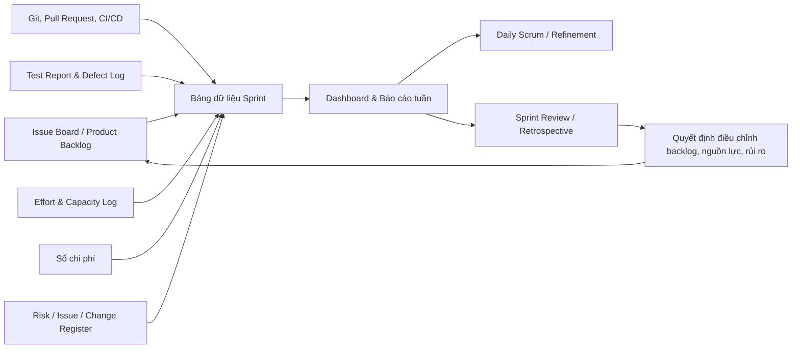

# KẾ HOẠCH GIÁM SÁT DỰ ÁN (PROJECT MONITORING PLAN)

| Thuộc tính | Giá trị |
| :--- | :--- |
| Tên dự án | Hệ thống Thư viện Số & Quản lý Bản quyền Số (LIBIF/CDLS) |
| Bối cảnh | Đồ án nhóm trong học phần Quản lý Dự án Phần mềm |
| Tên tài liệu | `docs/markdowns-vi-v2/LIBIF-Project-Monitoring.md` |
| Mã dự án | CDLS-2026 |
| Phương pháp phát triển | Scrum, 05 Sprint × 02 tuần |
| Quy mô nhóm | 06 sinh viên, có Coding Agent hỗ trợ xuyên suốt |
| Baseline tham chiếu | Estimation v2.0, Project Planning v1.0 và Statement of Work v1.0 |
| Phiên bản tài liệu | 1.0 |
| Ngày lập | 12/08/2026 |
| Trạng thái | Kế hoạch đề xuất để nhóm và giảng viên sử dụng |

---

## 1. Mục đích và Phạm vi Giám sát

Tài liệu này xác định cách nhóm **thu thập, kiểm tra, tổng hợp và sử dụng dữ liệu** để theo dõi LIBIF trong 10 tuần học. Mục đích của giám sát là giúp nhóm nhận biết sớm chênh lệch so với baseline, điều chỉnh Sprint Backlog và cung cấp bằng chứng thực hành quản lý dự án cho học phần.

Giám sát bao phủ năm nhóm dữ liệu:

1. Phạm vi và tiến độ Sprint.
2. Capacity, effort và mức độ đóng góp.
3. Chất lượng mã nguồn, kiểm thử và mức sẵn sàng demo.
4. Chi phí tiền mặt, rủi ro, issue và thay đổi.
5. Việc sử dụng Coding Agent theo nguyên tắc học thuật và bảo mật.

Kế hoạch không dùng dữ liệu để giám sát cá nhân một cách máy móc hoặc thay thế đánh giá chuyên môn của giảng viên. Số liệu cá nhân chỉ nhằm cân bằng tải, phát hiện blocker và bảo đảm đóng góp minh bạch.

---

## 2. Baseline Dùng để So sánh

| Thành phần | Baseline |
| :--- | :--- |
| Thời gian | 10 tuần học, 05 Sprint × 02 tuần |
| Scope | 16 PBIs + 03 enablers = 136 SP |
| Must Have | 13 PBI = 104 SP tính năng |
| Scope co giãn | PBI-03, PBI-13, PBI-15 = 13 SP |
| Capacity | 06 sinh viên × 15 giờ/tuần = 90 giờ/tuần |
| Effort danh nghĩa | 900 giờ-người |
| Effort tập trung | 765 giờ-người |
| Ngân sách tiền mặt | 0 VNĐ (Toàn bộ sử dụng Azure for Students, AI free-tier và tài nguyên sẵn có) |
| Chi phí nhân công | 0 VNĐ (quản lý bằng 900 giờ-người) |
| Ngưỡng velocity | Sau Sprint 2, cần trung bình tối thiểu 24 SP/Sprint |

Mọi chỉ số trong tài liệu này phải ghi rõ đang so sánh với baseline nào. Nếu baseline được thay đổi theo quy trình Change Control, dashboard và báo cáo kỳ tiếp theo phải dùng baseline mới và lưu lịch sử thay đổi.

---

## 3. Nguyên tắc Thu thập Dữ liệu

- **Một nguồn chuẩn cho mỗi loại dữ liệu:** backlog/issue board cho công việc; Git và CI cho mã/test; sổ chi phí cho tiền mặt; Risk/Issue/Change Register cho quản trị.
- **Thu thập tại nơi công việc diễn ra:** cập nhật issue khi trạng thái thay đổi, không hồi tưởng hàng loạt vào cuối Sprint.
- **Ưu tiên dữ liệu tự sinh:** commit, pull request, pipeline và test report được lấy từ công cụ trước khi nhập tay.
- **Minh bạch và truy vết:** mỗi dữ liệu thủ công cần người ghi, thời điểm ghi và liên kết bằng chứng nếu có.
- **Không đo lường để tạo áp lực sai:** số commit, dòng mã hay số prompt không phải KPI về giá trị đóng góp.
- **Bảo vệ dữ liệu:** không ghi secret, credential, tài liệu có bản quyền hoặc prompt chứa dữ liệu nhạy cảm vào báo cáo giám sát.
- **Tối thiểu cần thiết:** chỉ thu thập dữ liệu đủ để quản lý dự án và đáp ứng yêu cầu học phần.

---

## 4. Luồng Dữ liệu Giám sát

---

| Bước | Hoạt động | Owner | Đầu ra |
| :---: | :--- | :--- | :--- |
| 1 | Ghi nhận sự kiện công việc tại nguồn | Người thực hiện | Issue, commit, PR, pipeline, test result hoặc receipt |
| 2 | Kiểm tra dữ liệu tối thiểu | Owner của luồng dữ liệu | Trạng thái, thời điểm và liên kết bằng chứng hợp lệ |
| 3 | Tổng hợp vào bảng Sprint | Scrum Master/PO/QA tùy loại dữ liệu | Dashboard và báo cáo tuần |
| 4 | Phân tích chênh lệch | Cả nhóm | Nhận định, rủi ro và forecast cập nhật |
| 5 | Ra quyết định | PO, Scrum Master và nhóm | Điều chỉnh backlog, phân công hoặc Change Request |
| 6 | Lưu bằng chứng | Documentation Coordinator | Sprint folder/repository, biên bản Review/Retro |

---

## 5. Danh mục Dữ liệu và Kế hoạch Thu thập

### 5.1 Dữ liệu phạm vi và tiến độ

| Dữ liệu | Định nghĩa/Công thức | Nguồn chính | Người ghi/xác minh | Tần suất | Cách sử dụng |
| :--- | :--- | :--- | :--- | :--- | :--- |
| Product Backlog | Danh sách PBI, ưu tiên, SP, phụ thuộc, acceptance criteria | Issue board/backlog | Product Owner | Refinement và khi có thay đổi | Kiểm soát scope baseline |
| Sprint Backlog | PBI/task được chọn cùng Sprint Goal và owner | Issue board | Scrum Master xác minh | Đầu Sprint, cập nhật hằng ngày | Theo dõi cam kết Sprint |
| Story Points Done | Tổng SP của PBI đạt Definition of Done trong Sprint | Issue board + Review evidence | Product Owner | Cuối Sprint | Tính velocity |
| Velocity | `SP Done của Sprint` | Sprint board | Scrum Master | Cuối Sprint | Forecast phạm vi còn lại |
| Remaining SP | `Tổng SP đã phê duyệt - SP Done` | Backlog | Product Owner | Ít nhất hằng tuần | Burn-down/Burn-up |
| Scope change | SP/PBI thêm, bỏ hoặc thay đổi sau baseline | Change Register | Product Owner | Khi phát sinh | Kiểm soát scope creep |
| Sprint Goal status | Đạt/Chưa đạt/Nguy cơ, kèm lý do | Sprint board + Daily Scrum | Scrum Master | Hằng ngày, chốt cuối Sprint | Điều chỉnh kịp thời |
| WIP age | Số ngày làm việc task ở `In Progress` | Issue board | Scrum Master | Hằng ngày | Phát hiện công việc bị kẹt |

**Quy tắc quan trọng:** chỉ tính Story Point khi PBI đạt Definition of Done. Không tính điểm cho PBI mới bắt đầu, hoàn thành một phần, hoặc chỉ có mã nhưng chưa được test/chấp nhận.

### 5.2 Dữ liệu capacity, effort và đóng góp

| Dữ liệu | Định nghĩa/Công thức | Nguồn chính | Người ghi/xác minh | Tần suất | Cách sử dụng |
| :--- | :--- | :--- | :--- | :--- | :--- |
| Planned capacity | Số giờ thành viên cam kết có thể tham gia trong Sprint | Capacity Log | Từng thành viên; SM tổng hợp | Sprint Planning | Lập Sprint Backlog thực tế |
| Actual effort | Giờ dành cho task, review, test, họp và tài liệu | Effort Log | Từng thành viên; SM rà soát | Hằng tuần | Cân bằng tải và tái ước tính |
| Availability change | Chênh lệch do lịch thi, ốm, môn khác hoặc việc cá nhân | Capacity Log/Issue | Thành viên; SM xác nhận | Ngay khi biết | Điều phối lại công việc |
| Contribution evidence | Commit, PR, review, test, tài liệu, demo, issue resolution | Git/board/documentation | Documentation Coordinator | Cuối tuần/Cuối Sprint | Minh bạch đóng góp, không dùng một chỉ số đơn lẻ |
| Pairing/knowledge sharing | Buổi pair programming hoặc hướng dẫn chéo đã thực hiện | Team Log | Người tham gia | Khi phát sinh | Giảm phụ thuộc cá nhân |

`Capacity utilization = Actual effort / Planned capacity × 100%` chỉ dùng để phát hiện quá tải hoặc thiếu dữ liệu. Chỉ số này không là thước đo chất lượng cá nhân và không được dùng độc lập để xếp loại.

### 5.3 Dữ liệu chất lượng và kỹ thuật

| Dữ liệu | Định nghĩa/Công thức | Nguồn chính | Owner | Tần suất | Cách sử dụng |
| :--- | :--- | :--- | :--- | :--- | :--- |
| Build/Pipeline status | Pass/Fail của nhánh chính và Pull Request | CI/CD | QA/DevOps | Sau mỗi pipeline; tóm tắt tuần | Giữ nhánh chính có thể build |
| Test result | Tổng test pass/fail/blocked theo loại test | Test report | QA/DevOps | Sau mỗi run; tóm tắt tuần | Đánh giá release readiness |
| Defect log | Lỗi, severity, trạng thái, môi trường, bước tái hiện | Issue board | QA/DevOps | Khi phát hiện | Ưu tiên sửa lỗi |
| Defect trend | Số lỗi mở/đóng theo severity trong Sprint | Defect log | QA/DevOps | Hằng tuần/Cuối Sprint | Nhận biết chất lượng xấu đi |
| Code review status | PR đã review, blocker còn mở, merge status | Git platform | Tech Lead | Hằng ngày | Bảo đảm peer review |
| Security checklist | Kết quả kiểm tra secret, RBAC, token/URL, log và file gốc | Checklist + test | Frontend/Security Dev | Sprint 3-5 và trước demo | Giảm rủi ro bảo mật prototype |
| Environment status | Staging chạy được, seed data có sẵn, version release | Deployment log | QA/DevOps | Sau deploy và trước demo | Bảo đảm demo ổn định |
| Performance sample | Thời gian OCR/tìm kiếm/render trên dữ liệu demo | Benchmark log | Owner module | Sprint 1, 4, 5 | Xác nhận mục tiêu MVP |

### 5.4 Dữ liệu chi phí

| Dữ liệu | Nội dung | Nguồn | Owner | Tần suất | Cách sử dụng |
| :--- | :--- | :--- | :--- | :--- | :--- |
| Actual cost | Số tiền đã chi (nếu phát sinh), ngày chi, hạng mục | Sổ chi phí + hóa đơn | TV-01; TV-06 đối soát | Khi phát sinh | Theo dõi tiền mặt thực tế |
| Committed cost | Khoản cam kết chi (nếu có) | Sổ chi phí | TV-01 | Hằng tuần | Forecast chi phí |
| Cost forecast | `Actual cost + Committed cost + Estimate to complete` | Sổ chi phí | TV-01 | Hằng tuần/Cuối Sprint | Giám sát phát sinh so với baseline 0 VNĐ |

Không theo dõi “chi phí nhân công” vì công sức sinh viên đã được quản lý riêng bằng effort. Chỉ ghi nhận tiền mặt thực chi hoặc cam kết chi.

### 5.5 Dữ liệu rủi ro, issue và thay đổi

| Dữ liệu | Nội dung tối thiểu | Nguồn | Owner | Tần suất |
| :--- | :--- | :--- | :--- | :--- |
| Risk Register | Mã, mô tả, xác suất, tác động, owner, trigger, ứng phó | Risk Register | Scrum Master | Rà soát hằng tuần |
| Issue Log | Vấn đề đã xảy ra, mức độ, owner, hạn xử lý, trạng thái | Issue board | Scrum Master | Cập nhật ngay khi phát sinh |
| Change Log | Yêu cầu thay đổi, lý do, SP/chi phí/thời gian ảnh hưởng, quyết định | Change Register | Product Owner | Khi phát sinh |
| Decision Log | Quyết định quan trọng, lựa chọn, người quyết định và ngày hiệu lực | Sprint notes/ADR | Tech Lead hoặc PO | Khi ra quyết định |

### 5.6 Dữ liệu sử dụng Coding Agent

Nhóm chỉ ghi nhận dữ liệu ở mức cần thiết để minh bạch và cải tiến cách làm; không cần lưu prompt đầy đủ hoặc nội dung có thể nhạy cảm.

| Dữ liệu | Nội dung ghi nhận | Nguồn | Owner | Tần suất |
| :--- | :--- | :--- | :--- | :--- |
| Agent-assisted task | Mã task/PR, loại hỗ trợ (scaffold, test, debug, docs, review) | Issue/PR + Agent Log | Người thực hiện | Khi hoàn thành task |
| Human review | Reviewer, kết quả review, thay đổi cần sửa | Pull Request | Reviewer | Mỗi PR liên quan |
| Verification | Test/checklist đã chạy với đầu ra Agent hỗ trợ | CI/Test report | Người thực hiện/QA | Mỗi task liên quan |
| Rework signal | Có/không; lý do ở mức khái quát như “test fail”, “không phù hợp kiến trúc” | Retro note | Scrum Master | Cuối Sprint |
| Policy concern | Có/không; cách xử lý, không ghi dữ liệu nhạy cảm | Issue/Decision Log | Product Owner | Khi phát sinh |

Không sử dụng số prompt, số dòng mã sinh ra hay thời gian chat với Agent làm KPI. Không đưa password, token, tài liệu bản quyền, dữ liệu cá nhân hoặc log chat nguyên văn vào kho giám sát.

---

## 6. Biểu mẫu Thu thập Dữ liệu Tối thiểu

### 6.1 Bản ghi capacity và effort hằng tuần

| Tuần/Sprint | Thành viên | Capacity kế hoạch (giờ) | Effort thực tế (giờ) | Chênh lệch | Lý do/Blocker | Hành động tiếp theo |
| :--- | :--- | ---: | ---: | ---: | :--- | :--- |
| Sx-Wy | TV-xx |  |  |  |  |  |

### 6.2 Bản ghi issue/defect

| ID | Ngày | Loại | Severity | Mô tả ngắn | Nguồn phát hiện | Owner | Trạng thái | Liên kết bằng chứng |
| :--- | :--- | :--- | :---: | :--- | :--- | :--- | :--- | :--- |
| ISS-xx |  | Defect/Impediment | Critical/High/Medium/Low |  | Test/CI/Review/Demo |  | Open/In progress/Closed |  |

### 6.3 Bản ghi chi phí

| Ngày | Hạng mục | Loại | Số tiền (VNĐ) | Người thanh toán | Bằng chứng | Được nhóm xác nhận |
| :--- | :--- | :--- | ---: | :--- | :--- | :--- |
|  | Coding Agent/VPS/Domain/Test | Actual/Committed/Forecast |  |  | Hóa đơn/link | Có/Không |

### 6.4 Bản ghi hỗ trợ bởi Coding Agent

| Task/PR | Loại hỗ trợ | Thành viên chịu trách nhiệm | Reviewer | Test/xác minh | Có rework? | Ghi chú an toàn/học thuật |
| :--- | :--- | :--- | :--- | :--- | :---: | :--- |
|  | Scaffold/Test/Debug/Docs/Review |  |  |  | Có/Không |  |

Các biểu mẫu có thể được triển khai trong issue board, spreadsheet dùng chung hoặc Markdown trong repository. Công cụ cụ thể không quan trọng bằng việc dữ liệu có timestamp, owner và liên kết bằng chứng.

---

## 7. Lịch Thu thập và Báo cáo

| Nhịp | Dữ liệu thu thập/cập nhật | Owner | Đầu ra |
| :--- | :--- | :--- | :--- |
| Theo thời điểm phát sinh | Trạng thái task, commit/PR, pipeline, defect, issue, thay đổi, chi phí | Người phát sinh/owner | Dữ liệu nguồn được cập nhật |
| Mỗi ngày làm việc | Sprint Goal status, WIP age, blocker, pipeline nhánh chính | Scrum Master, Tech Lead, QA | Daily Scrum update |
| Mỗi tuần | Capacity/effort, risk register, chi phí forecast, defect trend, contribution evidence | SM, PO, QA/DevOps | Báo cáo tuần ngắn |
| Giữa Sprint | Remaining SP, khả năng đạt Sprint Goal, risk/issue lớn | Cả nhóm | Quyết định điều chỉnh nội bộ |
| Cuối Sprint | Velocity, scope change, Sprint Goal, test/release readiness, retro actions | PO, SM, QA | Sprint Review và Retrospective record |
| Cuối Sprint 1 | Velocity đầu tiên, assumption log | PO, SM | Forecast sơ bộ điều chỉnh |
| Cuối Sprint 2 | Velocity trung bình, scope/cost forecast, availability | PO, SM, cả nhóm | Tái ước tính chính thức và quyết định Should Have |
| Trước demo cuối kỳ | Regression, fresh-install, staging, chi phí thực tế, artifact checklist | QA/DevOps, TV-01 | Final readiness report |

---

## 8. Dashboard và Cách Tính Chỉ số

Dashboard tối thiểu có thể là bảng Markdown, spreadsheet hoặc view của issue board. Mỗi báo cáo tuần nên chỉ gồm số liệu mới nhất, biến động so với tuần trước, rủi ro và hành động kế tiếp.

| Chỉ số | Công thức/Quy tắc | Ngưỡng hành động | Hành động mặc định |
| :--- | :--- | :--- | :--- |
| Velocity | Tổng SP của PBI Done trong Sprint | Sau S2: dưới 24 SP/Sprint | Hoãn PBI-03, PBI-13, PBI-15 và tái cân bằng tải |
| Scope completion | `SP Done / 136 × 100%` | Lệch đáng kể so với burn-down | PO kiểm tra phụ thuộc và scope change |
| Must Have completion | `Must Have SP Done / 104 × 100%` | Must Have bị chậm trước S4 | Dừng mở rộng Should Have, ưu tiên luồng end-to-end |
| Sprint Goal success | Đạt/Chưa đạt, kèm lý do | Thất bại 02 Sprint liên tiếp | Retrospective tập trung vào nguyên nhân gốc |
| WIP age | Ngày làm việc ở In Progress | Trên 03 ngày | Pairing, chia nhỏ task hoặc gỡ blocker |
| Capacity variance | `(Actual effort - Planned capacity) / Planned capacity` | Lệch tuyệt đối trên 20% | Điều chỉnh phân công/Sprint Backlog |
| Defect Critical | Số lỗi Critical mở | Lớn hơn 0 | Dừng merge tính năng liên quan, xử lý ngay |
| Defect High | Số lỗi High mở | Trên 05 trước code freeze | Ưu tiên bug fix, giảm phạm vi phụ |
| Pipeline health | Thời gian nhánh chính không pass | Trên 01 ngày | Owner xử lý pipeline, hạn chế merge mới |
| Cash forecast | Actual + committed + ETC | Phát sinh tiền mặt ngoài dự kiến | Dùng free tier/giảm chi/trao đổi với nhóm |

Không dùng tỷ lệ code coverage, số commit hay số prompt làm ngưỡng bắt buộc nếu công cụ không đo tin cậy hoặc chưa có baseline. Có thể báo cáo các số đó như thông tin phụ trợ, kèm bối cảnh.

---

## 9. Kiểm tra Chất lượng Dữ liệu

| Kiểm tra | Quy tắc | Owner | Tần suất |
| :--- | :--- | :--- | :--- |
| Tính đầy đủ | Issue phải có trạng thái, owner, ưu tiên; defect có severity và bước tái hiện | Scrum Master/QA | Hằng tuần |
| Tính đúng đắn | SP Done khớp Definition of Done và Sprint Review evidence | Product Owner | Cuối Sprint |
| Tính nhất quán | Trạng thái issue, PR và test report không mâu thuẫn | Tech Lead/QA | Hằng tuần |
| Không trùng lặp | Một defect/issue chỉ có một bản ghi chính, các bản liên quan được liên kết | QA | Khi tạo issue |
| Tính kịp thời | Capacity change, blocker và chi phí được ghi trong 24 giờ sau khi biết | Từng thành viên/TV-01 | Liên tục |
| Tính truy vết | Báo cáo tổng hợp liên kết về nguồn hoặc bằng chứng | Documentation Coordinator | Cuối Sprint |
| Bảo mật | Không có secret, dữ liệu cá nhân nhạy cảm hoặc prompt nhạy cảm trong report | Tech Lead | Trước khi chia sẻ/nộp bài |

Nếu phát hiện số liệu sai, không ghi đè im lặng: cập nhật bản ghi nguồn, nêu lý do sửa và làm mới báo cáo có liên quan. Sai số effort nhỏ có thể điều chỉnh trong kỳ kế tiếp; sai số ảnh hưởng quyết định scope/cost phải được nêu ngay trong Sprint Review.

---

## 10. Phân quyền, Lưu trữ và Bảo mật Dữ liệu

| Loại dữ liệu | Quyền ghi | Quyền xem | Nơi lưu | Thời gian lưu |
| :--- | :--- | :--- | :--- | :--- |
| Backlog/Sprint/Issue | Thành viên theo task; PO/SM quản trị | Cả nhóm, giảng viên khi cần | Issue board/repository | Đến hết học phần và theo quy định lớp |
| Git/PR/CI/Test | Thành viên có quyền dự án | Cả nhóm, giảng viên khi cần | Repository/CI | Đến hết học phần và theo quy định lớp |
| Effort/Capacity | Thành viên tự ghi; SM tổng hợp | Cả nhóm; giảng viên khi cần | Bảng dùng chung có kiểm soát | Đến hết học phần |
| Chi phí/hóa đơn | TV-01 ghi; TV-06 đối soát | Cả nhóm; giảng viên khi vượt ngưỡng | Sổ chi phí riêng của nhóm | Đến khi quyết toán |
| Agent Log | Người thực hiện ghi; SM/PO tổng hợp | Cả nhóm; giảng viên khi yêu cầu | Issue/Retro note | Đến hết học phần |
| Risk/Change/Decision | PO/SM/Tech Lead tùy loại | Cả nhóm, giảng viên khi cần | Repository hoặc công cụ quản lý | Đến hết học phần |

- Không đưa dữ liệu cá nhân của độc giả/thủ thư, password, token hoặc file sách có bản quyền vào dashboard.
- Chỉ dùng dữ liệu demo đã được phép sử dụng.
- Báo cáo gửi giảng viên chỉ chứa dữ liệu cần thiết để đánh giá học phần.
- Backup dashboard/export báo cáo và repository trước code freeze; kiểm tra khả năng mở lại artifact trên tài khoản nhóm.

---

## 11. Cơ chế Ra Quyết định từ Dữ liệu

| Tình huống dữ liệu | Người quyết định | Quyết định phải ghi nhận |
| :--- | :--- | :--- |
| Velocity dưới ngưỡng sau Sprint 2 | PO, Scrum Master và nhóm | Hoãn Should Have, forecast mới và lý do |
| WIP/task bị kẹt quá 03 ngày | Scrum Master, owner task | Pairing, tách task, hỗ trợ kỹ thuật hoặc đổi owner |
| Có lỗi Critical/lộ secret | Tech Lead, QA/DevOps và nhóm | Dừng merge/deploy liên quan, phương án xử lý và retest |
| Capacity giảm trên 20% | Scrum Master và nhóm | Điều chỉnh Sprint Backlog/phân công |
| Phát sinh chi phí tiền mặt ngoài dự kiến | Cả nhóm thống nhất | Ưu tiên phương án miễn phí hoặc điều chỉnh scope |
| Thay đổi yêu cầu/kiến trúc lớn | PO hoặc Tech Lead, nhóm; giảng viên nếu ảnh hưởng học phần | Change Request/ADR, ảnh hưởng baseline và phê duyệt |
| Lo ngại quy định AI/học thuật | PO, Scrum Master, giảng viên khi cần | Dừng sử dụng có rủi ro, bổ sung công bố/kiểm chứng |

Daily Scrum dùng dữ liệu để điều chỉnh kế hoạch trong ngày; Sprint Review dùng dữ liệu để xem Increment; Retrospective dùng dữ liệu để cải tiến cách làm. Không dùng dashboard như một cơ chế thay thế thảo luận trực tiếp.

---

## 12. Báo cáo Chuẩn

### 12.1 Báo cáo tuần

| Nội dung | Yêu cầu |
| :--- | :--- |
| Sprint Goal | Trạng thái xanh/vàng/đỏ và lý do ngắn |
| Scope | SP Done, Remaining SP, PBI có nguy cơ |
| Capacity/Effort | Capacity kế hoạch, effort thực tế, chênh lệch quan trọng |
| Chất lượng | Pipeline, test, defect Critical/High và staging |
| Rủi ro/Issue | Rủi ro mới, trigger, issue mở và owner |
| Chi phí | Actual, committed, forecast, reserve đã dùng |
| Coding Agent | Loại hỗ trợ, kiểm chứng/rework đáng chú ý, không chứa prompt nhạy cảm |
| Hành động tuần tới | Tối đa 03 hành động có owner và hạn xử lý |

### 12.2 Báo cáo cuối Sprint

Báo cáo cuối Sprint bổ sung các nội dung: Sprint Goal đạt/chưa đạt, velocity, PBI Done/chưa Done, demo evidence, scope change, defect trend, retrospective actions, forecast Sprint sau và cập nhật baseline nếu có.

### 12.3 Báo cáo cuối dự án

Báo cáo cuối dự án tổng hợp baseline so với thực tế, tổng SP Done, effort/capacity, chi phí thực tế, chất lượng/release readiness, rủi ro đã xảy ra, thay đổi đã phê duyệt, đóng góp/bằng chứng Scrum, mức sử dụng Coding Agent và lessons learned.

---

## 13. Điều kiện Hoàn tất Giám sát

Kế hoạch giám sát được xem là hoàn tất khi:

- Có dữ liệu và báo cáo cho đủ 05 Sprint hoặc số Sprint thực tế của học phần.
- Mỗi PBI Done có bằng chứng Definition of Done; các PBI chưa hoàn thành được nêu rõ.
- Có sprint history, velocity, capacity/effort, defect, risk/issue/change và chi phí thực tế.
- Có báo cáo final readiness trước demo/nộp bài.
- Dữ liệu nộp bài đã được kiểm tra, không chứa secret hoặc thông tin nhạy cảm.
- Retrospective cuối dự án và lessons learned đã được lưu.

---

## 14. Xác nhận

| Vai trò | Nội dung xác nhận | Họ tên | Ngày/Xác nhận |
| :--- | :--- | :--- | :--- |
| Product Owner/Đại diện nhóm | Chỉ số, nguồn dữ liệu và báo cáo phù hợp phạm vi |  |  |
| Scrum Master/Trưởng nhóm | Quy trình thu thập và hành động theo dữ liệu khả thi |  |  |
| QA/DevOps/Documentation Coordinator | Nguồn kỹ thuật, kiểm tra dữ liệu và lưu trữ được xác định |  |  |
| Giảng viên phụ trách | Phù hợp yêu cầu theo dõi/đánh giá học phần |  |  |

---

> **Xác nhận:** `LIBIF-Project-Monitoring.md` là kế hoạch thu thập và sử dụng dữ liệu để giám sát đồ án LIBIF. Khi số liệu và báo cáo mâu thuẫn, dữ liệu nguồn có timestamp và bằng chứng truy vết là căn cứ ưu tiên.
