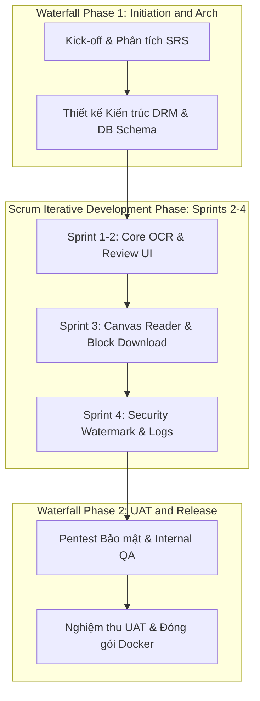
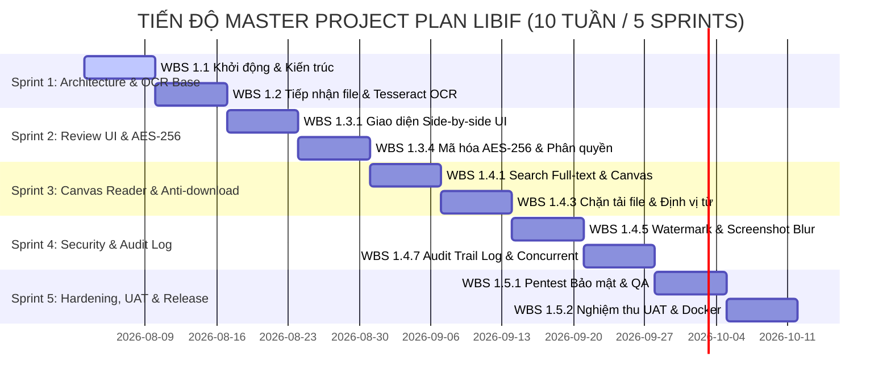

# KẾ HOẠCH QUẢN LÝ DỰ ÁN PHẦN MỀM (SOFTWARE PROJECT PLANNING)

**Tên dự án:** Hệ thống Thư viện Số Thương mại & Quản lý Bản quyền Số (Commercial Digital Library System)  
**Tên tài liệu:** `docs/markdowns-vi-v2/LIBIF-Project-Planning.md`  
**Mã dự án:** CDLS-PLAN-2026  
**Nguồn chiếu chính (Source of Truth):**  
- Tài liệu Product Backlog chính thức (`docs/markdowns-vi-v2/LIBIF-Product-Backlog.md` - 16 PBIs)  
- Bản Ước tính Dự án phê duyệt (`docs/markdowns-vi-v2/LIBIF-Project-Estimation.md` - 06 Sinh viên năm 4, 10 tuần / 5 Sprints)  
- Tuyên bố Phạm vi Công việc SOW (`docs/markdowns-vi-v2/LIBIF-Statement-Of-Work.md`)  
**Ngôn ngữ tài liệu:** Tiếng Việt  
**Tình trạng:** Bản kế hoạch thực thi chính thức (Approved Master Project Plan)  

---

## 1. Phương pháp Luận Phát triển Phần mềm (Development Methodology)

### 1.1 Lựa chọn Phương pháp luận: Mô hình Lai **Hybrid Waterfall-Scrum**

Dự án lựa chọn mô hình **Hybrid Waterfall-Scrum (Thác nước kết hợp Scrum)** làm phương pháp luận phát triển cốt lõi:

* **Tại sao không dùng Pure Waterfall (Thác nước thuần túy)?** Waterfall đòi hỏi đóng băng toàn bộ yêu cầu và thiết kế ngay từ đầu, không phù hợp với các phân hệ công nghệ mới như Tesseract OCR ngầm, HTML5 Canvas Reader và DRM mã hóa stream vốn cần thử nghiệm thực tế và chỉnh sửa UI/UX liên tục.
* **Tại sao không dùng Pure Kanban?** Kanban tập trung vào dòng chảy liên tục (continuous flow) không có thời gian kết thúc cố định (fixed deadline), trong khi dự án có ràng buộc cứng về mốc bàn giao 10 tuần và các mốc giải ngân hợp đồng SOW với Bên A.
* **Tại sao mô hình Lai Hybrid Waterfall-Scrum là Tối ưu nhất?**
  1. *Khung Waterfall (Vỏ ngoài):* Áp dụng cho giai đoạn Khởi động/Kiến trúc (Sprint 1) và Nghiệm thu UAT/Đóng gói bàn giao (Sprint 5) để kiểm soát mốc tiến độ hợp đồng và bảo đảm an toàn thông tin.
  2. *Khung Scrum (Lõi phát triển):* Áp dụng trong 3 Sprint phát triển cốt lõi (Sprint 2, 3, 4) với các chu kỳ 2 tuần (2-week Sprints). Đội ngũ 6 sinh viên phát triển cuốn chiếu theo các PBIs ưu tiên (MoSCoW), tổ chức Daily Standup, Sprint Review và Demo sản phẩm cho Bên A cuối mỗi Sprint.



---

## 2. Cấu trúc Phân chia Công việc (Work Breakdown Structure - WBS)

Toàn bộ khối lượng công việc của dự án được phân rã thành 5 Cấp độ WBS chính:

```
1. DỰ ÁN HỆ THỐNG THƯ VIỆN SỐ THƯƠNG MẠI (CDLS)
├── 1.1 Giai đoạn Lập kế hoạch & Kiến trúc (Planning & Architecture)
│   ├── 1.1.1 Khảo sát & Chuẩn hóa Tài liệu SRS/Charter/SOW
│   └── 1.1.2 Thiết kế Kiến trúc Mã hóa AES-256 & DB Schema
├── 1.2 Giai đoạn Phát triển Phân hệ Số hóa & OCR (Digitization & OCR Engine)
│   ├── 1.2.1 Tiếp nhận & Upload file scan (PBI-01)
│   ├── 1.2.2 Tích hợp Tesseract OCR Engine & Tiền xử lý ảnh (PBI-02)
│   └── 1.2.3 Dashboard theo dõi Hàng chờ OCR (PBI-03)
├── 1.3 Giai đoạn Phát triển Phân hệ Kiểm duyệt & Phân quyền (Review & Publishing)
│   ├── 1.3.1 Giao diện đối soát Side-by-side UI (PBI-04)
│   ├── 1.3.2 Luồng Phê duyệt / Từ chối xuất bản (PBI-05)
│   ├── 1.3.3 Biên mục dữ liệu Dublin Core (PBI-06)
│   ├── 1.3.4 Mô-đun mã hóa lưu kho AES-256 (PBI-07)
│   ├── 1.3.5 Phân quyền truy cập RBAC (PBI-08)
│   └── 1.3.6 Quản lý Hạn mức Đọc đồng thời qua Redis (PBI-09)
├── 1.4 Giai đoạn Phát triển Trình đọc An toàn & Bảo mật (Secure Reader & Deterrence)
│   ├── 1.4.1 Bộ máy Tìm kiếm Toàn văn PostgreSQL (PBI-10)
│   ├── 1.4.2 HTML5 Canvas Reader Viewer (PBI-11)
│   ├── 1.4.3 Cơ chế Chặn tải file gốc IDM/F12 (PBI-12)
│   ├── 1.4.4 Thuật toán Định vị từ khóa trong sách (PBI-13)
│   ├── 1.4.5 Nhúng Watermark động User/IP/Time (PBI-14)
│   ├── 1.4.6 Screenshot Blur răn đe chụp màn hình (PBI-15)
│   └── 1.4.7 Ghi nhật ký Audit Trail Log bất biến (PBI-16)
└── 1.5 Giai đoạn Kiểm thử, UAT & Triển khai (Testing, UAT & Release)
    ├── 1.5.1 Kiểm thử An toàn Thông tin (Pentest DRM)
    ├── 1.5.2 Nghiệm thu UAT với Khách hàng (Bên A)
    └── 1.5.3 Đóng gói Docker Container & Bàn giao Sản phẩm
```

---

## 3. Các Cột mốc Chính & Tiến độ Lịch trình (Milestones & Timeline)

### 3.1 Các Cột mốc Giao hàng (Delivery Milestones)

| Mã Mốc | Tên Cột mốc | Sản phẩm Bàn giao Cốt lõi | Thời gian Hoàn thành |
| :--- | :--- | :--- | :---: |
| **MS-01** | **Kick-off & Architecture Baseline** | Phê duyệt SOW, Kiến trúc DB & DRM Framework. | Cuối Tuần 2 (Sprint 1) |
| **MS-02** | **Core OCR & Side-by-side Review UI** | Hoàn thành Phân hệ Số hóa, OCR ngầm & Giao diện đối soát Side-by-side. | Cuối Tuần 4 (Sprint 2) |
| **MS-03** | **Secure Canvas Reader & Block Download** | Bàn giao Trình đọc HTML5 Canvas Reader, Mã hóa AES-256 & Chặn tải file. | Cuối Tuần 6 (Sprint 3) |
| **MS-04** | **Security Deterrence & Audit Logging** | Bàn giao Watermark động, Screenshot Blur, Hạn mức đồng thời & Audit Log. | Cuối Tuần 8 (Sprint 4) |
| **MS-05** | **Final UAT & Product Release** | Nghiệm thu UAT $100\%$, đóng gói Docker Container & Bàn giao chính thức. | Cuối Tuần 10 (Sprint 5) |

### 3.2 Sơ đồ Gantt Tiến độ Lịch trình (10 Tuần / 5 Sprints)



---

## 4. Kế hoạch Sprint Chi tiết (Sprint / Iteration Plan)

| Sprint ID | Thời gian | Mục tiêu Sprint (Sprint Goal) | Các PBIs Thực hiện | Kết quả Kỳ vọng (Sprint Increment) |
| :--- | :---: | :--- | :--- | :--- |
| **Sprint 1** | Tuần 1-2 | Thiết kế kiến trúc DB/DRM và hoàn thiện luồng Số hóa OCR ngầm. | PBI-01, PBI-02, PBI-03 | Module upload file scan và Tesseract OCR ngầm chạy thành công trên máy chủ Staging. |
| **Sprint 2** | Tuần 3-4 | Xây dựng giao diện đối soát Side-by-side UI và mã hóa AES-256 lưu kho. | PBI-04, PBI-05, PBI-06, PBI-07 | Thủ thư có thể đối soát màn hình kép và bấm phê duyệt để mã hóa file lưu kho. |
| **Sprint 3** | Tuần 5-6 | Phát triển HTML5 Canvas Reader, bộ máy tìm kiếm và cơ chế chặn tải file gốc. | PBI-10, PBI-11, PBI-12, PBI-13 | Độc giả tìm kiếm toàn văn và đọc sách trên Canvas Reader không bị lộ link PDF thô. |
| **Sprint 4** | Tuần 7-8 | Tích hợp lớp bảo mật răn đe (Watermark, Screenshot Blur) và Audit Log. | PBI-08, PBI-09, PBI-14, PBI-15, PBI-16 | Trình đọc hiển thị Watermark động, làm mờ khi mất focus và đếm phiên đồng thời. |
| **Sprint 5** | Tuần 9-10| Kiểm thử an ninh Pentest, sửa lỗi QA, nghiệm thu UAT và đóng gói Docker. | Hardening, Bugfix, UAT | Bộ đóng gói Docker hoàn chỉnh và Biên bản nghiệm thu UAT ký bởi Bên A. |

---

## 5. Phân công Nguồn lực & Phụ thuộc Công việc (Resource Assignment & Dependencies)

### 5.1 Bảng Phân công Nguồn lực 06 Sinh viên & Phụ thuộc Công việc

| PBI ID | Tên Tính năng | Phụ thuộc (Predecessors) | Người Phụ trách Chính | Người Phối hợp QA / Review |
| :--- | :--- | :---: | :--- | :--- |
| **PBI-01** | Upload gói file scan | None | **SV-2 (Backend Dev)** | SV-6 (QA) |
| **PBI-02** | Tesseract OCR ngầm | PBI-01 | **SV-2 (Backend Dev)** | SV-1 (Tech Lead) |
| **PBI-03** | Quản lý hàng chờ OCR | PBI-02 | **SV-2 (Backend Dev)** | SV-3 (Frontend) |
| **PBI-04** | Giao diện Side-by-side UI | PBI-02 | **SV-3 (Frontend Dev)** | SV-1 (Tech Lead) |
| **PBI-05** | Phê duyệt / Từ chối xuất bản | PBI-04 | **SV-3 (Frontend Dev)** | SV-2 (Backend) |
| **PBI-06** | Biên mục dữ liệu số | PBI-05 | **SV-3 (Frontend Dev)** | SV-6 (QA) |
| **PBI-07** | Mã hóa lưu kho AES-256 | PBI-05 | **SV-1 (Tech Lead)** | SV-5 (Security) |
| **PBI-08** | Cấu hình phân quyền đọc | PBI-07 | **SV-5 (Security Dev)** | SV-1 (Tech Lead) |
| **PBI-09** | Giới hạn đọc đồng thời | PBI-08 | **SV-5 (Security Dev)** | SV-2 (Backend) |
| **PBI-10** | Tìm kiếm toàn văn (Search) | PBI-05 | **SV-6 (Search/QA Dev)**| SV-2 (Backend) |
| **PBI-11** | Trình đọc HTML5 Canvas Reader | PBI-07, PBI-08 | **SV-4 (Frontend Dev)** | SV-1 (Tech Lead) |
| **PBI-12** | Chặn tải file (Block Download) | PBI-11 | **SV-5 (Security Dev)** | SV-4 (Frontend) |
| **PBI-13** | Định vị từ khóa trong sách | PBI-10, PBI-11 | **SV-6 (Search/QA Dev)**| SV-4 (Frontend) |
| **PBI-14** | Watermarking Động | PBI-11 | **SV-4 (Frontend Dev)** | SV-5 (Security) |
| **PBI-15** | Screenshot Blur răn đe | PBI-11 | **SV-5 (Security Dev)** | SV-4 (Frontend) |
| **PBI-16** | Nhật ký Audit Trail Log | PBI-11 | **SV-5 (Security Dev)** | SV-6 (QA) |

---

## 6. Phân tích Đường Găng (Critical Path Analysis)

### 6.1 Chuỗi Công việc Trên Đường Găng (Critical Path Sequence)
Đường găng (Critical Path) là chuỗi các công việc phụ thuộc lẫn nhau quyết định tổng thời gian hoàn thành dự án ($10\text{ tuần}$). Bất kỳ sự chậm trễ nào trên đường găng đều sẽ trực tiếp làm lùi ngày bàn giao dự án:

$$\text{Critical Path: } \text{PBI-01} \rightarrow \text{PBI-02} \rightarrow \text{PBI-04} \rightarrow \text{PBI-05} \rightarrow \text{PBI-07} \rightarrow \text{PBI-11} \rightarrow \text{PBI-12} \rightarrow \text{UAT \& Release}$$

```mermaid
flowchart LR
    PBI01["PBI-01: Upload"] --> PBI02["PBI-02: Tesseract OCR"]
    PBI02 --> PBI04["PBI-04: Side-by-side UI"]
    PBI04 --> PBI05["PBI-05: Phê duyệt"]
    PBI05 --> PBI07["PBI-07: Mã hóa AES-256"]
    PBI07 --> PBI11["PBI-11: Canvas Reader"]
    PBI11 --> PBI12["PBI-12: Chặn Tải File"]
    PBI12 --> UAT["Nghiệm thu UAT & Release"]
    
    style PBI01 fill:#f9f,stroke:#333,stroke-width:2px
    style PBI02 fill:#f9f,stroke:#333,stroke-width:2px
    style PBI04 fill:#f9f,stroke:#333,stroke-width:2px
    style PBI05 fill:#f9f,stroke:#333,stroke-width:2px
    style PBI07 fill:#f9f,stroke:#333,stroke-width:2px
    style PBI11 fill:#f9f,stroke:#333,stroke-width:2px
    style PBI12 fill:#f9f,stroke:#333,stroke-width:2px
    style UAT fill:#f9f,stroke:#333,stroke-width:2px
```



### 6.2 Chiến lược Quản lý Đường Găng:
* **Tech Lead (SV-1)** giám sát hàng ngày các PBI nằm trên đường găng.
* Nếu tác vụ PBI-04 (Side-by-side UI) hoặc PBI-11 (Canvas Reader) bị chậm quá 02 ngày, lập tức điều động SV-6 (QA) hỗ trợ viết code để giải phóng đường găng.

---

## 7. Kế hoạch Quản lý Rủi ro (Risk Management Plan)

| Mã Rủi ro | Mô tả Rủi ro | Phân loại | Khả năng (Likelihood) | Tác động (Impact) | Biện pháp Giảm thiểu (Mitigation) | Kế hoạch Dự phòng (Contingency) | Người Chịu Trách nhiệm |
| :--- | :--- | :--- | :---: | :---: | :--- | :--- | :--- |
| **RSK-01** | Tesseract OCR nhận dạng chữ tiếng Việt bị sai lệch nhiều trên sách cũ. | Kỹ thuật | Trung bình | Cao | Tiền xử lý ảnh (Denoise/Deskew); tận dụng tối đa Giao diện Side-by-side UI cho thủ thư đối soát. | Huấn luyện bổ sung traineddata cho font chữ đặc thù. | SV-2 (OCR Dev) |
| **RSK-02** | Hiệu năng Canvas Reader bị giật/lag khi render sách dung lượng lớn ($>300$ trang). | Kỹ thuật | Trung bình | Cao | Áp dụng thuật toán Lazy Loading (chỉ mã hóa và vẽ 5 trang trước/sau trang đang đọc). | Cắt nhỏ trang sách theo phân đoạn (Chunking). | SV-4 (Reader Dev) |
| **RSK-03** | Đội ngũ sinh viên gặp áp lực lịch thi cử tại trường gây chậm tiến độ Sprint. | Nhân sự | Cao | Trung bình | Bố trí tiến độ 10 tuần (đã dư 1 tuần dự phòng); Antigravity AI hỗ trợ sinh mã nhanh. | Tăng cường làm việc bù vào cuối tuần. | SV-1 (Tech Lead) |
| **RSK-04** | Trình duyệt thay đổi chính sách bảo mật làm ảnh hưởng tính năng Screenshot Blur. | Kỹ thuật | Thấp | Cao | Sử dụng các chuẩn Web API tiêu chuẩn (`window.onblur`, `visibilitychange`). | Bổ sung lớp Watermark động đậm nét hơn để răn đe. | SV-5 (Security Dev) |

---

## 8. Kế hoạch Giao tiếp & Báo cáo (Communication Plan)

### 8.1 Các Sự kiện Scrum trong Dự án

| Sự kiện Scrum | Tần suất | Thời lượng | Hình thức | Mục đích & Nội dung | Người Chủ trì |
| :--- | :--- | :---: | :--- | :--- | :--- |
| **Daily Standup** | Hàng ngày (Mon-Fri) | 15 phút | MS Teams / Trực tiếp | 3 câu hỏi: Đã làm gì hôm qua? Sẽ làm gì hôm nay? Có vướng mắc gì không? | SV-1 (Tech Lead) |
| **Sprint Planning** | Đầu mỗi Sprint | 2 giờ | Online Meeting | Phân chia công việc PBI cho 6 sinh viên, chốt Sprint Goal. | SV-1 (Tech Lead) |
| **Sprint Review / Demo** | Cuối mỗi Sprint | 1 giờ | Demo cho Bên A | Demo tính năng chạy thực tế cho đại diện Thư viện (Bên A) góp ý. | SV-1 & Các SV |
| **Sprint Retrospective** | Cuối mỗi Sprint | 45 phút | Nội bộ nhóm SV | Rút kinh nghiệm cải tiến quy trình kỹ thuật và phối hợp AI cho Sprint sau. | SV-1 (Tech Lead) |

---
> **Xác nhận:** Kế hoạch Quản lý Dự án Phần mềm (LIBIF-Project-Planning.md) đã thống nhất hoàn toàn với Product Backlog, Bản Ước tính và Tuyên bố SOW, sẵn sàng đưa vào vận hành thực thi.
