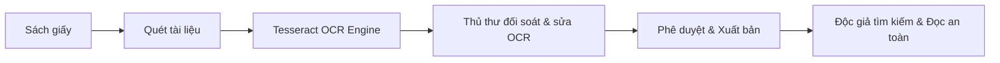

# ĐỀ XUẤT DỰ ÁN (PROJECT PROPOSAL)

**Tên dự án:** Hệ thống Thư viện Số Thương mại & Quản lý Bản quyền Số (Commercial Digital Library System)
**Tên tài liệu:** `docs/markdowns-vi-v2/LIBIF-Project-Proposal.md`
**Phân loại:** Phần mềm thương mại đóng gói / Phát triển theo hợp đồng cho thư viện thứ ba
**Ngôn ngữ tài liệu:** Tiếng Việt
**Tình trạng tài liệu:** Bản đề xuất phê duyệt dự án (Decision Support Document)

---

## 1. Tóm tắt Dự án (Executive Summary)

### 1.1 Bối cảnh & Mục tiêu Dự án
Dự án nhằm phát triển một **Hệ thống Thư viện Số Thương mại** có khả năng đóng gói bán sẵn (SaaS/On-premise) hoặc triển khai theo hợp đồng cho các thư viện đại học, thư viện chuyên ngành và thư viện công cộng. Hệ thống giải quyết triệt để hai bài toán vận hành cốt lõi:
1. **Số hóa & Khai thác:** Chuyển đổi sách giấy sang dữ liệu số có khả năng tìm kiếm toàn văn (full-text search) thông qua quy trình nhận dạng ký tự quang học (**Tesseract OCR Engine**) tích hợp khâu kiểm duyệt thủ công đối soát của thủ thư.
2. **Bảo vệ Bản quyền:** Thiết lập cơ chế kiểm soát truy cập và bảo vệ nội dung số đa lớp (Watermarking động, phân quyền đọc, hạn chế tải xuống, chống chụp màn hình, DRM và nhật ký hoạt động), giúp các thư viện tuân thủ pháp lý và tự tin hợp tác với các nhà xuất bản.

### 1.2 Lý do Thực hiện Dự án (Why Perform This Project?)
* **Tại sao cần thực hiện dự án này?** Thư viện truyền thống đang đối mặt với nguy cơ tụt hậu do rào cản truy cập vật lý, đồng thời bất lực trong việc bảo vệ bản quyền số khi chia sẻ tài liệu qua các kênh thông thường. Dự án tạo ra giải pháp thương mại chuẩn hóa giúp thư viện chuyển đổi số an toàn.
* **Tại sao lại thực hiện vào thời điểm này (Why Now?)**
  1. *Quy định pháp lý & Bản quyền:* Sự siết chặt Luật Sở hữu trí tuệ đòi hỏi thư viện phải có hệ thống kiểm soát bản quyền đạt chuẩn mới được phép lưu lưu hành sách số từ các nhà xuất bản.
  2. *Nhu cầu học tập từ xa:* Độc giả yêu cầu truy cập kho tri thức 24/7 từ xa, không còn phụ thuộc vào thời gian mở cửa thư viện vật lý.
* **Tại sao giải pháp hiện có không đáp ứng được?** Các giải pháp mã nguồn mở (như DSpace) thiếu tính năng DRM bảo vệ bản quyền chuyên sâu; phần mềm ngoại (Ex Libris Alma) quá đắt đỏ và khó tùy biến; còn việc ghép nối công cụ rời rạc gây rủi ro bảo mật và tốn nhiều nhân công.

### 1.3 Phân loại Thông tin Đánh giá
* **Thực tế (FACT):** Thư viện truyền thống gặp hạn chế lớn về không gian vật lý và khả năng phục vụ độc giả đồng thời; việc phát hành file tài liệu thô (PDF/Image) không mã hóa dẫn đến nguy cơ vi phạm bản quyền cao.

### 1.4 Khuyến nghị Tổng quan
Đề xuất phê duyệt khởi động dự án với mô hình phát triển phần mềm tập trung vào tính an toàn bản quyền và tối ưu quy trình nghiệp vụ cho thủ thư. Giải pháp đề xuất vượt trội hơn quy trình thủ công, việc kết hợp công cụ rời rạc và các phần mềm mã nguồn mở thông thường ở khả năng bảo vệ tài sản số và tính dễ sử dụng.

> **Kết luận phần 1:** Dự án tập trung giải quyết bài toán vận hành thực tế của thư viện thông qua quy trình số hóa an toàn và kiểm soát bản quyền nghiêm ngặt. Việc đầu tư phát triển sản phẩm thương mại này đáp ứng trực tiếp nhu cầu chuyển đổi số ngành thư viện hiện nay.

---

## 2. Bài toán Kinh doanh & Vấn đề Vận hành (Business Problem)

### 2.1 Thực trạng & Vấn đề Vận hành Tại các Thư viện

| STT | Vấn đề Vận hành | Nguyên nhân Gốc rễ | Tác động Kinh doanh / Vận hành | Loại Thông tin |
| :--- | :--- | :--- | :--- | :--- |
| 1 | **Tài liệu giấy bị giới hạn khả năng khai thác** | Sách giấy chỉ phục vụ 1 độc giả tại 1 thời điểm; không gian lưu trữ vật lý quá tải. | Chi phí vận hành kho bãi tăng; độc giả khó tiếp cận tài liệu quý hiếm. | **FACT** |
| 2 | **Dữ liệu số thô không thể tìm kiếm toàn văn** | Tài liệu quét lưu dạng file ảnh/PDF dạng scan không qua xử lý OCR chuẩn xác. | Độc giả tốn thời gian lật từng trang file; hiệu quả nghiên cứu giảm. | **INDUSTRY PRACTICE** |
| 3 | **Nguy cơ rò rỉ & vi phạm bản quyền số** | Chia sẻ file PDF/DOC thông thường qua Google Drive, Zalo hoặc cổng thông tin không bảo mật. | Nguy cơ bị tác giả/NXB kiện vi phạm bản quyền; thư viện không thể mua bản quyền sách số mới. | **FACT** |

### 2.2 Tác động Tới Các Bên Liên quan
* **Thủ thư:** Mất nhiều thời gian xử lý thủ công, thiếu công cụ kiểm duyệt tập trung và chịu trách nhiệm khi xảy ra sự cố rò rỉ tài liệu.
* **Ban Giám đốc Thư viện:** Không thể mở rộng quy mô phục vụ độc giả; gặp rào cản pháp lý khi ký kết hợp đồng bản quyền số với các Nhà xuất bản (NXB).
* **Độc giả:** Trải nghiệm đọc kém, không thể tìm kiếm từ khóa chính xác trong nội dung sách, bị giới hạn thời gian và địa điểm truy cập.

> **Kết luận phần 2:** Vấn đề cốt lõi không nằm ở việc thiếu công cụ quét tài liệu, mà ở thiếu một quy trình kiểm duyệt OCR tập trung và giải pháp bảo vệ bản quyền số đủ tin cậy để vận hành thương mại.

---

## 3. Phân tích Giải pháp Hiện hữu & So sánh (Existing Solutions & Competitor Analysis)

### 3.1 Các Phương án Hiện có trên Thị trường

1. **Phương án 1 - Quy trình Thủ công (Manual Workflow):** Quét sách giấy $\rightarrow$ Lưu file PDF thô $\rightarrow$ Phục vụ tại chỗ hoặc gửi file trực tiếp qua email/USB.
2. **Phương án 2 - Kết hợp các công cụ có sẵn (Combining Existing Discrete Tools):** Sử dụng các phần mềm rời rạc (ví dụ: Dùng phần mềm OCR độc lập như ABBYY/Tesseract chạy riêng $\rightarrow$ Đóng gói PDF $\rightarrow$ Lưu trữ trên Google Drive/Dropbox $\rightarrow$ Nhúng Watermark thủ công bằng phần mềm chỉnh sửa PDF $\rightarrow$ Gửi link cho độc giả).
3. **Phương án 3 - Phần mềm Mã nguồn Mở chuyên dụng (Open-Source Repository: DSpace, Greenstone):** Tập trung vào quản trị lưu trữ tài liệu nội bộ (Institutional Repository). Hỗ trợ biên mục chuẩn Dublin Core nhưng khả năng bảo mật xem trực tuyến kém, không có cơ chế DRM chống sao chép/chống tải nâng cao.
4. **Phương án 4 - Hệ thống Quản lý Thư viện Thương mại Quốc tế (International Commercial LMS: Ex Libris Alma/Primo, Koha nâng cao):** Đầy đủ chức năng nhưng chi phí bản quyền cực kỳ đắt đỏ, quy trình OCR và bảo vệ bản quyền không được tối ưu cho tài liệu địa phương và font chữ tiếng Việt.

### 3.2 Bảng So sánh Chi tiết Các Phương án

| Tiêu chí So sánh | Quy trình Thủ công | Kết hợp Công cụ có sẵn (Combine Tools) | Mã nguồn Mở (DSpace / Greenstone) | Thương mại Quốc tế (Ex Libris Alma) | Giải pháp Đề xuất (Proposed CDLS) |
| :--- | :--- | :--- | :--- | :--- | :--- |
| **Giao diện & Quy trình duyệt OCR** | Không có | Rời rạc (Chạy OCR phần mềm riêng, chỉnh sửa Word/Txt rồi ghép lại thủ công) | Phụ thuộc plugin ngoài; thiếu giao diện đối soát side-by-side cho thủ thư | Có tính năng OCR nhưng giao diện duyệt phức tạp, khó tùy biến | **Tích hợp Tesseract OCR + Giao diện đối soát song song (Side-by-side UI) cho thủ thư** |
| **Bảo vệ Bản quyền (DRM)** | Không có | Rất yếu (File PDF nhúng Watermark tĩnh vẫn bị tải về và phát tán dễ dàng) | Hạn chế (Chỉ phân quyền theo tài khoản, không chống tải/chụp màn hình) | Có hỗ trợ DRM chuẩn quốc tế (Phát sinh chi phí bản quyền đắt đỏ) | **Bảo mật đa lớp: Dynamic Watermark, Stream Canvas chống tải, Screenshot Blur, DRM** |
| **Khả năng Tìm kiếm Full-text** | Không hỗ trợ | Tìm kiếm cơ bản trên file PDF đã OCR | Hỗ trợ tìm kiếm cơ bản qua Lucene/Solr | Hỗ trợ tìm kiếm mạnh | **Hỗ trợ tìm kiếm toàn văn chính xác theo dữ liệu OCR đã qua kiểm duyệt** |
| **Chi phí Đầu tư & Bảo trì** | Nhân công cao, hiệu quả thấp | Chi phí bản quyền phần mềm rời + tốn nhân công vận hành ghép nối | Chi phí phần mềm $0$, nhưng chi phí tùy biến & bảo trì IT rất cao | Chi phí bản quyền & triển khai vô cùng đắt đỏ ($10.000 - $50.000+/năm) | **Chi phí hợp lý, mô hình thương mại linh hoạt (SaaS hoặc Bản quyền trọn gói)** |
| **Độ phức tạp & Rủi ro Vận hành** | Rời rạc, tốn thời gian | **Rủi ro cao:** Dễ nhầm lẫn file, quên nhúng Watermark, mất dấu nhật ký truy cập | **Độ phức tạp IT cao:** Yêu cầu đội ngũ kỹ thuật chuyên trách duy trì mã nguồn | Yêu cầu đào tạo vận hành quy mô lớn, phức tạp | **Nghiệp vụ tập trung (All-in-one), giao diện tối ưu cho thủ thư truyền thống** |

### 3.3 Phân tích Lý do Không lựa chọn Phương án "Kết hợp các công cụ có sẵn"
Mặc dù việc kết hợp các công cụ có sẵn (Tesseract standalone + Google Drive + Adobe Acrobat) có vẻ tiết kiệm chi phí ban đầu, nhưng bị **loại bỏ** vì các hạn chế chí mạng sau:
* **Quy trình bị đứt gãy (Fragmented Workflow):** Thủ thư phải chuyển đổi qua lại giữa 4-5 ứng dụng khác nhau cho 1 cuốn sách. Việc này tốn gấp 3-4 lần thời gian vận hành và dễ phát sinh lỗi do con người.
* **Lỗ hổng bảo mật bản quyền nghiêm trọng:** Google Drive hay file PDF thông thường không thể ngăn chặn độc giả dùng IDM (Internet Download Manager) để tải trọn bộ file gốc. Watermark nhúng thủ công là tĩnh (static), không thể nhúng động thông tin riêng của người đọc (IP, User ID, Timestamp) tại thời điểm đọc.
* **Thiếu nhật ký kiểm vết tập trung (Audit Trail):** Không thể biết chính xác độc giả nào đã đọc trang nào, đọc trong bao lâu hay có hành vi crawl dữ liệu bất thường hay không.

### 3.4 Phân tích Lý do Không lựa chọn Các Đối thủ Cạnh tranh
* **Đối với Phần mềm Mã nguồn mở (DSpace/Greenstone):** Thiết kế ban đầu dành cho lưu trữ tài liệu luận văn/nghiên cứu mở (Open Access), không có triết lý thiết kế để kinh doanh hoặc bảo vệ bản quyền chặt chẽ cho sách thương mại.
* **Đối với Hệ thống Thương mại Quốc tế (Ex Libris Alma/Primo):** Giá thành quá cao vượt ngân sách của $90\%$ thư viện tại Việt Nam; thủ tục hỗ trợ kỹ thuật phức tạp, khó can thiệp tùy biến giao diện duyệt OCR theo font chữ tiếng Việt cổ/đặc thù.

### 3.5 Phân tích Đánh đổi (Trade-off Analysis: Buy vs Build)
* **Mua giải pháp thương mại quốc tế:** Ngân sách quá cao, bị lệ thuộc vào nhà cung cấp nước ngoài (Vendor lock-in).
* **Dùng mã nguồn mở (DSpace):** Tiết kiệm ban đầu nhưng chi phí ẩn cho phát triển tùy biến tính năng bảo mật DRM và OCR đối soát là rất lớn.
* **Tự phát triển giải pháp đề xuất (Build CDLS):** Chi phí R&D ban đầu vừa phải, tạo ra **sản phẩm thương mại sở hữu trí tuệ riêng**, hoàn toàn chủ động công nghệ bảo mật và có khả năng nhân rộng bán cho nhiều khách hàng.

> **Kết luận phần 3:** Việc kết hợp các công cụ rời rạc hay dùng mã nguồn mở đều bộc lộ lỗ hổng bảo mật và sự đứt gãy quy trình vận hành. Xây dựng giải pháp CDLS chuyên biệt là con đường duy nhất đáp ứng trọn vẹn bài toán thương mại và an toàn bản quyền.

---

## 4. Giải pháp Đề xuất (Proposed Solution)

### 4.1 Quy trình Nghiệp vụ Cốt lõi (Core Workflow)

1. **Số hóa (Digitization):** Thủ thư thực hiện quét tài liệu giấy và tải file ảnh/PDF thô lên hệ thống.
2. **Trích xuất Tesseract OCR (Automatic OCR):** Hệ thống tự động kích hoạt **Tesseract OCR Engine** ngầm để trích xuất toàn bộ văn bản và tọa độ từ ngữ trên từng trang sách.
3. **Kiểm duyệt thủ công (Librarian Review):** Thủ thư sử dụng giao diện đối soát song song (Side-by-side viewer) để kiểm tra, sửa lỗi nhận dạng OCR và bấm "Phê duyệt".
4. **Xuất bản số (Digital Publishing):** Tài liệu đã duyệt được đưa vào kho lưu trữ mã hóa và sẵn sàng cho độc giả tra cứu.
5. **Khai thác An toàn (Secure Reader Access):** Độc giả được cấp quyền tiến hành tìm kiếm toàn văn, xem trước hoặc đọc trực tuyến qua Reader Viewer chuyên dụng.

### 4.2 Lựa chọn Công nghệ OCR: Tesseract OCR Engine

Dự án xác định lựa chọn **Tesseract OCR Engine** (Mã nguồn mở hàng đầu do Google tài trợ phát triển) làm lõi nhận dạng chữ viết với các căn cứ công nghệ và vận hành sau:

* **Lý do lựa chọn Tesseract OCR:**
  1. *Bảo mật & Tự chủ dữ liệu (Self-hosted & Privacy):* Tesseract chạy trực tiếp trên máy chủ nội bộ của hệ thống (On-premise/Private Cloud), đảm bảo tài liệu quét không bao giờ bị đẩy sang API của bên thứ ba (tránh nguy cơ rò rỉ dữ liệu tài liệu quý/mật).
  2. *Tùy biến traineddata tiếng Việt:* Cho phép huấn luyện (fine-tune) dữ liệu traineddata riêng cho các bộ font chữ tiếng Việt cổ, tài liệu Hán Nôm hoặc font chữ máy đánh chữ cũ.
  3. *Tối ưu Chi phí ($0 Bản quyền API):* Không phát sinh chi phí trả theo lượt quét (pay-per-page) như các Cloud OCR API (Google Cloud Vision hay ABBYY Cloud), giúp hạ giá thành sản phẩm thương mại.
* **Tính nhất quán giữa Tesseract OCR và Giao diện Kiểm duyệt Thủ thư:**
  * Do Tesseract là công cụ OCR mã nguồn mở, tỷ lệ chính xác phụ thuộc vào chất lượng ảnh quét (thường đạt $85\% - 95\%$ với sách thông thường, và thấp hơn với sách cũ).
  * Điều này **hoàn toàn nhất quán và làm nổi bật giá trị của Giao diện Kiểm duyệt Thủ công (Librarian Review UI)**: Hệ thống cung cấp công cụ giúp thủ thư đối soát và sửa $5\% - 15\%$ sai số còn lại một cách nhanh nhất trước khi xuất bản, đảm bảo dữ liệu tri thức đạt chuẩn $100\%$.

### 4.3 Các Cơ chế Bảo vệ Bản quyền & An toàn Nội dung

Hệ thống triển khai mô hình bảo mật đa lớp (Defense-in-depth) nhằm triệt hạ nguy cơ thất thoát tài sản số:

| Cơ chế Bảo vệ | Mô tả Kỹ thuật / Nghiệp vụ | Mục đích Bảo vệ | Loại Thông tin |
| :--- | :--- | :--- | :--- |
| **Watermarking động (Dynamic Watermark)** | Nhúng chìm thông tin độc giả (Tên, ID, IP, Timestamp) chéo qua trang sách khi đang đọc. | Deterrence (Răn đe): Nếu chụp ảnh màn hình sẽ lộ căn cước người phát tán. | **INDUSTRY PRACTICE** |
| **Kiểm soát Truy cập (Access Control)** | Phân quyền chi tiết theo nhóm người dùng, giới hạn số lượt đọc đồng thời (Concurrent read limit). | Chống việc 1 tài khoản chia sẻ cho nhiều người đọc cùng lúc. | **FACT** |
| **Hạn chế Tải xuống (Download Restrictions)** | Không cung cấp link tải file gốc (PDF/Image). Dữ liệu được cắt nhỏ và mã hóa stream qua HTML5 Canvas. | Chống tải trọn bộ tài liệu về máy cá nhân. | **INDUSTRY PRACTICE** |
| **Răn đe Chụp màn hình (Screenshot Deterrence)** | Tự động làm mờ (blur) nội dung khi cửa sổ trình duyệt mất focus hoặc phát hiện phím tắt chụp ảnh. | Hạn chế tối đa việc thu thập dữ liệu tự động/bằng tay. | **EXPERT JUDGEMENT** |
| **Nhật ký Hoạt động (Activity Logging)** | Ghi lại toàn bộ thao tác: thời gian xem, trang đọc, tần suất lật trang, IP truy cập. | Phân tích hành vi bất thường (crawl tự động) để tự động khóa tài khoản. | **FACT** |
| **Quản lý Quyền số (DRM)** | Mã hóa dữ liệu lưu trữ (AES-256) và giải mã tạm thời trên bộ nhớ RAM của trình duyệt qua Token hạn ngắn. | Đảm bảo file lưu trên server không thể bị đánh cắp trực tiếp. | **INDUSTRY PRACTICE** |

> **Kết luận phần 4:** Lựa chọn Tesseract OCR Engine đảm bảo tính tự chủ công nghệ và tối ưu chi phí, kết hợp hoàn hảo với Giao diện đối soát thủ thư và hạ tầng bảo mật 6 lớp để tạo nên sản phẩm hoàn chỉnh.

---

## 5. Phân tích Các Bên Liên quan (Stakeholder Analysis)

| Bên liên quan | Mục tiêu (Goals) | Mối quan ngại (Concerns) | Lợi ích Kỳ vọng | Quyền hạn & Ảnh hưởng |
| :--- | :--- | :--- | :--- | :--- |
| **Nhà đầu tư Dự án (Sponsor)** | Thương mại hóa sản phẩm; đạt doanh thu từ bán bản quyền/hợp đồng. | Chi phí R&D vượt định mức; sản phẩm khó bán do thị trường không chấp nhận. | Có sản phẩm phần mềm thương mại độc quyền, doanh thu bền vững. | **Phê duyệt ngân sách & định hướng dự án (Cao)** |
| **Ban Giám đốc Thư viện (Customer)** | Chuyển đổi số thư viện; nâng cao uy tín và số lượng phục vụ. | Nguy cơ bị kiện bản quyền; chi phí đầu tư cao không hiệu quả. | Hiện đại hóa thư viện; tuân thủ pháp luật; tối ưu ngân sách. | **Quyết định mua sản phẩm / Ký hợp đồng (Cao)** |
| **Thủ thư (Librarians - Primary User)** | Dễ dàng quản lý, kiểm duyệt OCR và xuất bản tài liệu. | Giao diện phức tạp, tăng khối lượng công việc, khó thao tác. | Tự động hóa khâu OCR; giảm thao tác thủ công; công cụ kiểm duyệt dễ dùng. | **Ảnh hưởng trực tiếp tới việc chấp nhận sản phẩm (Trung bình)** |
| **Độc giả (Readers - Primary User)** | Tìm kiếm tài liệu nhanh chóng, đọc trực tuyến mượt mà. | Giao diện đọc khó nhìn, bị che bởi watermark quá đậm, không tải được file. | Tiếp cận kho tri thức mọi lúc mọi nơi; tra cứu từ khóa chính xác. | **Người sử dụng cuối (Thấp trong quyết định mua, Cao trong trải nghiệm)** |
| **Tác giả / Nhà xuất bản (Copyright Owners)** | Đảm bảo sách không bị chia sẻ lậu, nhận đủ tiền bản quyền. | Sách số bị trích xuất lậu và phát tán tràn lan trên Internet. | Yên tâm cung cấp bản quyền sách số cho thư viện. | **Quyết định việc cấp phép bản quyền tài liệu (Cao)** |
| **Đội ngũ Kỹ thuật & Vận hành (Project Team)** | Xây dựng hệ thống ổn định, bảo mật cao, dễ bảo trì. | Yêu cầu chống chụp màn hình/DRM trên trình duyệt web có giới hạn kỹ thuật. | Nâng cao năng lực công nghệ; sản phẩm có tính đóng gói cao. | **Thực thi và kiến trúc kỹ thuật (Trung bình)** |

> **Kết luận phần 5:** Sự thành công của dự án phụ thuộc vào việc giải tỏa mối quan ngại bản quyền của NXB/Ban Giám đốc và tối ưu trải nghiệm giao diện cho Thủ thư cùng Độc giả.

---

## 6. Phân tích Tính Khả thi (Feasibility Analysis)

### 6.1 Tính Khả thi Kinh doanh (Business Feasibility)
* **Nhu cầu Thị trường:** Nhu cầu chuyển đổi số theo Đề án phát triển Thư viện số tại Việt Nam là rất lớn (đặc biệt ở khối Đại học và Thư viện Tỉnh/Thành phố).
* **Mô hình Doanh thu:** Có thể linh hoạt giữa hai mô hình: Bán bản quyền sử dụng phần mềm đóng gói kèm phí bảo trì hàng năm (On-premise) hoặc Thu phí dịch vụ theo dung lượng/tài khoản (SaaS).
* **Đánh giá:** **Khả thi cao** (High Feasibility).

### 6.2 Tính Khả thi Kỹ thuật (Technical Feasibility)
* **Công nghệ OCR:** Sử dụng **Tesseract OCR Engine** kết hợp với các thư viện xử lý ảnh (OpenCV/ImageMagick) để làm sạch ảnh quét (deskew, denoise) trước khi nhận dạng, đảm bảo tốc độ và độ chính xác cao.
* **Công nghệ Bảo mật:** Trình duyệt hiện đại hỗ trợ đầy đủ HTML5 Canvas, Encrypted Media Extensions (EME), WebSockets và WebAssembly giúp triển khai DRM và chống tải file trên Client mà không cần cài thêm plugin.
* **Đánh giá:** **Khả thi** (Medium-High Feasibility). *Lưu ý:* Việc chống chụp màn hình trên môi trường Web chỉ đạt mức độ răn đe (deterrence) chứ không thể ngăn chặn $100\%$ thiết bị phần cứng bên ngoài (như dùng điện thoại chụp lại màn hình).

### 6.3 Tính Khả thi Vận hành (Operational Feasibility)
* Quy trình nghiệp vụ được thiết kế mô phỏng chính xác luồng làm việc truyền thống của thư viện (Nhập kho $\rightarrow$ Biên mục $\rightarrow$ Kiểm tra $\rightarrow$ Phục vụ).
* Giao diện đối soát OCR được tối ưu hóa theo dạng so sánh hai màn hình (Ảnh gốc vs Văn bản OCR) giúp thủ thư thao tác chỉnh sửa nhanh chóng mà không cần kỹ năng IT chuyên sâu.
* **Đánh giá:** **Khả thi cao** (High Feasibility).

### 6.4 Tính Khả thi Tài chính (Financial Feasibility)
* **Khung Chi phí Dự kiến:**
  * Chi phí phát triển phần mềm (Nhân sự Dev, QA, BA, PM).
  * Chi phí hạ tầng thử nghiệm & bảo mật.
  * Chi phí tích hợp Tesseract OCR $= 0$ VNĐ bản quyền API.
* **Đánh giá:** **Cần xác minh (Requires Validation)** theo ngân sách thực tế của nhà đầu tư và kế hoạch kinh doanh chi tiết. Dự án không phát sinh chi phí mua bản quyền DRM hay OCR Cloud nhờ tự xây dựng lớp bảo vệ trên HTML5 và dùng Tesseract.

### 6.5 Tính Khả thi Tiến độ (Schedule Feasibility)
* **Tiến độ Dự kiến:** Khung thời gian phát triển sản phẩm tối thiểu (MVP) ước tính chia làm các mốc chính:
  1. Giai đoạn 1: Phân tích nghiệp vụ & Thiết kế kiến trúc bảo mật.
  2. Giai đoạn 2: Tích hợp Tesseract OCR, Tiền xử lý ảnh & Giao diện duyệt đối soát cho Thủ thư.
  3. Giai đoạn 3: Phát triển Reader Viewer & Các cơ chế bảo vệ DRM/Watermark.
  4. Giai đoạn 4: Thử nghiệm an toàn thông tin & Đánh giá chấp nhận của người dùng (UAT).
* **Đánh giá:** **Ước tính (Estimated)** - Cần lập kế hoạch chi tiết (WBS) sau khi phê duyệt đề xuất.

### 6.6 Tính Khả thi Pháp lý (Legal Feasibility)
* Tuân thủ Luật Sở hữu Trí tuệ Việt Nam, Luật An ninh mạng và các định hướng về bản quyền tài liệu số.
* Hệ thống cung cấp đầy đủ bằng chứng nhật ký (Audit trail) giúp thư viện giải trình minh bạch với cơ quan quản lý và các chủ sở hữu bản quyền.
* **Đánh giá:** **Khả thi cao** (High Feasibility).

> **Kết luận phần 6:** Dự án hoàn toàn khả thi về mặt Kỹ thuật, Vận hành và Pháp lý. Các yếu tố Tài chính và Tiến độ cụ thể cần tiếp tục được xác minh chi tiết trong Kế hoạch thực hiện dự án.

---

## 7. Lợi ích & Kết quả Kỳ vọng (Benefits and Expected Outcomes)

### 7.1 Bảng Đo lường Lợi ích Kỳ vọng

| Bên hưởng lợi | Kết quả / Lợi ích Kỳ vọng | Chỉ số Đo lường (KPIs) | Loại Đánh giá |
| :--- | :--- | :--- | :--- |
| **Thư viện / Ban Giám đốc** | Bảo vệ tuyệt đối tài sản số; tăng số lượng phục vụ độc giả không giới hạn vị trí địa lý. | - 0 sự cố thất thoát file gốc. - Tăng số lượng độc giả truy cập đồng thời. | **EXPERT JUDGEMENT** |
| **Thủ thư** | Giảm bớt thời gian nhập liệu thủ công; quy trình kiểm duyệt OCR tập trung, chuẩn hóa. | - Tăng tốc độ xuất bản sách số. - Đạt $100\%$ tài liệu xuất bản được đối soát. | **INDUSTRY PRACTICE** |
| **Độc giả** | Tra cứu từ khóa trong nội dung sách chính xác; đọc sách mượt mà, tiện lợi. | - Thời gian tìm kiếm tài liệu giảm. - Mức độ hài lòng của độc giả tăng. | **ASSUMPTION** |
| **Chủ sở hữu Bản quyền** | An tâm ủy quyền khai thác sách cho thư viện nhờ cơ chế răn đe và bảo mật DRM. | - Tăng số lượng hợp đồng bản quyền ký kết với thư viện. | **EXPERT JUDGEMENT** |

> **Kết luận phần 7:** Lợi ích lớn nhất của hệ thống không chỉ là số hóa sách, mà là tạo ra **môi trường khai thác tài nguyên số an toàn**, tạo niềm tin cho các bên nắm giữ bản quyền.

---

## 8. Giả định & Rủi ro (Risks and Assumptions)

### 8.1 Danh mục Giả định (Explicit Assumptions)

| Mã | Mô tả Giả định | Lý do Cần thiết | Tác động nếu Giả định Sai | Phương pháp Xác minh |
| :--- | :--- | :--- | :--- | :--- |
| **A-01** | Thư viện trang bị máy quét (scanner) đạt chất lượng hình ảnh tối thiểu 300 DPI. | Đảm bảo đầu vào cho Tesseract OCR đạt tỷ lệ nhận dạng tốt. | Tỷ lệ OCR sai cao, thủ thư tốn nhiều thời gian sửa thủ công. | Khảo sát thực tế hạ tầng thiết bị của khách hàng mục tiêu. |
| **A-02** | Độc giả chấp nhận việc xem sách số có nhúng Watermark động trên màn hình. | Watermark là biện pháp răn đe rò rỉ hình ảnh bắt buộc. | Độc giả phàn nàn về trải nghiệm đọc. | Thử nghiệm UI/UX trên nhóm độc giả mẫu (Focus Group). |
| **A-03** | Khách hàng (Thư viện) có hạ tầng máy chủ hoặc chấp nhận dùng Cloud hosting. | Cần không gian lưu trữ và năng lực xử lý OCR/mã hóa. | Hệ thống bị nghẽn mạng hoặc chậm khi có nhiều người đọc. | Khảo sát năng lực IT và ngân sách hạ tầng của đối tác. |

### 8.2 Bảng Phân tích Rủi ro & Biện pháp Giảm thiểu (Risk Matrix)

| STT | Rủi ro (Risk Description) | Phân loại | Khả năng xảy ra (Likelihood) | Mức độ tác động (Impact) | Biện pháp Giảm thiểu (Mitigation Strategy) |
| :--- | :--- | :--- | :--- | :--- | :--- |
| 1 | **Chất lượng Tesseract OCR giảm với sách cũ/font chữ hiếm** | Kỹ thuật | Trung bình | Cao | Tiền xử lý ảnh (Denoise/Deskew); huấn luyện bổ sung traineddata tiếng Việt; tận dụng tối đa Giao diện duyệt đối soát cho thủ thư. |
| 2 | **Người dùng cố tình dùng thiết bị bên ngoài (điện thoại) chụp màn hình** | An ninh / Pháp lý | Cao | Trung bình | Nhúng Watermark động đậm nét chứa thông tin nhận dạng độc giả (IP, User ID, Time) để truy cứu trách nhiệm khi rò rỉ. |
| 3 | **Thủ thư ngại thay đổi quy trình làm việc mới** | Vận hành | Trung bình | Trung bình | Thiết kế giao diện đơn giản tối đa; tổ chức các buổi đào tạo thực hành trực tiếp và cung cấp tài liệu HDSD chi tiết. |
| 4 | **Trình duyệt thay đổi chính sách gây ảnh hưởng tới tính năng DRM/chống tải** | Kỹ thuật | Thấp | Cao | Sử dụng các chuẩn Web tiêu chuẩn (HTML5 Canvas/WebAssembly); liên tục cập nhật bảo trì theo chuẩn trình duyệt mới. |

> **Kết luận phần 8:** Tất cả các rủi ro kỹ thuật và vận hành đều đã được nhận diện và có phương án giảm thiểu khả thi. Các giả định cần tiếp tục được kiểm chứng trong giai đoạn khảo sát chi tiết.

