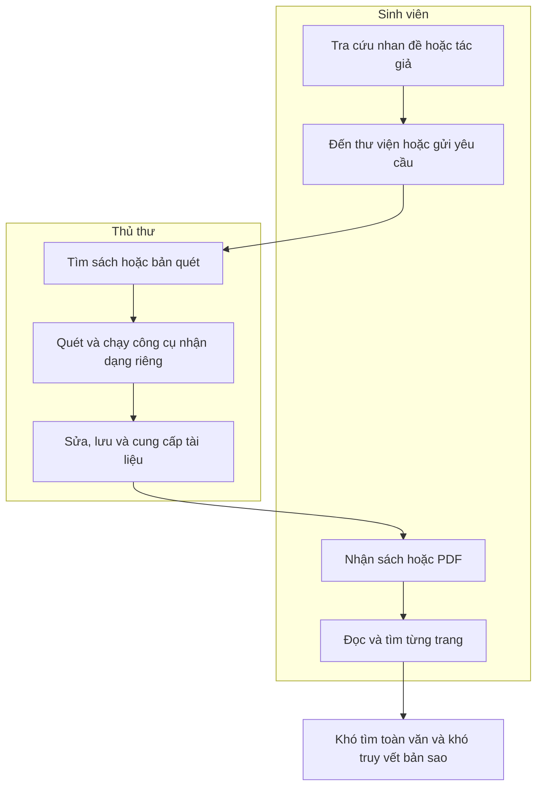

# TẦM NHÌN VÀ PHẠM VI DỰ ÁN LIBIF

| Thuộc tính | Nội dung |
| :--- | :--- |
| Bối cảnh | Đồ án nhóm trong học phần Quản lý Dự án Phần mềm |
| Sản phẩm | Bản mẫu hệ thống thư viện số LIBIF |
| Thời gian | 10 tuần, gồm 05 Sprint |
| Nhóm thực hiện | 06 sinh viên |
| Phiên bản | 2.0 |
| Ngày cập nhật | 21/08/2026 |

## 1. Mục đích tài liệu

Tài liệu mô tả hiện trạng, quy trình của thủ thư và sinh viên, trạng thái tương lai, tính năng cần có và ranh giới của bản mẫu LIBIF. Yêu cầu chi tiết được quản lý trong [Danh sách yêu cầu sản phẩm](./LIBIF-Product-Backlog.md).

## 2. Trạng thái và quy trình hiện tại

Hiện trạng dưới đây đại diện cho thư viện còn xử lý tài liệu quét bằng công cụ rời. Nhóm cần xác minh lại bằng phỏng vấn thủ thư trước khi thí điểm thực tế.

### 2.1 Thủ thư

- Tiếp nhận sách giấy hoặc bản quét, lưu ảnh và PDF theo thư mục.
- Chạy nhận dạng chữ bằng công cụ riêng rồi sửa văn bản thủ công.
- Biên mục, phê duyệt và chia sẻ tài liệu trên các hệ thống tách rời.
- Khó quản lý phiên bản, quyền đọc và nhật ký truy cập tại một nơi.

### 2.2 Sinh viên

- Tra cứu chủ yếu theo nhan đề, tác giả hoặc thông tin biên mục.
- Đến thư viện, gửi yêu cầu hoặc nhận đường dẫn PDF nếu được phép.
- Đọc tuần tự từng trang khi bản quét không có lớp văn bản.
- Khó tìm đúng đoạn cần dùng; tệp đã tải xuống khó được thư viện truy vết.

### 2.3 Luồng hiện tại

## 3. Tầm nhìn sản phẩm

> Dành cho thư viện cần khai thác tài liệu quét, LIBIF cung cấp một quy trình tập trung để nhận dạng chữ, đối soát, xuất bản, tìm kiếm và đọc trực tuyến có kiểm soát. Sản phẩm ưu tiên nghiệp vụ thủ thư và tài liệu tiếng Việt, đồng thời hỗ trợ giảm nguy cơ phát tán tệp gốc bằng phân quyền, watermark và audit log.

Mục tiêu trước mắt là kiểm chứng bản mẫu trong học phần. Thí điểm thực tế và thương mại hóa chỉ được xem xét sau khi có kết quả nghiệm thu.

### 3.1 Trạng thái tương lai khi có LIBIF

- Thủ thư thực hiện nhận dạng, đối soát, phê duyệt và xuất bản trong một quy trình.
- Sinh viên tìm kiếm trong nội dung, mở đúng trang và đọc theo quyền được cấp.
- Hệ thống áp dụng mã hóa, giới hạn phiên, dấu nhận diện và nhật ký truy cập.

### 3.2 Luồng tương lai

```mermaid
flowchart TD
    subgraph TT["Thủ thư"]
        A[Tải bản quét] --> B[Tesseract nhận dạng nền]
        B --> C[Đối soát ảnh và văn bản]
        C --> D[Phê duyệt, biên mục và đặt quyền]
    end

    D --> E[Mã hóa, xuất bản và tạo chỉ mục]

    subgraph SV["Sinh viên"]
        F[Tìm kiếm toàn văn] --> G[Chọn kết quả và đúng trang]
        G --> H[Hệ thống kiểm tra quyền]
        H --> I[Đọc bằng Canvas]
    end

    E --> F
    I --> J[Dấu nhận diện và nhật ký truy cập]
```

## 4. Mục tiêu và tiêu chí thành công

- Chạy được luồng tải tài liệu → nhận dạng chữ → đối soát → phê duyệt → tìm kiếm → đọc trực tuyến.
- Áp dụng được mã hóa, quyền truy cập, giới hạn phiên, dấu nhận diện và nhật ký trên dữ liệu thử.
- Tìm đúng tài liệu và trang chứa từ khóa trong tập dữ liệu mẫu.
- Cài đặt và chạy được theo hướng dẫn; không còn lỗi nghiêm trọng khi bàn giao.
- Hoàn thành trong 10 tuần và không phát sinh chi phí tiền mặt ngoài dự kiến.

> Tiêu chí nghiệm thu đầy đủ xem tại [Phạm vi công việc](./LIBIF-Statement-Of-Work.md).

## 5. Bên liên quan và người dùng

| Nhóm | Nhu cầu chính | Vai trò đối với sản phẩm |
| :--- | :--- | :--- |
| Thủ thư | Số hóa, sửa kết quả nhận dạng, biên mục và xuất bản | Người dùng chính |
| Sinh viên hoặc độc giả | Tìm kiếm và đọc tài liệu được cấp quyền | Người dùng cuối |
| Quản trị viên | Quản lý tài khoản, quyền, phiên đọc và nhật ký | Người vận hành |
| Giảng viên | Đánh giá sản phẩm và bằng chứng quản lý dự án | Người nghiệm thu học phần |
| Chủ sở hữu nội dung | Yêu cầu sử dụng tài liệu đúng quyền | Bên liên quan bên ngoài |

## 6. Từ hiện trạng đến tính năng

| Khoảng trống hiện tại | Khả năng cần có | Tính năng LIBIF |
| :--- | :--- | :--- |
| Bản quét không tìm được nội dung | Tạo lớp văn bản và chỉ mục | Tesseract OCR và tìm kiếm toàn văn |
| Nhận dạng và sửa lỗi bằng công cụ rời | Tập trung xử lý và kiểm tra | Hàng chờ nhận dạng và đối soát song song |
| Thiếu bước kiểm soát trước khi công bố | Ghi nhận quyết định của thủ thư | Phê duyệt, từ chối và biên mục |
| Chia sẻ trực tiếp tệp gốc | Cung cấp nội dung theo quyền | Mã hóa, bảo vệ đường dẫn và trình đọc Canvas |
| Một tài khoản có thể mở nhiều phiên | Kiểm soát hạn mức sử dụng | Phân quyền và giới hạn phiên đồng thời |
| Sinh viên phải tìm từng trang | Đưa người đọc tới đúng nội dung | Đoạn trích kết quả và mở đúng trang |
| Bản sao khó truy nguồn | Răn đe và lưu bằng chứng | Dấu nhận diện động và nhật ký hoạt động |

Những tính năng trên tạo thành phạm vi cấp cao; yêu cầu chỉ được thêm khi truy về một nhu cầu hoặc khoảng trống đã xác nhận.

> Thiết kế kỹ thuật xem tại [Kiến trúc hệ thống](./LIBIF-Architecture.md).

## 7. Phạm vi sản phẩm

### 7.1 Trong phạm vi

- Tải ảnh hoặc PDF và xử lý nhận dạng chữ trên máy chủ.
- Theo dõi trạng thái nhận dạng, đối soát song song và phê duyệt.
- Biên mục cơ bản, mã hóa lưu trữ và phân quyền theo nhóm.
- Giới hạn phiên đọc đồng thời và ghi nhật ký hoạt động.
- Tìm kiếm toàn văn, mở đúng trang và đọc bằng Canvas.
- Không công khai đường dẫn PDF gốc trên giao diện.
- Dấu nhận diện động và làm mờ khi trình duyệt mất tiêu điểm ở mức bản mẫu.

### 7.2 Ngoài phạm vi

- Vận hành thật với cam kết dịch vụ, dự phòng thảm họa hoặc giám sát liên tục.
- Triển khai diện rộng, số hóa hàng loạt hoặc cung cấp máy quét.
- Mua, phân phối hoặc tư vấn pháp lý về bản quyền nội dung.
- Kiểm thử xâm nhập và chứng nhận an toàn chuyên nghiệp.
- Cam kết ngăn chặn tuyệt đối mọi hình thức sao chép hoặc chụp màn hình.
- Ứng dụng di động, đọc ngoại tuyến, dịch, tóm tắt và nhận dạng chữ viết tay.
- Thanh toán, nhiều thư viện dùng chung và hỗ trợ thương mại sau triển khai.

### 7.3 Hướng phát triển sau bản mẫu

- Thử nghiệm với thủ thư và dữ liệu được phép sử dụng.
- Gia cố an toàn, đo tải và hoàn thiện vận hành.
- Đánh giá nhu cầu nhiều thư viện, ứng dụng di động và tính năng trí tuệ nhân tạo.

## 8. Khả năng cấp cao và mức ưu tiên

| Nhóm khả năng | Kết quả mong đợi | Ưu tiên |
| :--- | :--- | :---: |
| Số hóa và nhận dạng | Tải tài liệu, tiền xử lý và trích xuất văn bản | Bắt buộc |
| Kiểm duyệt | Đối soát, chỉnh sửa, phê duyệt và biên mục | Bắt buộc |
| Xuất bản có kiểm soát | Mã hóa, phân quyền và giới hạn phiên | Bắt buộc |
| Tra cứu và đọc | Tìm kiếm toàn văn và đọc bằng Canvas | Bắt buộc |
| Răn đe và truy vết | Bảo vệ đường dẫn, dấu nhận diện và nhật ký | Bắt buộc |
| Theo dõi tiến độ, nhảy trang, làm mờ | Hoàn thiện trải nghiệm và hỗ trợ vận hành | Nên có |

> Danh sách tính năng và tiêu chí chấp nhận xem tại [Danh sách yêu cầu sản phẩm](./LIBIF-Product-Backlog.md).

## 9. Yêu cầu chất lượng cấp cao

- **An toàn:** mã hóa tài liệu, kiểm soát quyền và không công khai PDF gốc trên giao diện.
- **Khả dụng:** luồng chính hoạt động ổn định trên môi trường thử nghiệm.
- **Dễ sử dụng:** thủ thư có thể đối soát ảnh và văn bản trên cùng giao diện.
- **Hiệu năng:** nhận dạng chạy nền; thời gian tìm kiếm được đo trên dữ liệu mẫu.
- **Bảo trì:** hệ thống được đóng gói, có kiểm thử và hướng dẫn cài đặt.

Các biện pháp trên nhằm giảm rủi ro và hỗ trợ truy vết, không bảo đảm chống sao chép tuyệt đối.

## 10. Giả định, ràng buộc và phụ thuộc

### 10.1 Giả định

- Có 10–20 tài liệu tiếng Việt hợp pháp, chất lượng khoảng 300 DPI để thử nghiệm.
- Nền tảng kỹ thuật và bản chứng minh khả thi hiện có được tái sử dụng.
- Product Owner đại diện nghiệp vụ; ưu tiên có thủ thư góp ý.

### 10.2 Ràng buộc

- 06 sinh viên tham gia khoảng 15 giờ/người/tuần trong 10 tuần.
- Ngân sách tiền mặt 0 VNĐ (tối ưu toàn diện bằng tài nguyên Azure for Students, Free AI và tài nguyên miễn phí sẵn có).
- Phạm vi ưu tiên thấp được hoãn trước khi xem xét kéo dài thời hạn.

### 10.3 Phụ thuộc

- Tesseract, PostgreSQL, Redis, MinIO, trình duyệt và môi trường triển khai thử nghiệm.
- Quyền sử dụng dữ liệu mẫu và khả năng tham gia của các thành viên.

## 11. Rủi ro và vấn đề mở

- Chất lượng ảnh hoặc phông chữ làm tăng sai số nhận dạng.
- Trình duyệt không thể ngăn việc chụp bằng thiết bị bên ngoài.
- Thiếu dữ liệu hợp pháp hoặc thiếu hụt năng lực nhóm có thể làm giảm phạm vi.
- Hiệu quả và chi phí thương mại hóa chưa được xác minh bằng thí điểm thực tế.

> Chi tiết xem tại [Kế hoạch quản lý rủi ro](./LIBIF-Software-Risk-Management-Plan.md).

## 12. Quản lý phạm vi và phê duyệt

- Product Owner sở hữu tầm nhìn, sắp xếp ưu tiên và đề xuất thay đổi phạm vi.
- Nhóm đánh giá tác động của thay đổi đến thời gian, chi phí, chất lượng và rủi ro.
- Thay đổi vượt đường cơ sở phải được nhóm và giảng viên xem xét trước khi thực hiện.
- Tài liệu được rà soát sau Sprint 1, Sprint 2 và khi có thay đổi đã được phê duyệt.

> Quy trình chi tiết xem tại [Kế hoạch quản lý dự án](./LIBIF-Project-Planning.md). Cơ sở thời gian và chi phí xem tại [Ước tính dự án](./LIBIF-Project-Estimation.md).
