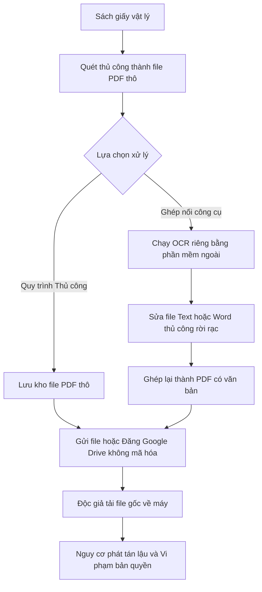
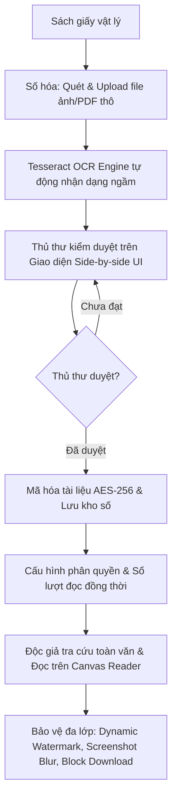

# TÀI LIỆU TẦM NHÌN & PHẠM VI DỰ ÁN (PROJECT VISION & SCOPE)

**Tên dự án:** Hệ thống Thư viện Số Thương mại & Quản lý Bản quyền Số (Commercial Digital Library System)  
**Tên tài liệu:** `docs/markdowns-vi-v2/LIBIF-Project-Vision-Scope.md`  
**Phân loại:** Tài liệu Yêu cầu & Phạm vi Dự án (Requirements & Scope Document)  
**Ngôn ngữ tài liệu:** Tiếng Việt  
**Tình trạng:** Bản hoàn thiện phê duyệt (Decision Support Document)  

---

## 1. Tuyên bố Tầm nhìn (Vision Statement)

Dành cho **các Thư viện Đại học, Thư viện Chuyên ngành và Thư viện Công cộng** có nhu cầu số hóa và khai thác tài sản tri thức.  
Hệ thống **Thư viện Số Thương mại (CDLS)** là giải pháp phần mềm quản lý kho tri thức số đóng gói, cung cấp quy trình khép kín từ **Số hóa $\rightarrow$ Trích xuất Tesseract OCR ngầm $\rightarrow$ Kiểm duyệt đối soát thủ công của Thủ thư $\rightarrow$ Xuất bản số $\rightarrow$ Đọc trực tuyến an toàn**.  
Không giống như **các giải pháp mã nguồn mở thiếu bảo mật DRM (DSpace)** hoặc **các tập hợp công cụ ghép nối rời rạc gây rò rỉ bản quyền**, sản phẩm này giải quyết triệt để bài toán chất lượng dữ liệu OCR và bảo vệ bản quyền số đa lớp (Watermark động, chống tải file gốc, chống chụp màn hình, mã hóa DRM).  
Mục tiêu dài hạn của giải pháp là trở thành **nền tảng phần mềm thư viện số thương mại chuẩn hóa**, giúp các thư viện chuyển đổi số an toàn, tối ưu chi phí vận hành và mở rộng hợp tác bản quyền với các Nhà xuất bản.

---

## 2. Trạng thái Hiện tại (Current State)

### 2.1 Bối cảnh Quy trình Nghiệp vụ Hiện tại

| Khía cạnh | Thực trạng Vận hành | Hạn chế & Tác động | Loại Thông tin |
| :--- | :--- | :--- | :--- |
| **Bảo quản & Khai thác** | Thư viện lưu trữ sách giấy truyền thống. Độc giả phải đến kho vật lý để mượn/đọc. | Giới hạn không gian lưu trữ; sách bị hư hỏng theo thời gian; 1 cuốn sách chỉ phục vụ 1 người tại 1 thời điểm. | **FACT** |
| **Quy trình Số hóa** | Thủ thư dùng máy quét (scanner) lưu thành file ảnh hoặc file PDF thô. | File dạng scan không có dữ liệu văn bản, độc giả không thể tìm kiếm từ khóa (Full-text search). | **INDUSTRY PRACTICE** |
| **Xử lý OCR & Kiểm duyệt** | Sử dụng các công cụ OCR độc lập (ABBYY, Tesseract rời) chạy ra file text/word rồi thủ thư sửa thủ công ngoài. | Quy trình bị đứt gãy qua nhiều phần mềm; không có giao diện đối soát tập trung song song; tốn nhân công. | **INDUSTRY PRACTICE** |
| **Chia sẻ & Bản quyền** | Phát hành file PDF/Image qua Google Drive, Zalo hoặc cổng thông tin không mã hóa. | **Rủi ro vi phạm bản quyền cao:** Độc giả dễ dàng tải file gốc, nhân bản và chia sẻ trái phép lên Internet. | **FACT** |

### 2.2 Sơ đồ Quy trình Vận hành Hiện tại (Current Workflow)

### 2.3 Phân tích Quy trình của Các Phương án Hiện hữu & Đối thủ

* **Quy trình Thủ công & Ghép nối Công cụ rời rạc:**
  * Quét $\rightarrow$ Chạy OCR độc lập $\rightarrow$ Sửa thủ công bằng MS Word/Notepad $\rightarrow$ Nhúng Watermark tĩnh bằng Acrobat $\rightarrow$ Tải lên Google Drive $\rightarrow$ Gửi link.
  * *Hạn chế:* Rủi ro mất an toàn thông tin cao; đứt gãy quy trình; Watermark tĩnh không định danh được độc giả phát tán.
* **Quy trình Phần mềm Mã nguồn Mở (DSpace / Greenstone):**
  * Quét $\rightarrow$ Upload file PDF lên DSpace $\rightarrow$ Trích xuất text qua plugin $\rightarrow$ Phân quyền xem/tải theo IP hoặc tài khoản.
  * *Hạn chế:* Không có giao diện kiểm duyệt đối soát OCR dòng-theo-dòng cho thủ thư; độc giả vẫn tải được file PDF gốc khi được cấp quyền xem.
* **Quy trình Hệ thống Thương mại Quốc tế (Ex Libris Alma / Primo):**
  * Tích hợp quy trình quản trị toàn diện và mã hóa DRM quốc tế.
  * *Hạn chế:* Chi phí bản quyền quá cao ($10.000 - $50.000+/năm); phức tạp trong triển khai và khó tùy biến giao diện duyệt OCR theo ngôn ngữ tiếng Việt.

---

## 3. Trạng thái Tương lai (Future State)

### 3.1 Quy trình Nghiệp vụ Tương lai Đề xuất

### 3.2 Các Cải tiến Cốt lõi (Key Improvements)

1. **Chuẩn hóa & Tự động hóa Quy trình OCR:** Tự động kích hoạt Tesseract OCR Engine ngay sau khi upload file scan, giảm $70\%$ thời gian xử lý thủ công ban đầu.
2. **Giao diện Kiểm duyệt Đối soát Tập trung (Side-by-side Review UI):** Hiển thị màn hình kép (Ảnh scan gốc bên trái, Văn bản OCR bên phải), cho phép thủ thư chỉnh sửa trực tiếp và phê duyệt trước khi xuất bản.
3. **Bảo vệ Bản quyền Đa lớp (Multi-layered Content Protection):**
   * Không cấp link tải file gốc; dữ liệu mã hóa được render trực tiếp qua HTML5 Canvas Reader.
   * Watermark động nhúng thông tin độc giả (User ID, IP, Thời gian đọc) đè lên nội dung sách.
   * Chống chụp màn hình (Screenshot Deterrence): Tự động làm mờ (blur) trang sách khi ứng dụng mất focus hoặc có thao tác chụp ảnh.
4. **Tìm kiếm Toàn văn Chính xác (Full-text Search):** Độc giả tìm kiếm từ khóa chính xác tới từng trang sách dựa trên dữ liệu OCR đã qua kiểm duyệt chuẩn $100\%$.

---

## 4. Phân tích Khoảng trống (Gap Analysis)

| Vấn đề Hiện tại (Current Problem) | Quy trình Tương lai (Future Workflow) | Tính năng Tương ứng (System Feature) | Loại Thông tin |
| :--- | :--- | :--- | :--- |
| **Văn bản dạng scan không thể tìm kiếm nội dung.** | Hệ thống tự động nhận dạng chữ viết và tạo chỉ mục tìm kiếm ngay sau khi số hóa. | **Module Tesseract OCR & Indexing Engine** | **INDUSTRY PRACTICE** |
| **Sai sót OCR không được kiểm soát trước khi xuất bản.** | Thủ thư đối soát màn hình kép (Side-by-side) và bấm phê duyệt trước khi lưu kho xuất bản. | **Giao diện Kiểm duyệt OCR dành cho Thủ thư (Side-by-side Review UI)** | **EXPERT JUDGEMENT** |
| **File PDF thô bị tải về và chia sẻ lậu tràn lan.** | Dữ liệu được mã hóa stream và hiển thị qua Canvas Reader; triệt tiêu link tải file gốc. | **HTML5 Canvas Reader Viewer & Block Download** | **FACT** |
| **Ảnh chụp màn hình nội dung sách bị phát tán không rõ nguồn gốc.** | Nhúng Watermark chứa ID/IP/Thời gian của người đọc; làm mờ màn hình khi mất focus. | **Watermark động & Cơ chế Răn đe Chụp màn hình (Screenshot Deterrence)** | **INDUSTRY PRACTICE** |
| **1 tài khoản bị chia sẻ cho nhiều người đọc cùng lúc.** | Hệ thống giới hạn số lượng thiết bị/phiên đọc đồng thời (Concurrent Limit). | **Module Quản lý Phân quyền & Giới hạn Đọc đồng thời** | **FACT** |
| **Thiếu bằng chứng khi xảy ra tranh chấp rò rỉ dữ liệu.** | Tự động ghi lại toàn bộ lịch sử truy cập, đọc, lật trang và IP của người dùng. | **Module Nhật ký Hoạt động & Kiểm vết (Audit Trail & Activity Logging)** | **FACT** |

---

## 5. Phạm vi Dự án (Project Scope)

### 5.1 Trong Phạm vi (In Scope)

* **Phân hệ Số hóa & OCR:**
  * Upload file ảnh/PDF thô từ máy quét.
  * Tích hợp Tesseract OCR Engine (Self-hosted) xử lý ngầm.
  * Tiền xử lý ảnh (Denoise, Deskew) hỗ trợ tăng độ chính xác OCR.
* **Phân hệ Kiểm duyệt dành cho Thủ thư:**
  * Giao diện đối soát màn hình kép Side-by-side (Ảnh scan vs Văn bản OCR).
  * Công cụ chỉnh sửa văn bản OCR, đánh dấu vị trí từ và bấm "Phê duyệt/Từ chối".
  * Biên mục dữ liệu số theo chuẩn thư viện cơ bản.
* **Phân hệ Quản lý Kho sách Số & Xuất bản:**
  * Mã hóa tài liệu số (AES-256) trước khi lưu trữ.
  * Cấu hình chính sách xuất bản: Phân quyền nhóm đọc, thời hạn mượn số, giới hạn số lượt đọc đồng thời.
* **Phân hệ Khai thác & Đọc an toàn (Reader Viewer):**
  * Bộ máy tìm kiếm toàn văn (Full-text Search Engine).
  * HTML5 Canvas Reader hiển thị trực tuyến không cần plugin.
  * Watermark động (Nhúng User ID, IP, Timestamp).
  * Khóa tính năng tải file gốc (Block Download & Direct Link Protection).
  * Răn đe chụp màn hình (Blur khi mất focus).
* **Phân hệ Quản trị & Bảo mật:**
  * Phân quyền người dùng theo vai trò (Thủ thư, Độc giả, Admin).
  * Ghi nhật ký hoạt động (Audit Trail Log) chi tiết.

### 5.2 Ngoài Phạm vi (Out of Scope)

* **Sản xuất phần cứng:** Không sản xuất hoặc bán kèm máy quét tài liệu (Scanner hardware).
* **Cung cấp bản quyền nội dung:** Không mua bán hoặc chịu trách nhiệm về bản quyền các cuốn sách do thư viện tự tải lên.
* **In ấn tài liệu số:** Không phát triển tính năng hỗ trợ in sách từ bản số ra giấy.
* **Dịch thuật tự động:** Không tích hợp tính năng dịch tự động ngôn ngữ sách trong phiên bản này.

### 5.3 Phạm vi Tương lai (Future Scope)

* **Tích hợp AI Nâng cao:** Tự động tóm tắt nội dung sách, trích xuất từ khóa chủ đề (Keyphrase extraction) bằng LLM.
* **Mobile App Chuyên dụng:** Phát triển ứng dụng iOS/Android hỗ trợ đọc offline có mã hóa bảo mật dữ liệu trên thiết bị di động.
* **Nhận dạng Chữ viết tay (HTR):** Mở rộng engine Tesseract để nhận dạng chữ viết tay cổ/Hán Nôm chuyên sâu.

---

## 6. Danh mục Tính năng Cấp cao (High-level Features)

| Feature ID | Tên Tính năng (Feature Name) | Vai trò Sử dụng | Mô tả Tóm tắt | Giá trị Kinh doanh | Độ Ưu tiên | Tiêu chí Chấp nhận (Acceptance Criteria) |
| :--- | :--- | :--- | :--- | :--- | :--- | :--- |
| **FE-01** | Quản lý Số hóa & OCR Tesseract | Thủ thư | Upload file scan, tự động kích hoạt Tesseract OCR trích xuất văn bản ngầm. | Tự động hóa khâu trích xuất dữ liệu, giảm chi phí nhân công. | **High** | Given file PDF scan được upload $\rightarrow$ When Tesseract OCR hoàn tất $\rightarrow$ Then xuất ra dữ liệu văn bản và tọa độ từ ứng với từng trang. |
| **FE-02** | Giao diện Đối soát Side-by-side | Thủ thư | Màn hình kép hiển thị ảnh gốc và văn bản OCR; cho phép sửa lỗi và phê duyệt xuất bản. | Đảm bảo chất lượng dữ liệu tri thức $100\%$ trước khi ra công chúng. | **High** | Given văn bản OCR cần duyệt $\rightarrow$ When thủ thư chỉnh sửa và bấm "Phê duyệt" $\rightarrow$ Then trạng thái tài liệu chuyển sang "Đã duyệt" và mã hóa lưu kho. |
| **FE-03** | Tìm kiếm Toàn văn (Full-text Search) | Độc giả / Thủ thư | Tìm kiếm từ khóa chính xác trong nội dung sách đã OCR và duyệt. | Tăng $90\%$ tốc độ tra cứu tài liệu phục vụ học tập/nghiên cứu. | **High** | Given từ khóa tra cứu $\rightarrow$ When nhấn tìm kiếm $\rightarrow$ Then hệ thống trả về danh sách sách và trỏ chính xác tới trang chứa từ khóa. |
| **FE-04** | HTML5 Canvas Reader An toàn | Độc giả | Trình đọc sách trực tuyến trên Web mã hóa stream, chặn hoàn toàn tính năng tải file. | Ngăn chặn việc đánh cắp và lưu trữ file gốc về máy cá nhân. | **High** | Given độc giả mở đọc sách $\rightarrow$ When kiểm tra F12/IDM $\rightarrow$ Then không tìm thấy URL file gốc và không tải được file PDF. |
| **FE-05** | Watermarking Động (Dynamic Watermark) | Độc giả | Nhúng mờ thông tin cá nhân độc giả (User ID, IP, Time) đè lên nội dung khi đọc. | Răn đe và truy vết hành vi chụp ảnh màn hình phát tán lậu. | **High** | Given tài khoản độc giả X đang đọc sách $\rightarrow$ When trang sách render $\rightarrow$ Then thông tin "User X - IP - Time" hiển thị chéo mờ trên trang. |
| **FE-06** | Răn đe Chụp màn hình (Screenshot Blur) | Độc giả | Tự động làm mờ nội dung sách khi trình duyệt mất focus hoặc bấm phím chụp màn hình. | Hạn chế thu thập dữ liệu bằng công cụ chụp ảnh màn hình tự động. | **Medium** | Given độc giả đang đọc sách $\rightarrow$ When chuyển tab hoặc bấm PrintScreen $\rightarrow$ Then nội dung trang sách lập tức bị làm mờ (blurred). |
| **FE-07** | Phân quyền & Giới hạn Đọc đồng thời | Quản trị viên | Cấu hình quyền đọc theo nhóm người dùng và giới hạn số lượt truy cập đồng thời. | Tuân thủ chính sách hạn mức bản quyền của Nhà xuất bản. | **High** | Given cuốn sách X có hạn mức 5 lượt đọc đồng thời $\rightarrow$ When người thứ 6 vào đọc $\rightarrow$ Then hệ thống báo quá hạn mức và đưa vào hàng chờ. |
| **FE-08** | Nhật ký Hoạt động & Audit Trail | Quản trị viên | Tự động ghi vết chi tiết lịch sử đọc, lật trang, thời gian và IP truy cập. | Cung cấp bằng chứng giải trình bản quyền và phát hiện hành vi bất thường. | **Medium** | Given mọi thao tác của người dùng $\rightarrow$ When thực hiện trên hệ thống $\rightarrow$ Then nhật ký hệ thống ghi lại chính xác thời gian, IP và hành vi. |

---
> **Xác nhận:** Tài liệu Tầm nhìn & Phạm vi Dự án (LIBIF-Project-Vision-Scope.md) được lập dựa trên các nguyên tắc phân tích nghiệp vụ thực tế, tập trung vào tính khả thi thương mại và hỗ trợ ra quyết định.
