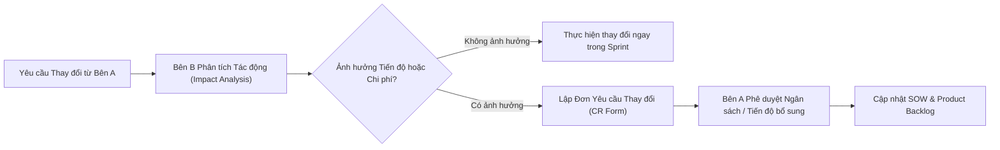

# TUYÊN BỐ PHẠM VI CÔNG VIỆC DỰ ÁN (STATEMENT OF WORK - SOW)

**Tên dự án:** Hệ thống Thư viện Số Thương mại & Quản lý Bản quyền Số (Commercial Digital Library System)  
**Tên tài liệu:** `docs/markdowns-vi-v2/LIBIF-Statement-Of-Work.md`  
**Mã hợp đồng / Dự án:** CDLS-SOW-2026  
**Bên Giao việc (Bên A - Khách hàng):** Đại diện Ban Giám đốc Thư viện / Đơn vị Đặt hàng  
**Bên Thực hiện (Bên B - Đội ngũ Phát triển):** Đội ngũ Kỹ sư Dự án LIBIF (06 Sinh viên năm 4 + Trợ lý Antigravity AI)  
**Nguồn chiếu chính (Source of Truth):**  
- Tài liệu Tầm nhìn & Phạm vi Dự án (`docs/markdowns-vi-v2/LIBIF-Project-Vision-Scope.md`)  
- Tài liệu Product Backlog chính thức (`docs/markdowns-vi-v2/LIBIF-Product-Backlog.md` - 16 PBIs)  
- Bản Ước tính Dự án phê duyệt (`docs/markdowns-vi-v2/LIBIF-Project-Estimation.md` - Ngân sách $112.000.000\text{ VNĐ}$, $10\text{ tuần}$)  
**Ngôn ngữ tài liệu:** Tiếng Việt  
**Tình trạng:** Bản thỏa thuận hợp đồng chính thức (Binding SOW Document)  

---

## 1. Mục tiêu Dự án (Project Objectives)

Tài liệu Tuyên bố Phạm vi Công việc (SOW) này xác lập các cam kết pháp lý và kỹ thuật giữa **Bên A (Khách hàng)** và **Bên B (Đội ngũ Phát triển)** nhằm xây dựng và bàn giao thành công **Hệ thống Thư viện Số Thương mại (CDLS)** với các mục tiêu cốt lõi:
1. **Chuyển đổi Số & Tự động hóa OCR:** Chuyển đổi tài liệu quét thô sang dữ liệu văn bản có khả năng tìm kiếm toàn văn (full-text search) thông qua **Tesseract OCR Engine** kết hợp **Giao diện đối soát Side-by-side dành cho Thủ thư**.
2. **Bảo vệ Bản quyền Đa lớp:** Triệt tiêu hoàn toàn rò rỉ file thô và chống sao chép trái phép thông qua **HTML5 Canvas Reader, Watermark động nhúng thông tin độc giả, Screenshot Blur và Mã hóa AES-256**.
3. **Thương mại hóa & Đóng gói Triển khai:** Bàn giao sản phẩm phần mềm hoàn chỉnh dưới dạng gói đóng gói (Docker Container / SaaS) sẵn sàng đưa vào vận hành thương mại trong thời gian **10 tuần**.

---

## 2. Phạm vi Công việc (Scope of Work)

### 2.1 Trong Phạm vi Thực hiện (In-Scope)
Bên B có trách nhiệm nghiên cứu, thiết kế, phát triển, kiểm thử và bàn giao đầy đủ **16 Product Backlog Items (PBIs)** thuộc 5 Phân hệ (Epics) sau:

* **Phân hệ 1: Số hóa & Nhận dạng Văn bản (Digitization & Tesseract OCR)**
  * Tiếp nhận file ảnh/PDF scan thô từ máy quét (PBI-01).
  * Tiền xử lý ảnh (Deskew, Denoise) và chạy Tesseract OCR ngầm trích xuất văn bản + tọa độ từ ngữ (PBI-02).
  * Dashboard theo dõi và quản lý hàng chờ tác vụ OCR (PBI-03).
* **Phân hệ 2: Kiểm duyệt & Biên mục Dữ liệu Số (Librarian Review & Cataloging)**
  * Giao diện đối soát màn hình kép Side-by-side (Ảnh scan vs Text OCR) cho thủ thư (PBI-04).
  * Quy trình Phê duyệt / Từ chối xuất bản tài liệu số (PBI-05).
  * Biểu mẫu biên mục dữ liệu tả theo chuẩn thư viện Dublin Core (PBI-06).
* **Phân hệ 3: Quản lý Xuất bản & Phân quyền Kho số (Publishing & Access Control)**
  * Mã hóa tự động dữ liệu tài liệu lưu kho bằng thuật toán AES-256 (PBI-07).
  * Phân quyền truy cập theo nhóm người dùng (PBI-08).
  * Quản lý hạn mức số lượng phiên đọc đồng thời (Concurrent Limit) tuân thủ bản quyền (PBI-09).
* **Phân hệ 4: Tra cứu & Trình đọc An toàn (Search & Secure Canvas Reader)**
  * Bộ máy tìm kiếm toàn văn chính xác tới từng trang sách (PBI-10).
  * Trình đọc trực tuyến HTML5 Canvas Reader hiển thị mã hóa stream (PBI-11).
  * Cơ chế chặn hoàn toàn tính năng tải file gốc (Block Download, khóa chuột phải, IDM, F12) (PBI-12).
  * Định vị từ khóa và chuyển trang trực tiếp trong trình đọc (PBI-13).
* **Phân hệ 5: Giám sát, Bảo mật & Audit Log (Security Deterrence & Logging)**
  * Nhúng Watermark động (User ID, Mã thẻ, IP, Timestamp) đè trên nội dung khi đọc (PBI-14).
  * Làm mờ màn hình (Screenshot Blur) khi trình duyệt mất focus hoặc bấm phím chụp màn hình (PBI-15).
  * Hệ thống nhật ký hoạt động bất biến (Audit Trail Log) ghi vết toàn bộ hành vi khai thác (PBI-16).

### 2.2 Ngoài Phạm vi Thực hiện (Out-of-Scope)
Các hạng mục sau đây **không thuộc trách nhiệm thực hiện của Bên B** trong hợp đồng này:
* Cung cấp hoặc sản xuất thiết bị phần cứng máy quét (Scanner hardware).
* Mua sắm bản quyền sách/tài liệu giấy đầu vào cho Bên A.
* Phát triển ứng dụng di động native (iOS/Android App) đọc offline (chỉ hỗ trợ Web Responsive).
* Phát triển tính năng in ấn tài liệu số ra giấy hoặc dịch thuật tự động ngôn ngữ sách.

---

## 3. Sản phẩm Bàn giao (Deliverables)

| Mã Sản phẩm | Tên Sản phẩm Bàn giao | Định dạng / Phương thức Bàn giao | Tiêu chí Hoàn thành |
| :--- | :--- | :--- | :--- |
| **DEL-01** | **Tài liệu Đặc tả Yêu cầu & Kiến trúc** | Tệp Markdown/PDF (`docs/markdowns-vi-v2/LIBIF-*.md`) | Được Bên A thẩm định và phê duyệt chính thức. |
| **DEL-02** | **Bộ Mã nguồn Hệ thống CDLS** | Git Repository (Backend API, Frontend Canvas Reader, Tesseract Worker) | Mã nguồn sạch, đạt độ bao phủ Unit Test $\ge 80\%$, qua Đánh giá Mã nguồn (Code Review). |
| **DEL-03** | **Gói Cài đặt & Triển khai** | Gói Docker Compose / Docker Image đóng gói sẵn | Triển khai thành công trên máy chủ Staging của Bên A chỉ với 1 câu lệnh script. |
| **DEL-04** | **Tài liệu Hướng dẫn Vận hành & UAT** | Tệp PDF Hướng dẫn Thủ thư + Kịch bản nghiệm thu UAT | $100\%$ kịch bản UAT đạt yêu cầu không còn lỗi mức Blocker/Critical. |

---

## 4. Tiêu chí & Quy trình Nghiệm thu (Acceptance Criteria & Process)

### 4.1 Tiêu chí Nghiệm thu Tổng thể
1. **Bảo mật Bản quyền $100\%$:** Không thể trích xuất URL file PDF gốc bằng công cụ IDM hay Developer Tools (F12); Watermark động hiển thị đúng thông tin độc giả đang đăng nhập.
2. **Đối soát OCR Chuẩn xác:** Giao diện Side-by-side UI hoạt động mượt mà, cho phép thủ thư duyệt và chỉnh sửa $100\%$ dữ liệu trước khi xuất bản.
3. **Độ ổn định & Hiệu năng:** Thời gian phản hồi truy vấn tìm kiếm toàn văn $< 2\text{ giây}$; trình đọc Canvas render trang sách $< 1.5\text{ giây}$.

### 4.2 Quy trình Nghiệm thu
* **Bước 1 (Đăng ký UAT):** Bên B bàn giao gói sản phẩm thử nghiệm kèm Tài liệu Kịch bản UAT cho Bên A.
* **Bước 2 (Thực hiện Kiểm thử):** Bên A phối hợp cùng Bên B thực hiện kiểm thử trong vòng **05 ngày làm việc**.
* **Bước 3 (Ký Biên bản Nghiệm thu):** Khi $100\%$ tiêu chí UAT đạt yêu cầu, Bên A tiến hành ký **Biên bản Nghiệm thu Sản phẩm**.

---

## 5. Tiến độ Dự án & Các mốc Milestone (Project Schedule)

Tổng thời gian thực hiện dự án là **10 tuần (05 Sprints, mỗi Sprint 2 tuần)**:

| Mốc Tiến độ | Tên Mốc / Sprint | Sản phẩm & Nội dung Bàn giao | Thời gian |
| :--- | :--- | :--- | :---: |
| **Milestone 1** | **Sprint 1: Phân tích & Số hóa OCR** | Hoàn thành Phân hệ Tiếp nhận file scan & Tesseract OCR ngầm (PBI-01, PBI-02, PBI-03). | Tuần 1 - 2 |
| **Milestone 2** | **Sprint 2: Side-by-side UI & Mã hóa** | Bàn giao Giao diện đối soát Side-by-side UI và Mã hóa AES-256 (PBI-04, PBI-05, PBI-06, PBI-07). | Tuần 3 - 4 |
| **Milestone 3** | **Sprint 3: Canvas Reader & Chặn tải** | Bàn giao Trình đọc Canvas Reader, Chặn tải file & Định vị từ khóa (PBI-10, PBI-11, PBI-12, PBI-13). | Tuần 5 - 6 |
| **Milestone 4** | **Sprint 4: Bảo mật Đa lớp & Audit Log** | Bàn giao Watermark động, Screenshot Blur, Hạn mức đồng thời & Audit Log (PBI-08, PBI-09, PBI-14, PBI-15, PBI-16). | Tuần 7 - 8 |
| **Milestone 5** | **Sprint 5: UAT & Bàn giao Chính thức** | Thử nghiệm Pentest an ninh, nghiệm thu UAT toàn hệ thống và đóng gói Docker bàn giao. | Tuần 9 - 10 |

---

## 6. Vai trò & Trách nhiệm (Roles & Responsibilities)

### 6.1 Trách nhiệm của Bên B (Đội ngũ Phát triển LIBIF - 06 Sinh viên)
* Bố trí **06 sinh viên năm 4** (01 Tech Lead + 05 Lập trình viên) làm việc đúng cam kết tối thiểu $20\text{ giờ/tuần/sinh viên}$.
* Tận dụng tối đa công cụ **Antigravity IDE + Google AI Pro** để đảm bảo tiến độ và chất lượng mã nguồn.
* Bàn giao mã nguồn, tài liệu kỹ thuật và hỗ trợ triển khai hệ thống lên máy chủ Staging của Bên A.
* Đảm bảo tính bảo mật và không tiết lộ dữ liệu tài liệu của Bên A cho bất kỳ bên thứ ba nào.

### 6.2 Trách nhiệm của Bên A (Khách hàng / Thư viện)
* Cung cấp đầy đủ file mẫu ảnh/PDF scan chất lượng $\ge 300\text{ DPI}$ để làm dữ liệu thử nghiệm ở Sprint 1.
* Phân công đại diện **Thủ thư Trưởng** tham gia họp định kỳ cuối mỗi Sprint để xem Demo và góp ý giao diện UI/UX.
* Chuẩn bị hạ tầng Máy chủ Staging (VPS 8 Core, 16GB RAM) để Bên B triển khai gói Docker thử nghiệm.
* Thực hiện kiểm thử và ký biên bản nghiệm thu đúng thời hạn cam kết.

---

## 7. Giả định Dự án (Assumptions)

* **ASN-01:** Bên A cung cấp hạ tầng VPS máy chủ Staging đúng cấu hình tối thiểu trước Tuần 3 của dự án.
* **ASN-02:** Tài khoản sinh viên Google AI Pro được duy trì miễn phí và hoạt động ổn định trong suốt 10 tuần.
* **ASN-03:** Các yêu cầu chức năng được giữ cố định theo đúng 16 PBIs đã phê duyệt trong Product Backlog.

---

## 8. Ràng buộc Dự án (Constraints)

* **Ràng buộc Thời gian:** Toàn bộ công việc phát triển và bàn giao phải hoàn thành trong hạn mức **10 tuần**.
* **Ràng buộc Công nghệ:** Bắt buộc sử dụng **Tesseract OCR Engine** (mã nguồn mở, self-hosted) và trình đọc trực tuyến chuẩn **HTML5 Canvas**.
* **Ràng buộc Ngân sách:** Ngân sách tổng của hợp đồng không vượt quá **$112.000.000\text{ VNĐ}$**.

---

## 9. Quy trình Quản lý Thay đổi (Change Management)

Nhằm đảm bảo dự án hoàn thành đúng tiến độ 10 tuần và ngân sách cố định, mọi yêu cầu thay đổi phạm vi (Scope Change) phải tuân theo quy trình nghiêm ngặt:

1. **Nguyên tắc Đánh đổi (Trade-off Principle):** Nếu Bên A muốn bổ sung 01 PBI mới, Bên A phải đồng ý loại bỏ 01 PBI có nỗ lực tương đương (Story Points tương đương) ra khỏi phạm vi phiên bản này.
2. **Quy trình Phê duyệt CR (Change Request):** Nếu yêu cầu làm tăng tổng nỗ lực quá $5\%$, Bên B sẽ lập Đơn Yêu cầu Thay đổi (CR Form) báo cáo chi phí và thời gian phát sinh để Bên A xem xét phê duyệt bổ sung trước khi thực hiện.

---

## 10. Các Mốc Giải ngân & Thanh toán (Payment Milestones)

Tổng giá trị hợp đồng thực hiện dự án là **$112.000.000\text{ VNĐ}$ (Bằng chữ: Một trăm mười hai triệu đồng)**. Tiến độ giải ngân được chia làm **03 đợt** gắn liền với các mốc bàn giao sản phẩm:

| Đợt Thanh toán | Mốc Giải ngân (Payment Milestone) | Điều kiện Giải ngân | Giá trị Thanh toán (VNĐ) | Tỷ lệ (%) |
| :--- | :--- | :--- | :---: | :---: |
| **Đợt 1** | **Tạm ứng Ký Hợp đồng (Kick-off)** | Ngay sau khi hai bên ký kết hợp đồng SOW và phê duyệt Tài liệu Yêu cầu (`DEL-01`). | **$33.600.000\text{ VNĐ}$** | **$30\%$** |
| **Đợt 2** | **Nghiệm thu Giai đoạn 1 (Milestone 3)** | Hoàn thành Sprint 3: Bàn giao Phân hệ OCR ngầm, Side-by-side UI và Canvas Reader chống tải (`DEL-02` thử nghiệm). | **$44.800.000\text{ VNĐ}$** | **$40\%$** |
| **Đợt 3** | **Nghiệm thu Bàn giao Chính thức (Final Acceptance)** | Hoàn thành UAT, bàn giao đầy đủ Mã nguồn, Gói Docker và Tài liệu HDSD (`DEL-02, DEL-03, DEL-04`). | **$33.600.000\text{ VNĐ}$** | **$30\%$** |
| **TỔNG CỘNG** | | | **$112.000.000\text{ VNĐ}$** | **$100\%$** |

---

## 11. ĐẠI DIỆN CÁC BÊN KÝ XÁC NHẬN (APPROVAL SIGNATURES)

Văn bản SOW này được lập thành 02 bản có giá trị pháp lý như nhau, mỗi bên giữ 01 bản để làm căn cứ thực hiện.

| Đại diện Bên A (Khách hàng / Thư viện) | Đại diện Bên B (Đội ngũ Phát triển LIBIF) |
| :--- | :--- |
| **ĐẠI DIỆN BAN GIÁM ĐỐC THƯ VIỆN** | **TRƯỞNG NHÓM KỸ THUẬT (TECH LEAD)** |
| *(Ký, ghi rõ họ tên & đóng dấu)* | *(Ký & ghi rõ họ tên)* |
|    **Ngày ký:** ..... / ..... / 2026 |    **Ngày ký:** ..... / ..... / 2026 |

---
> **Xác nhận:** Tệp Tuyên bố Phạm vi Công việc (LIBIF-Statement-Of-Work.md) đã hoàn tất và sẵn sàng cho khâu ký kết hợp đồng chính thức giữa Bên A và Bên B.
